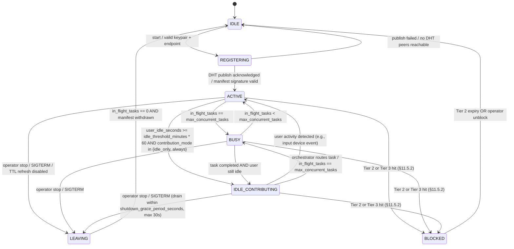
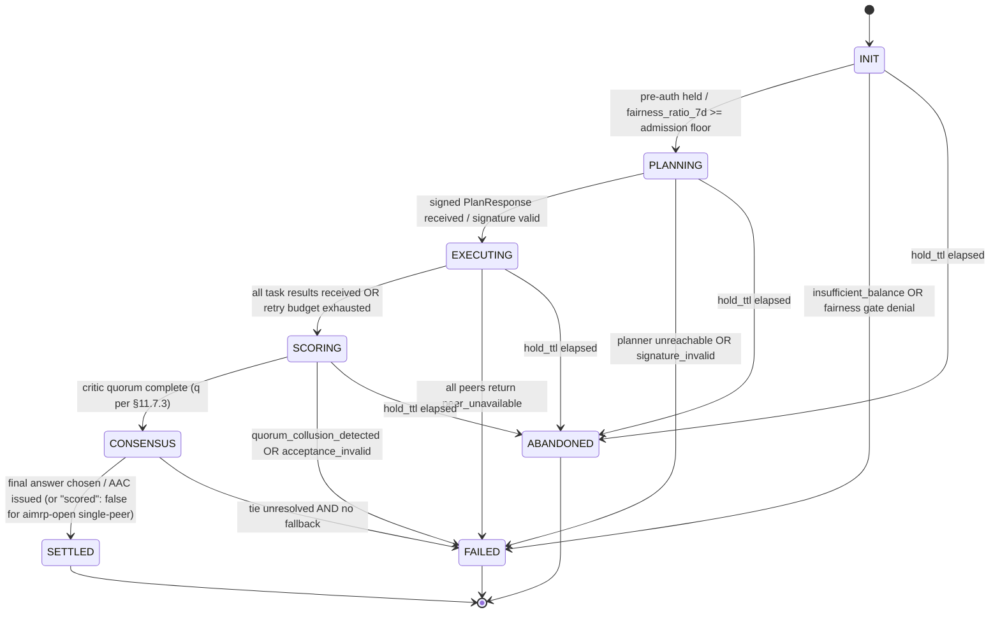
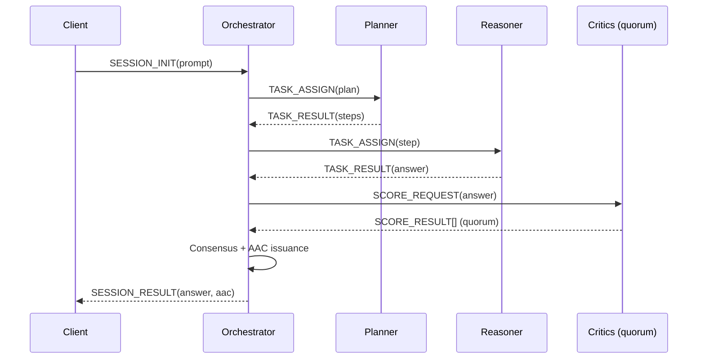
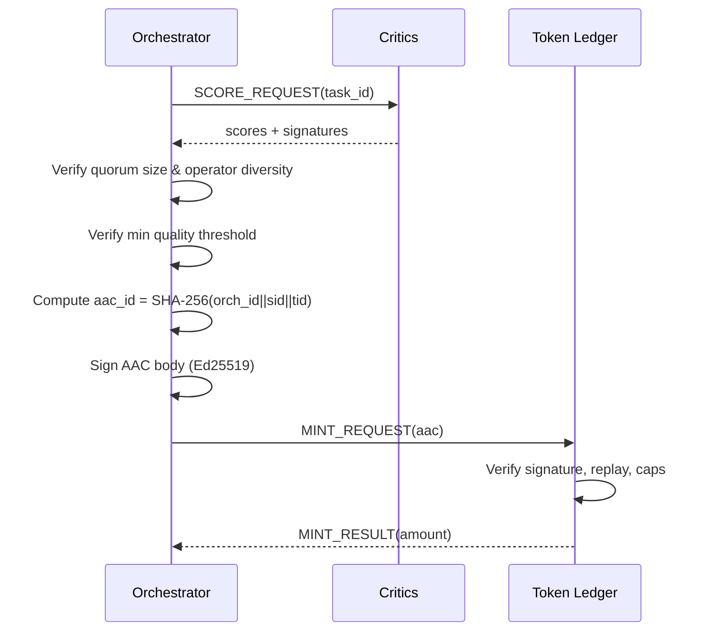
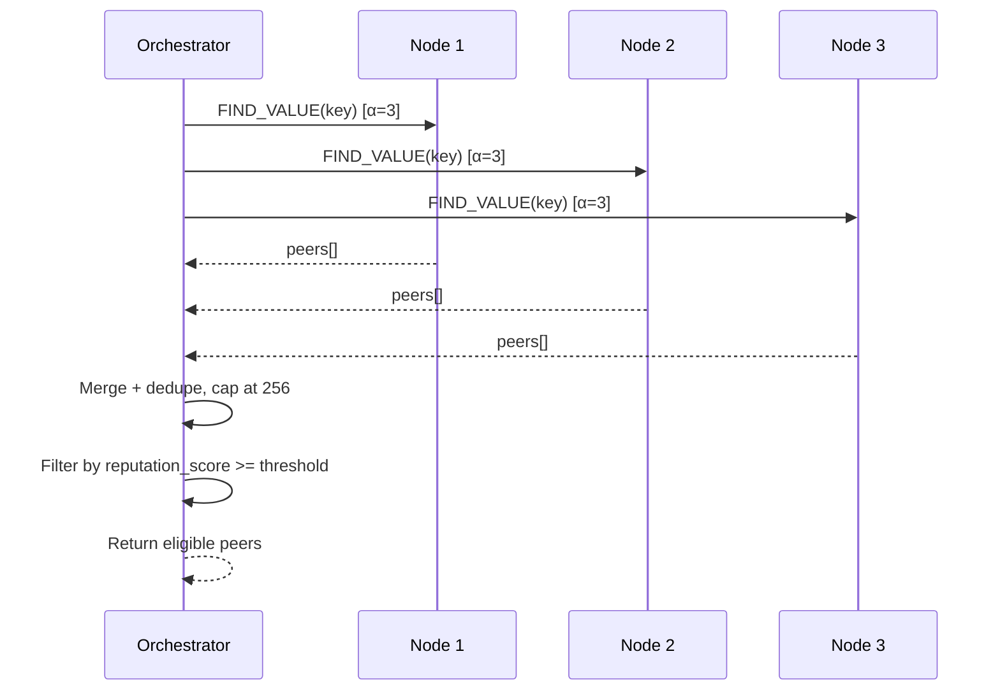
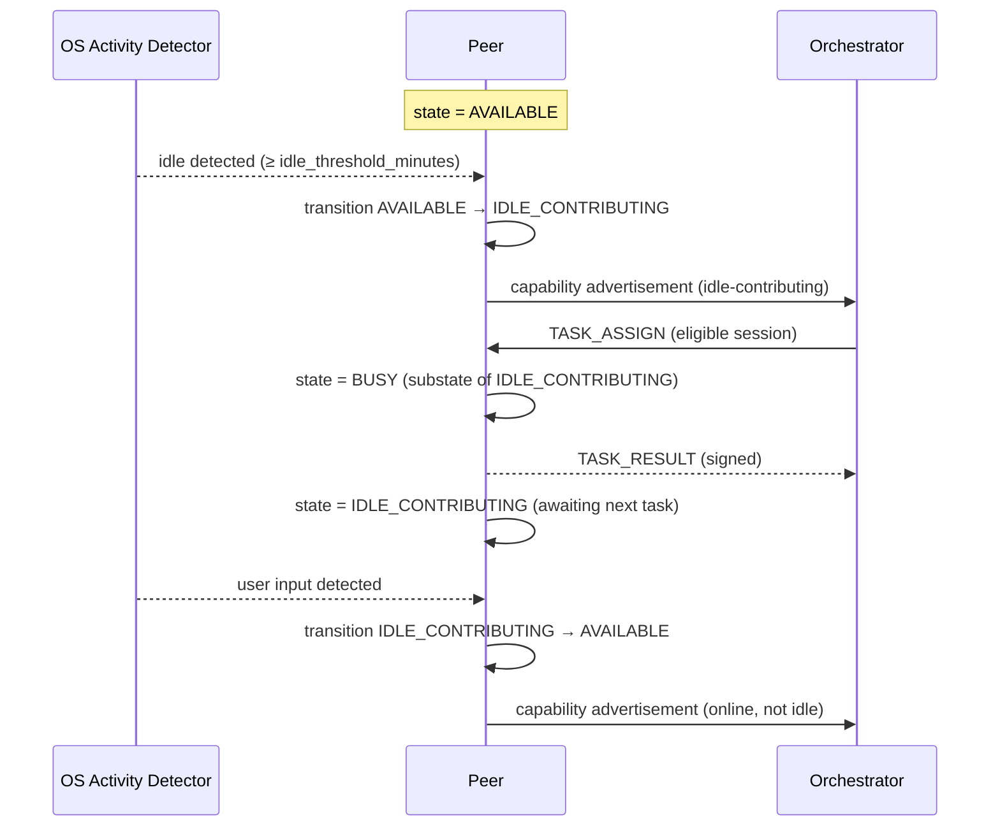
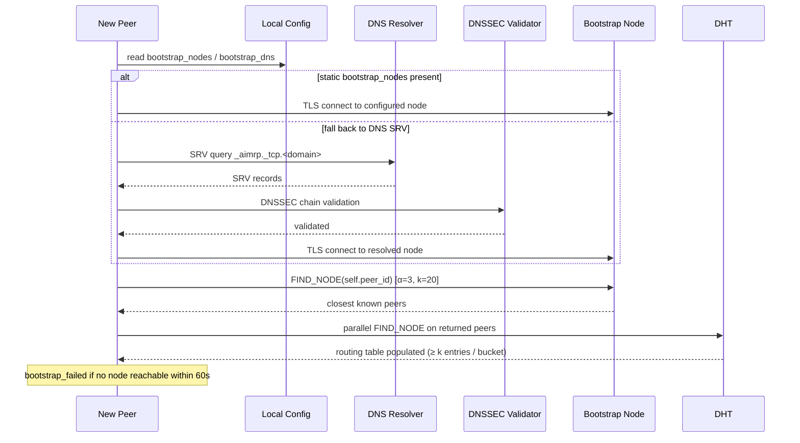

# AI Mesh Reasoning Protocol (AIMRP)

| | |
|---|---|
| **Title** | AI Mesh Reasoning Protocol (AIMRP) |
| **Version** | 0.1 |
| **Status** | Release Candidate 1 |
| **Category** | Standards Track |
| **Date** | 2026-05-01 |
| **Authors** | TBD |

## Status of This Memo

> This Internet-Draft is submitted in full conformance with the provisions of BCP 78 and BCP 79.
>
> Internet-Drafts are working documents of the Internet Engineering Task Force (IETF). Note that other groups may also distribute working documents as Internet-Drafts. The list of current Internet-Drafts is at https://datatracker.ietf.org/drafts/current/.
>
> Internet-Drafts are draft documents valid for a maximum of six months and may be updated, replaced, or obsoleted by other documents at any time. It is inappropriate to use Internet-Drafts as reference material or to cite them other than as "work in progress."

## Copyright Notice

> Copyright (c) 2026 AIMRP Contributors and the persons identified as the document authors. All rights reserved.
>
> This document is licensed under the Creative Commons Attribution 4.0 International License (CC-BY-4.0). Reference implementations and code samples within this document are additionally licensed under the Apache License, Version 2.0.

## Abstract

This document specifies the AI Mesh Reasoning Protocol (AIMRP), a peer-to-peer
protocol for distributed AI reasoning that operates without a central server.
AIMRP defines peer identity, capability discovery over a Kademlia-based DHT,
session lifecycle and task orchestration, a mandatory contribution-token
fairness model with Accepted Answer Certificates (AAC), a baseline reputation
model, and protocol security requirements. The protocol targets interoperable
deployments across private, semi-public, and public networks.

## 1. Purpose and Scope

AIMRP defines a peer-to-peer protocol for distributed AI reasoning without a central server.
Each peer contributes model capabilities and participates in collaborative reasoning sessions.

This document defines:
- Peer identity and trust model
- Wallet identity and spend authorization model (§3.4)
- Capability discovery over DHT
- Session lifecycle and task orchestration
- Mutual Compute Barter (MCB) bootstrap mode for zero-balance peers (§7.6)
- Mandatory contribution-token fairness model with Accepted Answer Certificates (AAC)
- Baseline reputation model (quality and routing signal)
- Protocol security requirements

The contribution-token fairness model is normative in this specification and is REQUIRED for interoperable deployments.

> **RC1 revision notice**: This RC1 revision introduces the wallet model (§3.4), MCB sessions (§7.6), `IDLE_CONTRIBUTING` state (§7.5.1), and the path-B open-door clause (§22.9). It is not wire-compatible with earlier 0.1 drafts.

**Economic and operational identity are decoupled.** Operational identity is the per-host `peer_id` (§3.1) and governs routing, reputation, and per-host rate limiting. Economic identity is the `wallet_id` (§3.4) and governs CTU balances, mint targets, fairness ratios, and Sybil caps that span multiple hosts under one user. A single user MAY operate multiple peer hosts and consolidate the resulting CTU into one wallet; conversely, a single wallet MAY authorize multiple peer keys to spend on its behalf within explicit limits (§3.4.3).

**MCB bootstrap (default entry mode for new peers).** A newly joined peer with `balance_ctu = 0` MUST be able to participate in the network without first earning CTU. The Mutual Compute Barter (MCB) protocol defined in §7.6 provides atomic, in-session, mint-free work exchange between two peers. MCB is the default entry mode for new peers and is the documented path to becoming AAC-eligible (§7.6.6); the protocol does not provide free CTU grants.

Out of scope for this version:
- Final production BFT wire format
- SLA and fiat billing semantics
- Peer-to-peer CTU transfer between wallets (path B; see §22.9)

### 1.1 Conventions and Terminology

The key words "MUST", "MUST NOT", "REQUIRED", "SHALL", "SHALL NOT", "SHOULD", "SHOULD NOT", "RECOMMENDED", "NOT RECOMMENDED", "MAY", and "OPTIONAL" in this document are to be interpreted as described in BCP 14 [RFC2119] [RFC8174] when, and only when, they appear in all capitals, as shown here.

## 2. System Model

### 2.1 Peer

A peer is a network participant with:
- Ed25519 keypair
- Network endpoints (HTTP/JSON-first in v0.1)
- At least one role: planner, reasoner, critic, retriever
- Model execution capability (local or remote provider)

### 2.2 Orchestrator

The orchestrator is a logical component that:
- Creates sessions
- Finds suitable peers by role/capability
- Assigns tasks
- Aggregates and evaluates results
- Produces final answer via consensus

The orchestrator may run as a standalone process or be co-hosted with a peer.

### 2.3 Session

A session is identified by `session_id` (UUID) and contains:
- Problem statement
- Planned task steps
- Assigned peers
- Intermediate and final outputs

## 3. Identity and Security

### 3.1 Key Material

- Every peer MUST generate an Ed25519 keypair.
- `peer_id` MUST be derived from the public key hash.
- Private keys MUST NOT be transmitted over the network.

### 3.2 Signed Messages

The following message families MUST be signed:
- MANIFEST
- SESSION_INIT (or equivalent transport payload)
- TASK_RESULT

Each signed payload MUST include:
- `signature`
- `pubkey` (or stable key reference)
- `timestamp`
- `nonce` (or equivalent anti-replay field)

Receivers MUST verify signature validity before processing.

#### 3.2.1 Canonical Serialization Algorithm

Before signing, the payload MUST be serialized to canonical form:

1. Serialize the payload object to JSON (UTF-8 encoded **without BOM**).
2. **Sort all object keys alphabetically** in lexicographic byte order over the UTF-8 codepoint encoding (recursive — nested objects also sorted).
3. **Remove all insignificant whitespace** (no spaces, no newlines, no indentation; only the single-byte separators `,` and `:` MAY appear).
4. **Exclude the `signature` field** from the serialized representation (omit the key and value entirely).
5. **Exclude `null` fields** — fields with null/undefined values MUST NOT appear in the canonical form.
6. **Unicode normalization (normative)**: All string values MUST be normalized to Unicode Normalization Form C (NFC) per Unicode Standard Annex #15 prior to UTF-8 encoding. Verifiers that observe non-NFC strings in a payload presented for signature MUST treat the payload as non-conforming and MUST fail signature verification.
7. **Numeric serialization (normative)**: Numbers MUST be serialized per [RFC 8785] (JSON Canonicalization Scheme, JCS) numeric rules.
8. **No trailing newline.**

The resulting UTF-8 bytes are the input to the Ed25519 sign operation. Implementations SHOULD use [RFC 8785] (JCS) where available; the additional NFC requirement (rule 6) is normative on top of JCS.

Verification of any signed payload MUST recompute the canonical form before signature check; raw payload comparison is non-conforming. This canonical form is the unique input format for every signed message family in this specification, including PeerManifest (§4.2), wallet attestations (§3.4.2), spend authorizations (§3.4.3), SESSION_INIT / PlanResponse (§6.3, §7.1), SessionAdmissionPlan (§7.4, Appendix D.6a), `/score` ScoreResponse (§6.4), AAC (§11.7.3), MCB envelopes and receipts (§7.6.2), and all paraphrase-cache sync messages (§11.7.13).

**Example** — PeerManifest canonical form:
```json
{"endpoints":[{"address":"localhost:8080","type":"http"}],"models":[{"context_window":128000,"name":"llama3.2:3b"}],"nonce":"550e8400-e29b-41d4-a716-446655440000","peer_id":"a3f9c2...","pubkey":"base64...","reputation_samples":5,"reputation_score":0.42,"roles":["reasoner"],"timestamp":"2026-05-02T00:00:00Z","ttl_seconds":3600}
```

**Verification**: The verifier MUST apply the same canonical serialization before calling Ed25519 verify. If the computed canonical form does not match the signed bytes, verification MUST fail regardless of cryptographic validity.

**Library note**: Do NOT use `System.Security.Cryptography.ECDiffieHellman` for Ed25519. Use `NSec.Cryptography` (`SignatureAlgorithm.Ed25519`) or `BouncyCastle` (`Ed25519Signer`).

Signed payloads SHOULD include the optional fields `signature_algorithm` (default `"ed25519"`) and `hash_algorithm` (default `"sha-256"`) per §11.13. Verifiers MUST honour these fields when present and reject unknown values per `signature_algorithm_unsupported`.

#### 3.2.2 Timestamp Discipline (Normative)

All timestamps in AIMRP signed payloads MUST conform to:

1. **Format**: RFC 3339 [RFC3339] with mandatory UTC offset `Z` (e.g., `2026-05-02T14:30:00Z`). Local-time offsets, omitted offsets, or epoch integers MUST be rejected as `timestamp_format_invalid`.
2. **Resolution**: second precision REQUIRED; sub-second precision (up to milliseconds) OPTIONAL. Implementations MUST round to milliseconds; nanosecond precision MUST NOT be used.
3. **Time source**: implementations SHOULD synchronize via NTS [RFC8915]; NTPv4 [RFC5905] is the minimum baseline.
4. **Acceptable clock skew** for `issued_at`:
   - ±300s for AAC, PlanResponse, SessionAdmissionPlan, SESSION_INIT.
   - ±600s for PeerManifest.
   - ±60s for MCB receipts.
   Out-of-skew → `timestamp_skew_exceeded`.
5. **Leap seconds**: UTC with smear-leap-second policy (no `:60` value).
6. **Expiration**: payloads past `expires_at` MUST be rejected regardless of skew tolerance.

### 3.3 Threat Model

Primary threats:
- Replay attacks (within and across orchestrators)
- Peer impersonation
- Sybil identities (including IP and ASN rotation)
- Malicious or low-quality task outputs
- Malicious or unauthenticated orchestrator issuing forged AACs
- Contribution farming (low-entropy and paraphrase variants)
- Token usage inflation by reasoner peers
- Quorum collusion and quorum domination

Mitigations:
- Signature verification on critical messages
- Timestamp and nonce checks
- Reputation-weighted scoring
- Mandatory orchestrator authentication (§11.4) and AAC orchestrator signature
- VRF-based quorum selection (§7.4) and per-pair collusion detection (§11.7.7)
- IP-subnet and ASN reputation aggregation (§11.6.7)
- Orchestrator-side `usage_units` recomputation (§11.7.4)
- Entropy and semantic-similarity farming detection (§11.7.7)
- Allowlist/bootstrapping policy per deployment

**peer_id Derivation**  
`peer_id` is the hex-encoded SHA-256 digest of the peer's Ed25519 public key (raw bytes, no prefix).  
Example: `"peer_id": "a3f9c2d1e5b8f4a7c0d3e6b9f2a5c8d1e4b7f0a3c6d9e2b5f8a1c4d7e0b3f6a9"`

#### Session and Task ID Format

- **`session_id`**: UUID v4, represented as a lowercase hyphenated string, e.g. `"550e8400-e29b-41d4-a716-446655440000"`. Generated by the orchestrator at session creation. Maximum length: 36 characters.
- **`task_id`**: UUID v4, same format. For tasks derived from a plan step, the orchestrator uses the `step_id` returned by the planner as the `task_id`. Maximum length: 36 characters.
- **`nonce`**: UUID v4, same format. Generated fresh for each signed message. Scope: per peer, per TTL window. A peer MUST reject a second message with an identical nonce received within the `ttl_seconds` window of the first. Nonces are NOT globally unique across peers.
- **`timestamp`**: RFC 3339 UTC timestamp with `Z` offset (per §3.2.2). The receiver MUST reject messages whose `issued_at` exceeds the per-message-class skew tolerance defined in §3.2.2 #4.

### 3.4 Wallet Identity and Spend Authorization

AIMRP separates economic identity (the wallet) from operational identity (the per-host peer key). This section defines the wallet master keypair, the attestation that binds an operational `peer_id` to a wallet, and the delegated spend authorization that allows a peer key to consume CTU from its wallet under explicit limits.

#### 3.4.1 Wallet Identifier (Normative)

A wallet is identified by its master Ed25519 public key.

- `wallet_master_keypair` MUST be an Ed25519 keypair generated and stored separately from any `peer_id` keypair (§3.1). Compromise of a `peer_id` private key MUST NOT compromise the wallet master key.
- `wallet_pubkey` is the raw 32-byte Ed25519 public key of the wallet master key.
- `wallet_id := hex(SHA-256(wallet_pubkey))` — lowercase hex, 64 characters, identical encoding rules to `peer_id`.
- `wallet_id` MUST be stable for the lifetime of the wallet master key. Rotation of the wallet master key produces a new `wallet_id` and MUST NOT carry forward CTU balance, debt, fairness ratios, or attestations from the prior `wallet_id` automatically.

#### 3.4.2 Wallet Attestation (Normative)

A `wallet_attestation` cryptographically binds an operational `peer_pubkey` to a `wallet_id`.

```
wallet_attestation := base64(Ed25519_sign(
    wallet_master_privkey,
    canonical_bytes({"peer_pubkey": <base64>, "wallet_id": <hex>, "issued_at": <rfc3339-utc>})
))
```

Normative rules:
1. The signed body MUST be canonicalized per §3.2.1 before signing.
2. The orchestrator and any verifier MUST verify the attestation against `wallet_pubkey` recovered from `wallet_id` (or from a published wallet manifest). Verification failure MUST be reported as `wallet_attestation_invalid` (HTTP 401, §11.10/§14.1).
3. A `wallet_attestation` is non-transferable across `peer_pubkey` values. A peer that presents another peer's attestation MUST be rejected.
4. A wallet MAY revoke a previously attested `peer_id` by publishing a signed `WalletRevocation` (§6.5.2). After revocation, AAC mints to that `peer_id` MUST be ignored by all orchestrators that have observed the revocation.

#### 3.4.3 Spend Authorization (Normative)

A `spend_authorization` allows a `peer_pubkey` to spend CTU from a wallet up to a daily limit, without requiring the wallet master key on the host.

Structure:

```json
{
  "wallet_id": "<hex64>",
  "peer_pubkey": "<base64>",
  "daily_limit_ctu": <int>,
  "expiry": <rfc3339-utc>,
  "issued_at": <rfc3339-utc>,
  "nonce": "<uuid v4>",
  "signature": "<base64>"
}
```

Normative rules:
1. `signature` MUST be an Ed25519 signature produced by the wallet master key over the canonical body (§3.2.1) excluding `signature`.
2. `daily_limit_ctu` MUST be a non-negative integer. The orchestrator MUST track per-(wallet_id, peer_pubkey) rolling 24h spend and reject any SESSION_INIT that would push the rolling sum above `daily_limit_ctu` with `spend_authorization_expired` only if `expiry < now`; otherwise reject with `insufficient_balance`.
3. `expiry` MUST be a RFC 3339 UTC timestamp with `Z` offset (see §3.2.2) not more than 30 days after `issued_at`. Any presentation after `expiry` MUST be rejected with `spend_authorization_expired` (HTTP 403).
4. SESSION_INIT messages (§7.1) MUST be signed by either (a) the wallet master key directly, or (b) an attested `peer_key` accompanied by a valid, unexpired `spend_authorization` referencing the SESSION_INIT's `wallet_id`.
5. Revocation: a wallet MAY revoke an outstanding `spend_authorization` by publishing a `WalletRevocation` (§6.5.2) referencing the authorization `nonce`.

## 4. Discovery and DHT

### 4.1 Discovery Mechanism

AIMRP uses DHT-based discovery (Kademlia-compatible design) to:
- Publish peer manifests
- Lookup peers by role and capability hints

The reference implementation uses a pure .NET Kademlia stack behind an `IDhtClient` abstraction.

### 4.2 Peer Manifest Record

DHT key:
- `aimrp:peer:{peer_id}`

Example value (JSON/CBOR canonical form):

```json
{
  "peer_id": "string",
  "pubkey": "base64",
  "wallet_id": "hex64",
  "wallet_attestation": "base64",
  "endpoints": [
    { "type": "http-json", "address": "host:port" }
  ],
  "roles": ["planner", "reasoner"],
  "models": [
    {
      "name": "llama-3.2-3b",
      "family": "llama",
      "context_window": 8192,
      "max_tokens": 1024,
      "avg_latency_ms": 200,
      "tokenizer_id": "huggingface/meta-llama/Llama-3.2-3B@a1b2c3d"
    }
  ],
  "contribution_mode": "idle_only",
  "activity_detection_mode": "os_input",
  "idle_threshold_minutes": 5,
  "max_concurrent_tasks": 2,
  "shutdown_grace_period_seconds": 30,
  "reputation_score": 0.42,
  "reputation_samples": 17,
  "timestamp": "2025-01-01T00:00:00Z",
  "nonce": "random-string",
  "signature": "base64"
}
```

**`tokenizer_id` (REQUIRED, normative)**: Each entry in `models` MUST include a `tokenizer_id`. The format MUST be one of:

- `tiktoken/<encoding>` (e.g., `tiktoken/cl100k_base`)
- `huggingface/<repo>@<commit_hash>` (e.g., `huggingface/meta-llama/Llama-3.2-3B@a1b2c3d`)
- `custom/<identifier>`

This identifier is used by the orchestrator to recompute `usage_units` against the same tokenizer family as the executing model (§11.7.4).

**`wallet_id` (REQUIRED, normative)**: 64-char lowercase hex per §3.4.1. The manifest MUST declare the wallet to which mint events for this peer's accepted answers (§11.7.3) are credited. A manifest missing `wallet_id` MUST be rejected by DHT validators and orchestrators with `manifest_invalid`.

**`wallet_attestation` (REQUIRED, normative)**: Base64-encoded Ed25519 signature per §3.4.2 binding `pubkey` (the peer's operational key) to `wallet_id` under the wallet master key. Validators MUST verify the attestation before storing the manifest in the DHT. Verification failure MUST be reported as `wallet_attestation_invalid` (HTTP 401) and the manifest MUST be treated as `manifest_invalid` for DHT publication purposes.

**Idle contribution fields (OPTIONAL, normative when present)**: When advertised, the following fields configure the peer's IDLE_CONTRIBUTING behavior (§7.5.1):

- `contribution_mode` MUST be one of `idle_only`, `always`, `never`. Default: `idle_only`.
- `activity_detection_mode` (OPTIONAL) MUST be one of `os_input`, `process_cpu`, `explicit_api`, `headless`. Default: `headless` if not advertised. Semantics are normatively defined in §7.5.3. Peers in `contribution_mode = idle_only` MUST advertise a value other than `headless` unless they are dedicated headless contributors. Peers in `contribution_mode = always` MUST be treated by orchestrators as `activity_detection_mode = headless`.
- `idle_threshold_minutes` MUST be a non-negative integer. Default: `5`.
- `max_concurrent_tasks` MUST be a positive integer. Default: `2` for hosts in `idle_only` mode; otherwise the §16.1 default applies.
- `shutdown_grace_period_seconds` MUST be a non-negative integer not exceeding `30`. Default: `30`.

**`content_classifier_version` (OPTIONAL, normative)**: Identifier of the content-class classifier version used by this peer for entropy-based farming detection (§11.7.7 #4). Default: `"unicode-block-v1"`. Orchestrators MAY use this value to align per-class thresholds across deployments.

### 4.3 Lookup Semantics

Logical lookup examples:
- `find_peers(role=planner)`
- `find_peers(role=reasoner, max_latency_ms<300)`
- `find_peers(model_name~"llama")`

#### DHT Key Format (Normative)

All DHT keys use the following format:

| Record type | DHT key format | Value |
|---|---|---|
| Peer manifest | `aimrp:peer:<peer_id>` | Serialized and signed `PeerManifest` (JSON or proto3 binary) |
| Role index (per-peer sub-key) | `aimrp:role:<role_name>:<peer_id>` | `{ "peer_id": "<peer_id>", "endpoint": "<https-url>", "ttl": <epoch> }` |
| IP rate-limit flag | `aimrp:iplimit:<sha256_of_ip>` | `{ "peer_ids": ["..."], "blocked_until": <rfc3339-utc>, "reason": "per-ip-limit" }` — written by DHT nodes, TTL 86400s |
| Sybil report | `aimrp:sybil:<peer_id>` | `{ "reported_by": "<peer_id>", "evidence": "role-flooding\|self-scoring\|liveness-fail", "timestamp": <rfc3339-utc> }` — TTL 86400s |

**Role index (normative)**: The role index in the DHT MUST be implemented as a Kademlia set, NOT a single read-modify-write value. Each peer publishes its own sub-key:

```
Key:   aimrp:role:<role_name>:<peer_id>
Value: { "peer_id": "<peer_id>", "endpoint": "<https-url>", "ttl": <epoch> }
TTL:   3600 seconds (republished by peer every 1800s)
```

Aggregation by lookup: orchestrator queries the prefix `aimrp:role:<role_name>:*` (Kademlia iterative bucket walk) to enumerate active peers. A cap of 256 peers per role is enforced by the orchestrator post-lookup via reputation-sorted truncation. This eliminates atomic read-modify-write hazards on a shared key.

**Lookup flow**: To find peers for a role, the orchestrator enumerates `aimrp:role:<role_name>:*`, then looks up `aimrp:peer:<peer_id>` for each enumerated peer_id to retrieve the full manifest.

**Key encoding**: All DHT keys are UTF-8 strings. `peer_id` in the key uses the same 64-char hex format as elsewhere. `role_name` is lowercase, e.g. `aimrp:role:reasoner:<peer_id>`.

#### 4.3.1 Kademlia Parameters (Normative)

The DHT layer MUST be a Kademlia DHT with the following pinned parameters. Implementations MUST NOT alter these values; they are part of the wire-level interoperability contract.

| Parameter | Value | Description |
|---|---|---|
| `k` (bucket size) | `20` | Maximum number of contacts per k-bucket. |
| `α` (concurrency) | `3` | Number of parallel asynchronous lookups issued per iteration of an iterative `FIND_NODE` / `FIND_VALUE`. |
| `replication_factor` | `8` | Number of distinct peers that MUST store each `(key, value)` record. |
| `republish_interval` | `3600` seconds | Owner re-publishes records to maintain the replication factor; matches the default manifest TTL. |
| `bucket_refresh_interval` | `3600` seconds | Inactive k-buckets MUST be refreshed via lookup of a random ID in the bucket range. |
| `lookup_timeout` | `5` seconds | Per-RPC timeout for `PING` / `FIND_NODE` / `FIND_VALUE` / `STORE`. |

**Distance metric (normative)**: The peer ID space is `256` bits. `peer_id_bits := SHA-256(peer_pubkey)` (the same 32-byte digest whose hex form is the public `peer_id`). The Kademlia distance between two identifiers `x` and `y` is `distance(x, y) := x XOR y` interpreted as a 256-bit big-endian unsigned integer. All routing-table placement, lookup ordering, and `replication_factor` peer selection MUST use this metric.

**Record key hashing (normative)**: For DHT operations (`STORE`, `FIND_VALUE`), the routing key derived from a string DHT key (e.g., `aimrp:peer:<peer_id>`) is `SHA-256(utf8(dht_key))`, also a 256-bit identifier in the same XOR space.

**Refresh and republication (normative)**: A peer MUST refresh any k-bucket that has not been used for `bucket_refresh_interval` by issuing a `FIND_NODE` for a random ID within the bucket range. A record owner MUST re-publish each owned `(key, value)` pair every `republish_interval`, and MUST honor record TTL eviction at the storing nodes.

### 4.4 DHT Bootstrap Discovery (Normative)

A peer joining for the first time MUST discover ≥1 bootstrap DHT node via:

1. **Explicit configuration**: `bootstrap_nodes` array of `{address, port, peer_id}`. Tried first.
2. **DNS SRV records** [RFC2782]: `_aimrp-dht._tcp.<network-domain>`. Honour priority/weight.
3. **DNSSEC validation** [RFC4033]: SRV records SHOULD be DNSSEC-validated. Unvalidated records MAY be used in `aimrp-open` only.
4. **Well-known fallback list**: hardcoded community-operated bootstrap nodes (configurable, overridable).
5. **mDNS** [RFC6762]: LAN deployments MAY use service type `_aimrp-dht._tcp.local`.

After connecting to ≥1 bootstrap node, peer MUST perform Kademlia FIND_NODE on its own peer_id. Bootstrap nodes MUST NOT be treated specially after initial join.

If all mechanisms fail within 60s, peer MUST fail startup with `bootstrap_failed`.

## 5. Entry Requirements

A peer is eligible for orchestration if it:
- Publishes a valid signed manifest
- Exposes at least `/infer`
- Responds within configured liveness window

Orchestrators MAY ignore peers that fail validation or liveness checks.

## 6. Peer API (HTTP/JSON-first)

Transport binding for v0.1 is HTTP/JSON-first.
Message schema should remain portable to future gRPC transport.
All HTTP requests and responses MUST include `AIMRP-Version: 0.1`.

### 6.0 Common Rules

- Per [RFC6648], the `X-` prefix MUST NOT be used for AIMRP-defined custom headers. AIMRP 1.0 uses bare custom header names exclusively (e.g., `AIMRP-Version`, `AIMRP-Priority`, `AIMRP-Fairness-Ratio-7d`). The `X-AIMRP-*` form MUST NOT appear in conforming implementations.
- All requests MUST include header `AIMRP-Version: 0.1`. Requests missing this header MUST be rejected with HTTP 400 and error code `version_unsupported`.
- All responses MUST include header `AIMRP-Version: 0.1`.
- Request bodies MUST be `Content-Type: application/json; charset=utf-8`.
- Maximum request body size: 4 MB. Larger requests MUST be rejected with HTTP 400.
- All endpoints that accept a `role` field MUST validate it against the peer's advertised roles. Non-matching roles return `invalid_request`.

### 6.1 GET /capabilities

Response example:

```json
{
  "peer_id": "a3f9c2d1e5b8f4a7c0d3e6b9f2a5c8d1e4b7f0a3c6d9e2b5f8a1c4d7e0b3f6a9",
  "roles": ["planner", "reasoner"],
  "models": [
    {
      "name": "llama3.2:3b",
      "family": "llama",
      "context_window": 128000,
      "max_tokens": 4096
    }
  ],
  "endpoints": [
    { "type": "http", "address": "localhost:8080" }
  ],
  "protocol_versions": ["0.1"],
  "compliance_level": "aimrp-open",
  "pubkey": "base64-encoded-ed25519-public-key"
}
```

**Normative fields:**
- `peer_id` (string, REQUIRED): hex-encoded SHA-256 of Ed25519 public key, 64 lowercase hex chars.
- `roles` (array of string, REQUIRED): at least one of: `planner`, `reasoner`, `critic`, `retriever`.
- `models` (array, REQUIRED): at least one model entry.
- `protocol_versions` (array of string, REQUIRED): versions this peer supports, e.g. `["0.1"]`.
- `pubkey` (string, REQUIRED): base64-encoded raw Ed25519 public key bytes (32 bytes → 44 base64 chars).
- `endpoints` (array, REQUIRED): at least one entry with `type` and `address`.
- `compliance_level` (string, OPTIONAL): one of `aimrp-open`, `aimrp-safe`, `aimrp-strict`.

**`GET /capabilities` is NOT signed.** It is informational. The authoritative identity is in the DHT manifest (which IS signed).

### 6.2 POST /infer

Request example:

```json
{
  "session_id": "uuid",
  "task_id": "uuid",
  "prompt": "string",
  "max_tokens": 512,
  "role": "reasoner",
  "orchestrator_signature": "MEUCIQDx...=="
}
```

Response example:

```json
{
  "task_id": "uuid",
  "completion": "string",
  "confidence": 0.82,
  "usage": { "prompt_tokens": 123, "completion_tokens": 256 },
  "signature": "base64"
}
```

Response fields:

**`confidence`** (number, [0.0, 1.0]): Estimated answer confidence. Computed by the model adapter as:

```
confidence = clamp(exp(mean(token_logprobs_completion_only)), 0.0, 1.0)
```

where `token_logprobs_completion_only` excludes prompt tokens.

If the model does not expose logprobs:

```
confidence := 0.75   (heuristic)
confidence_source := "heuristic"
```

Else:

```
confidence_source := "logprob"
```

AIMRP-Strict orchestrators MUST treat `confidence_source = "heuristic"` as `confidence = 0.5` for consensus weighting. The orchestrator uses this value as a weight input to the weighted-majority consensus formula.

### 6.3 POST /plan

Request example:

```json
{
  "session_id": "uuid",
  "problem": "string",
  "context": "string",
  "orchestrator_signature": "MEUCIQDx...=="
}
```

Response example:

```json
{
  "session_id": "uuid",
  "steps": [
    {
      "step_id": "uuid",
      "description": "Analyze requirements",
      "suggested_role": "reasoner"
    }
  ],
  "signature": "base64"
}
```

### 6.4 POST /score

Request example:

```json
{
  "session_id": "uuid",
  "task_id": "uuid",
  "answer": "string",
  "criteria": ["logic", "factuality"],
  "orchestrator_signature": "MEUCIQDx...=="
}
```

Response example:

```json
{
  "task_id": "uuid",
  "scores": { "logic": 0.9, "factuality": 0.7 },
  "overall": 0.8,
  "signature": "base64"
}
```

**`overall` computation (normative):**

`overall` is the **arithmetic mean** of all requested criterion scores:

```
overall = sum(scores.values()) / len(scores)
```

Example: criteria = [logic=0.9, factuality=0.7, relevance=0.8] → overall = (0.9 + 0.7 + 0.8) / 3 = **0.800**

The peer MUST compute and return `overall`. The orchestrator MUST NOT recompute it — it uses the peer-returned value directly.

**Role restriction**: Only peers advertising the `critic` role MUST serve POST /score. If a non-critic peer receives this request, it MUST return `invalid_request` with message "role not supported".

**`criteria` field**: The request `criteria` array MUST contain at least one value from the scoring criterion registry (Section 20.4). Unknown criteria MUST be ignored (not cause an error). If all criteria are unknown, return `invalid_request`.

### 6.5 Wallet Endpoints

The following endpoints implement the wallet identity and spend authorization model defined in §3.4. Endpoints are exposed by the orchestrator (not by individual peers).

#### 6.5.1 POST /wallet/register

A peer registers an attested mapping `(peer_pubkey → wallet_id)` with the orchestrator's local state. Registration is idempotent per `(wallet_id, peer_pubkey)`.

Request body:

```json
{
  "wallet_id": "<hex64>",
  "peer_pubkey": "<base64>",
  "wallet_attestation": "<base64>",
  "issued_at": <rfc3339-utc>,
  "nonce": "<uuid v4>"
}
```

Normative behavior:
1. The orchestrator MUST verify `wallet_attestation` per §3.4.2. On failure, return HTTP 401 with `wallet_attestation_invalid`.
2. The orchestrator MUST persist `(wallet_id, peer_pubkey, issued_at)` so that subsequent AAC mints (§11.7.3) can be credited to `wallet_id`.
3. Re-registration with a more recent `issued_at` MUST replace the prior record.

Response: HTTP 200 with `{ "wallet_id": "...", "peer_pubkey": "...", "registered_at": <rfc3339-utc> }`.

#### 6.5.2 POST /wallet/revoke

The wallet master key publishes a revocation that severs the binding between a `peer_id` and `wallet_id` and/or revokes a `spend_authorization` by `nonce`.

Request body (signed by wallet master key over canonical form per §3.2.1, excluding `signature`):

```json
{
  "wallet_id": "<hex64>",
  "revoke_peer_id": "<hex64>",
  "revoke_authorization_nonce": "<uuid v4>",
  "issued_at": <rfc3339-utc>,
  "nonce": "<uuid v4>",
  "signature": "<base64>"
}
```

At least one of `revoke_peer_id` or `revoke_authorization_nonce` MUST be present. Both MAY be present.

Normative behavior:
1. The orchestrator MUST verify the signature against `wallet_pubkey` recovered from `wallet_id`. Failure: HTTP 401 with `signature_invalid`.
2. After a successful revocation of `revoke_peer_id`:
   - The orchestrator MUST ignore any subsequent AAC whose `producer_peer_id == revoke_peer_id` for credit to `wallet_id`. Such AACs MUST be persisted for audit but MUST mint zero CTU to the revoked wallet linkage.
   - Pending mints already accrued before revocation MUST settle normally.
3. After a successful revocation of `revoke_authorization_nonce`, the orchestrator MUST reject any SESSION_INIT presenting a `spend_authorization` with that `nonce` with `spend_authorization_expired` (HTTP 403).
4. Revocations MUST be persisted across restarts and SHOULD be propagated through the operator group (§11.8) gossip channel.

Response: HTTP 200 with `{ "revoked_at": <rfc3339-utc> }`.

#### 6.5.3 POST /wallet/authorize_spend

The wallet master key issues a `spend_authorization` for a specific `peer_pubkey`. The orchestrator stores the authorization for use during SESSION_INIT verification.

Request body (signed by wallet master key per §3.4.3):

```json
{
  "wallet_id": "<hex64>",
  "peer_pubkey": "<base64>",
  "daily_limit_ctu": <int>,
  "expiry": <rfc3339-utc>,
  "issued_at": <rfc3339-utc>,
  "nonce": "<uuid v4>",
  "signature": "<base64>"
}
```

Normative behavior:
1. The orchestrator MUST verify the signature per §3.4.3 rule 1. Failure: HTTP 401 with `signature_invalid`.
2. `expiry - issued_at` MUST NOT exceed `30 * 86400`. Otherwise return HTTP 400 with `invalid_request`.
3. The orchestrator MUST persist the authorization keyed by `nonce` and indexed by `(wallet_id, peer_pubkey)` so that SESSION_INIT (§7.1) can validate spend rights.
4. The orchestrator MUST track rolling 24h spend per `(wallet_id, peer_pubkey)` and enforce `daily_limit_ctu`.

Response: HTTP 201 with `{ "nonce": "...", "expiry": <rfc3339-utc>, "daily_limit_ctu": <int> }`.

### 6.6 POST /peer/activity

**Purpose**: application-controlled idle state notification. Used only when peer's `activity_detection_mode = explicit_api` (§7.5.3).

**Authentication**: localhost-only by default (bind 127.0.0.1); if exposed beyond loopback, MUST require Bearer token configured in deployment.

**Request body**:

```json
{
  "idle": true,
  "since": "2026-05-02T14:30:00Z",
  "source": "user-app-name"
}
```

Required: `idle` (boolean), `since` (RFC 3339 UTC, see §3.2.2).
Optional: `source` (string, free-form, for logging).

**Responses**:

- `200 OK`: `{ "accepted": true, "current_state": "AVAILABLE" | "IDLE_CONTRIBUTING" }`
- `400 Bad Request` with `timestamp_format_invalid` if `since` malformed.
- `409 Conflict` with `activity_mode_mismatch` if peer's `activity_detection_mode != explicit_api`.

**Effect**: transitions peer's idle state per §7.5.3; the `idle_threshold_minutes` timer is bypassed when `explicit_api` is the active mode.

### 6.7 Discovery and Diagnostic Endpoints (Normative)

Conforming peers and orchestrators MUST expose the following endpoints in addition to the role-specific endpoints in §6.1–§6.6. These endpoints are unauthenticated unless explicitly noted, and are subject to the rate limits in §16.1.

| Endpoint | Purpose | Specification |
|---|---|---|
| `GET /version` | Protocol version negotiation handshake (supported versions, extensions, deprecation notices). | Full normative definition in §10.5 (in particular §10.5.1). |
| `GET /health` | Liveness and self-downgrade status. | Full normative definition in §16.4.4. |
| `GET /metrics` | Prometheus metrics exposition. | Full normative definition in §16.4.1. |
| `GET /session/{session_id}/partial-state` | Persisted partial work for orchestrator-crash recovery. | Full normative definition in §11.12.1. |

This subsection is a discovery aid only; the binding semantics, request/response shapes, error codes, and authentication requirements are normed in the cross-referenced sections.

## 7. Session Protocol

### 7.1 SESSION_INIT

SESSION_INIT is implemented as the orchestrator calling `POST /plan` on the selected planner peer. There is no separate `/session` endpoint.

**Flow:**
1. Orchestrator generates `session_id` (UUID v4).
2. Orchestrator selects a planner peer (highest reputation among peers advertising `planner` role, with `reputation_samples ≥ 5` or all peers if none qualify).
3. Orchestrator calls `POST /plan` with the `session_id` and goal.
4. Planner responds with an ordered list of `TaskStep` objects (the plan).
5. The planner peer considers itself "in session" from this point — it will accept subsequent `/infer` or `/score` requests bearing the same `session_id`.

**Signed payload for SESSION_INIT**: The `PlanResponse` returned by the planner MUST be signed. The orchestrator MUST verify this signature before proceeding.

### 7.2 TASK_ASSIGN

TASK_ASSIGN is implemented as the orchestrator calling `POST /infer` on the selected reasoner or retriever peer.

**Flow:**
1. For each step in the plan, orchestrator selects an eligible peer (role matches `step.suggested_role`; reputation above threshold).
2. Orchestrator calls `POST /infer` with `session_id`, `task_id = step.step_id`, `prompt = step.description`, and `role`.
3. Peer validates: session_id is not unknown (peers MAY accept any session_id in v0.1 — session tracking is optional), role matches its advertised roles, and prompt passes safety filter.
4. Peer calls `IModelAdapter.CompleteAsync()` and returns signed `InferResponse`.

**Role validation (normative)**: If the `role` field in the request does not match any role the peer advertises in its manifest, the peer MUST return `invalid_request` with message "role not supported by this peer".

**Concurrent sessions**: A peer MAY participate in multiple simultaneous sessions. The limit is `max_concurrent_tasks` (default: 4) across ALL sessions combined — not per session.

### 7.3 TASK_EVAL (Critic Scoring)

TASK_EVAL is implemented as the orchestrator calling `POST /score` on the selected critic peer. It uses the same endpoint as direct scoring, with the `answer` field containing the reasoner's output.

**Flow:**
1. After all reasoner results are collected, orchestrator selects critic peers.
2. Orchestrator calls `POST /score` for each result to be evaluated.
3. Critic peer returns `ScoreResponse` with per-criterion scores and `overall`.
4. The response is signed; orchestrator MUST verify signature.

**No critic available**: If no peers advertising the `critic` role are reachable or above the reputation threshold:
- The orchestrator MUST log a warning.
- The orchestrator MUST proceed to consensus using only `confidence` values (treating `overall` as `0.5` for all candidates).
- The orchestrator MUST NOT fail the session solely due to missing critics.
- The final response MUST include a field `"scored": false` indicating unscored consensus.

### 7.4 CONSENSUS

After scoring, orchestrator runs weighted-majority consensus:

```
weight(answer) = critic_overall × reputation_normalized × confidence
```

Where:
- `critic_overall`: from ScoreResponse (0.5 if no critics available)
- `reputation_normalized`: `(reputation_score + 1.0) / 2.0` — maps [-1,1] to [0,1]
- `confidence`: from InferResponse [0.0, 1.0]

**Answer normalization**: Before weight comparison, answers MUST be lowercased and whitespace-normalized for grouping. For AIMRP-Safe and AIMRP-Strict deployments, semantic deduplication via embedding similarity (cosine `>= 0.92` against the producer's recent-AAC embedding cache, §11.7.7) is REQUIRED before grouping; near-duplicate answers MUST collapse into a single weighted bucket so that paraphrase variants cannot inflate consensus weight.

**Tie-breaking**: If two answers have equal total weight (within floating-point tolerance of 1e-9), the answer from the peer with the higher `reputation_score` wins. If still tied, the answer received first wins.

**Minimum peers for consensus**: weighted majority requires no minimum peer count. A single peer answer is valid (weight = its own score × rep × confidence). PBFT (v0.2) will enforce the 3f+1 minimum.

**VRF-based critic quorum selection (normative)**: The orchestrator MUST select critic peers from the eligible pool using a Verifiable Random Function (VRF) seeded with `H(session_id || task_id || epoch)`, where `H` is SHA-256, `session_id` and `task_id` are the canonical UUID strings, and `epoch` is the integer Unix-seconds timestamp of the orchestrator at quorum-formation time floored to 60-second buckets. Selection MUST NOT be a deterministic ranking by `reputation_score`; reputation MAY be used only as an eligibility gate (above threshold) before VRF sampling. The VRF proof MUST be persisted with the AAC for audit (`vrf_proof` field) so that any verifier can re-derive the quorum from the public seed and the orchestrator pubkey.

### 7.5 Peer and Orchestrator State Machines

This section defines the normative state machines for peers and for orchestrator-managed sessions. Implementations MUST honor the states, triggers, and guard conditions below. Out-of-spec transitions MUST be rejected.

#### 7.5.1 Peer State Machine

A peer cycles between connection, registration, task service, and removal. The `BLOCKED` state is the terminal-by-policy outcome of the graduated exclusion policy in §11.5.2 (Tier 2 or Tier 3).

States (normative):
- `IDLE` — peer process started; no manifest published; no tasks served.
- `REGISTERING` — peer is publishing its `PeerManifest` (§4.2) and corresponding role sub-keys to the DHT and waiting for an initial publish acknowledgement.
- `ACTIVE` — manifest is live in the DHT and the peer is accepting `/infer`, `/plan`, `/score` requests at or below `max_concurrent_tasks`.
- `BUSY` — the peer is at `max_concurrent_tasks`; new task assignments MUST be rejected with `peer_unavailable` (HTTP 503) until at least one in-flight task completes.
- `IDLE_CONTRIBUTING` — operator-side substate of `ACTIVE`: the peer is detected as user-idle (no local user activity for at least `idle_threshold_minutes`, default 5) and the manifest declares `contribution_mode` of `idle_only` or `always` (§4.2). The peer accepts AAC-eligible work in this state and contributes to mints crediting `wallet_id` (§11.7).
- `LEAVING` — the peer is draining (refusing new tasks; finishing in-flight tasks; preparing manifest withdrawal).
- `BLOCKED` — the peer has hit Tier 2 or Tier 3 of §11.5.2 and MUST refuse all requests with HTTP 403 / 429 per the tier policy.

Transitions (normative; `trigger / guard`):



Per-state response policy (normative):
- `IDLE`, `REGISTERING`, `LEAVING` (post-drain): inbound `/infer`, `/plan`, `/score` MUST return `peer_unavailable` (HTTP 503).
- `BUSY`: new assignments MUST return `peer_unavailable` (HTTP 503) with `Retry-After` per §16.1.
- `IDLE_CONTRIBUTING`: behaves identically to `ACTIVE` for inbound requests; the only distinction is operator-visible (the peer is contributing during user-idle time per its `contribution_mode`).
- `BLOCKED`: requests MUST return HTTP 403 (`invalid_request` with `details.reason = "source blocked"`) for Tier 2 or HTTP 429 (`rate_limited`) for Tier 1 escalations, both with `Retry-After` per §11.5.2 and §S9 of this document (§16).

Cross-references: §4.2 (manifest), §11.5.2 (graduated exclusion), §16.1 (rate limits).

#### 7.5.2 Orchestrator Session State Machine

Each session managed by the orchestrator follows a strict state progression from creation through settlement. The state machine MUST be authoritative for routing, scoring, mint, and ledger writes.

States (normative):
- `INIT` — `session_id` allocated; client admission and pre-authorization in progress (§11.7.5, §11.7.6).
- `PLANNING` — orchestrator has called `POST /plan` on the planner peer (§7.1) and is awaiting the signed `PlanResponse`.
- `EXECUTING` — orchestrator is dispatching `POST /infer` to assigned peers per the plan (§7.2).
- `SCORING` — all reasoner results received; orchestrator is dispatching `POST /score` to critic peers (§7.3).
- `CONSENSUS` — orchestrator runs weighted-majority consensus and (for `aimrp-safe` and `aimrp-strict`) AAC quorum validation (§7.4, §11.7.3).
- `SETTLED` — final answer returned to client; AAC issued (when applicable); mint and spend persisted to ledger (§11.7.4, §11.7.5).
- `FAILED` — session terminated due to a non-recoverable error (e.g., `acceptance_invalid`, `quorum_collusion_detected`, `usage_inflation_detected`); no AAC issued; pre-authorization hold released.
- `ABANDONED` — `hold_ttl` elapsed before reaching SESSION_CLOSE (§16.2); pre-authorization refunded; abandonment counter incremented per `client_id`.

Transitions (normative):



Invariants (normative):
- Mint operations (§11.7.4) MUST be performed only on the `CONSENSUS → SETTLED` transition.
- Reputation deltas (§8.1) MUST be applied no earlier than `SCORING → CONSENSUS`.
- Pre-authorization holds MUST be released on every `* → FAILED` and `* → ABANDONED` transition.
- The state of every session MUST be persisted before any external side effect (peer dispatch, AAC issuance, ledger write).

Cross-references: §7.1 (SESSION_INIT / `/plan`), §7.2 (TASK_ASSIGN / `/infer`), §7.3 (TASK_EVAL / `/score`), §7.4 (CONSENSUS), §11.7.3 (AAC quorum), §11.7.4–§11.7.6 (mint, spend, fairness), §16.2 (authorization hold lifecycle).

#### 7.5.3 User Activity Detection (Normative)

This subsection specifies how a peer that runs in `contribution_mode = idle_only` (§4.2) detects user activity for the purpose of entering and leaving the `IDLE_CONTRIBUTING` state defined in §7.5.1.

A peer in `contribution_mode = idle_only` MUST implement at least ONE of the following detection mechanisms and MUST declare the chosen mechanism in its PeerManifest as `activity_detection_mode` (§4.2, Appendix D.1):

- `os_input` — system-level idle timer obtained from the host operating system. Reference APIs: Windows `GetLastInputInfo`; macOS `CGEventSourceSecondsSinceLastEventType`; Linux `XScreenSaverQueryInfo` or the `org.freedesktop.ScreenSaver` D-Bus interface.
- `process_cpu` — local user-process aggregate CPU usage. The threshold MUST be configurable; default `< 5%` averaged over a rolling 60-second window indicates idle.
- `explicit_api` — application-controlled flag set by the local user agent via `POST /peer/activity {"idle": <bool>}` on the peer's local API. The peer MUST accept this endpoint only on loopback or operator-authorized origins.
- `headless` — the peer declares that no interactive user is present (e.g., a dedicated server). A `headless` peer is treated as continuously user-idle and is in `IDLE_CONTRIBUTING` whenever it would otherwise be in `ACTIVE`.

Normative timing rules:

1. The configured `idle_threshold_minutes` (§4.2) MUST be applied to the output of the chosen detection method.
2. The transition `ACTIVE → IDLE_CONTRIBUTING` MUST occur no later than `idle_threshold_minutes + 30 seconds` after the moment the chosen method first reports the user as idle.
3. The transition `IDLE_CONTRIBUTING → ACTIVE` (return on user activity) MUST occur within 2 seconds of the chosen method reporting renewed activity. In-flight tasks MUST be allowed to complete; only new task acceptance is suspended.
4. Peers that advertise `contribution_mode = always` MUST be treated as `activity_detection_mode = headless` regardless of any other declared value.
5. Peers that advertise `contribution_mode = never` MUST NOT enter `IDLE_CONTRIBUTING`. Such peers MAY only serve their own client-initiated sessions and MUST NOT accept AAC-eligible work routed by an orchestrator under the idle-contribution policy.
6. The chosen `activity_detection_mode` MUST NOT be changed for the lifetime of a published manifest; a change requires republication of the manifest with a fresh `nonce` and `timestamp` (§4.2).

Cross-references: §4.2 (manifest fields), §7.5.1 (state machine), §11.7.12 (idle-contributing mint eligibility).

### 7.6 Mutual Compute Barter (MCB) Sessions

#### 7.6.1 Purpose and Eligibility

Mutual Compute Barter (MCB) is a normative, mint-free, 1-on-1 atomic work-exchange protocol that allows peers with `balance_ctu = 0` (in particular newly joined peers) to participate in the network before becoming AAC-eligible (§7.6.6). MCB does not involve an orchestrator, does not produce AACs, does not mint or spend CTU, and does not require quorum.

Eligibility (normative):
- Every peer MUST be capable of initiating and accepting MCB sessions.
- AIMRP-Open MUST support MCB.
- AIMRP-Safe SHOULD support MCB; operators MAY restrict counterpart sets.
- AIMRP-Strict MAY support MCB; an orchestrator-controlled deployment policy MAY disable MCB for hosts under its administrative scope.

#### 7.6.2 Protocol

An MCB session is a three-message exchange (initiation, acceptance, mutual receipt) with parallel execution between the messages.

**Step 1 — `MCB_INIT`** (sent by initiator Alice to counterpart Bob):

```json
{
  "session_type": "mcb",
  "session_id": "<uuid v4>",
  "initiator_wallet_id": "<hex64>",
  "initiator_peer_id": "<hex64>",
  "request_type": "inference",
  "prompt": "...",
  "estimated_cost_units": 5,
  "offered_work_types": ["embedding_batch", "verification_batch", "small_inference"],
  "timestamp": "2026-05-02T14:30:00Z",
  "nonce": "<uuid v4>",
  "signature": "<base64>"
}
```

The signature MUST be produced by `initiator_peer_id`'s private key over the canonical body per §3.2.1.

**Step 2 — `MCB_ACCEPT` or `MCB_REJECT`** (sent by counterpart Bob):

```json
{
  "session_id": "<uuid v4>",
  "decision": "accept",
  "required_work_units": 5,
  "work_request": {
    "type": "embedding_batch",
    "items": ["text1", "text2", "..."],
    "expected_format": "MiniLM-L6-v2-384d-fp32"
  },
  "max_response_seconds": 60,
  "timestamp": "2026-05-02T14:30:00Z",
  "nonce": "<uuid v4>",
  "signature": "<base64>"
}
```

`MCB_REJECT` MUST carry `decision: "reject"` and a `reason` string; no further messages follow.

**Step 3 — Parallel execution.** After `MCB_ACCEPT`, both peers execute in parallel:
- Bob streams its deliverable (e.g., inference completion tokens via Server-Sent Events) to Alice.
- Alice executes Bob's `work_request` and streams results to Bob.

Both deliverables MUST complete within `max_response_seconds` (default 60).

**Step 4 — `MCB_RECEIPT`** (signed by both peers; either peer MAY assemble and broadcast):

```json
{
  "session_id": "<uuid v4>",
  "alice_received_hash": "<sha256 of Bob's deliverable, hex>",
  "bob_received_hash": "<sha256 of Alice's work output, hex>",
  "outcome": "success",
  "duration_ms": 8400,
  "alice_signature": "<base64 by initiator_peer_id>",
  "bob_signature": "<base64 by counterpart peer_id>"
}
```

`outcome` MUST be one of `success`, `failure`, `timeout`, `atomicity_violation`, `verification_failed`.

#### 7.6.3 Work Units (Normative)

The following table defines normative equivalence between work types and MCB work units. Implementations MUST use these equivalences when computing `estimated_cost_units` and `required_work_units`.

| Work type | 1 unit ≈ |
|---|---|
| Inference 100 tokens (small model 1–3B, CPU) | 1.0 |
| Inference 100 tokens (medium 7B, GPU) | 0.5 |
| 10 embeddings (MiniLM-L6, 384-dim) | 0.5 |
| 100 Ed25519 verifications | 0.1 |
| Cache lookup + serve cached response | 0.05 |
| 1 MB compressed data relay | 0.2 |

Counterpart MAY decline a proposed equivalence by responding with `MCB_REJECT`.

#### 7.6.4 Anti-Abuse Rules (Normative)

1. **Atomicity**: the two deliverables MUST complete within ±20% of each other's wall-clock duration. A peer that observes its counterpart's deliverable completing more than 20% before its own is finished, while its counterpart has stopped sending data, MUST emit `MCB_RECEIPT` with `outcome: "atomicity_violation"` and report `mcb_atomicity_violation` (HTTP 408) to its local audit log.
2. **Verification**: each peer MAY perform a spot-check on a uniformly random 5% sample of the counterpart's deliverable (e.g., re-compute 5% of embeddings and compare with cosine ≥ 0.999, or re-verify 5% of signatures). A mismatch rate ≥ 5% MUST set `outcome: "verification_failed"` and report `mcb_work_verification_failed` (HTTP 422).
3. **Inference asymmetry**: if both `request_type` (Step 1) and the counterpart's offered work type (Step 2) are `inference`, the counterpart MUST instead require a verifiable work type (`embedding_batch`, `verification_batch`, or cached relay). A pure inference-for-inference exchange is not permitted, because inference outputs are not deterministically verifiable.
4. **Per-pair reputation (local only)**: MCB receipts MUST NOT be published to the DHT, the orchestrator's fairness ledger, or any global audit channel. Each peer MUST maintain a local map `mcb_history[counterpart_peer_id] = { success_count, failure_count, avg_duration_ms }` and SHOULD use it to bias future counterpart selection.
5. **Gossip blacklist**: after 3 unfulfilled (`failure`, `timeout`, `atomicity_violation`, or `verification_failed`) MCB sessions with the same counterpart `peer_id` within a rolling 24h window, a peer SHOULD propagate an `mcb_blacklist_warning` over its operator-group gossip channel (§11.8) to its trusted peers. Receivers MUST treat such warnings as advisory, not authoritative.

#### 7.6.5 No CTU Effect

MCB sessions MUST NOT mint CTU and MUST NOT spend CTU. The fairness ledger (§11.7.2) MUST NOT be modified as a result of an MCB session. No AAC (§11.7.3) is emitted. Wallet balances (`balance_ctu`, `debt_ctu`) MUST remain unchanged.

#### 7.6.6 Promotion to AAC-Eligible

A peer becomes eligible to participate in CTU-economy work (i.e., to produce mint-eligible AAC-bearing answers per §11.7.3 and to spend CTU at SESSION_INIT per §11.7.5) automatically once both of the following hold:

- The peer has accumulated `≥ 10` `MCB_RECEIPT` entries with `outcome: "success"` against `≥ 3` distinct counterpart `wallet_id` values.
- The peer's per-peer success rate `success_count / (success_count + failure_count)` over the rolling 30-day window is `≥ 0.80`.

Promotion is automatic; no manual onboarding step is required. An orchestrator that observes a peer's first AAC SHOULD verify these promotion criteria from the peer's locally reported MCB statistics, but the criteria are not protocol-enforced at the orchestrator level beyond the standard AAC quality gates (§11.7.3).

## 8. Reputation Model

### 8.1 Baseline Formula (v0.1)

`reputation_score` range: [-1.0, 1.0]. Initial value for a new peer: `0.0`.

**Per-task update formula (normative):**

```
delta     = (critic_overall - 0.5) × 0.1
new_score = clamp(old_score + delta, -1.0, 1.0)
```

Where:
- `critic_overall` is the `overall` field from `ScoreResponse` (see §6.4), a float in [0.0, 1.0].
- `delta` ranges from -0.05 (worst score) to +0.05 (best score).
- `clamp(x, min, max)` returns `min` if `x < min`, `max` if `x > max`, else `x`.
- `reputation_samples` is incremented by 1 after each update.

**Example:**
- Old score: `0.30`, critic overall: `0.9` → delta = `+0.04` → new score: `0.34`
- Old score: `0.10`, critic overall: `0.1` → delta = `-0.04` → new score: `0.06`

**Warm-up rule**: Peers with `reputation_samples < 5` MUST be treated as if their score is `0.0` for routing decisions, regardless of their actual score. This prevents reputation gaming on first tasks.

### 8.2 Usage

Orchestrator MAY:
- Filter peers below threshold
- Prefer peers with higher score for critical tasks

## 9. Consensus Roadmap

- v0.1 execution path: weighted majority + reputation
- Strategic direction: BFT-ready architecture
- v0.2 target: BFT-capable consensus module for permissionless/public deployments

## 10. Versioning and Compatibility

### 10.1 Version Scheme

AIMRP uses semantic versioning with the format `MAJOR.MINOR`.

- **MAJOR** increment: breaking changes; interoperability across MAJOR versions is prohibited.
- **MINOR** increment: additive changes within one MAJOR line; all mandatory rules of that MAJOR remain required.
- Patch versions (e.g., `1.0.1`) are editorial and do not affect wire format.

Normative rules:

- Protocol version MUST be present in headers or envelope metadata.
- AIMRP 0.x is draft-only and provides NO backward compatibility guarantees, including across 0.x minor versions. Within MAJOR 0 (draft line), exact-version matching is REQUIRED (`0.1` is not guaranteed compatible with any future `0.x`).
- AIMRP 1.0 introduces a hard compatibility break from all 0.x drafts.
- Implementations claiming AIMRP 1.0 support MUST implement the mandatory token fairness and AAC rules in Section 11.7.
- In AIMRP 1.x, minor versions MUST remain backward compatible within MAJOR 1: a node implementing `1.y` MUST accept requests valid for any `1.x` where `x <= y`.
- Mixed-major sessions are forbidden: all participants in one session MUST use the same MAJOR version.
- If a request arrives with a different MAJOR version, the receiver MUST reject it with `version_unsupported`.

### 10.2 Breaking Changes

A change is classified as **breaking** if it:
- Removes or renames a required field in any message
- Changes the semantics of an existing field
- Removes an existing role or endpoint
- Changes the signature scheme or `peer_id` derivation formula
- Removes an error code from the canonical list
- Alters mint/spend equations, AAC quorum rules, or mandatory fairness admission gates in §11.7

A change is **non-breaking** if it:
- Adds a new optional field (proto3 unknown fields are ignored by default)
- Adds a new error code
- Adds a new role (existing peers ignore unknown roles)
- Adds a new endpoint on the peer

### 10.3 Version Negotiation

All requests MUST include the header:

```
AIMRP-Version: <version>
```

Version negotiation rules:
1. If the peer supports the requested version exactly → respond normally with `AIMRP-Version: <version>`.
2. If `MAJOR >= 1` and the peer supports a compatible minor version in the same MAJOR line → respond with `AIMRP-Version: <peer_version>`.
3. If `MAJOR = 0` and the version is not an exact match → respond HTTP 400 with error code `version_unsupported`.
4. If the peer does not support the MAJOR version → respond HTTP 400 with error code `version_unsupported`.

Peers MUST advertise their supported protocol versions in the `GET /capabilities` response:

```json
{
  "protocol_versions": ["0.1"]
}
```

### 10.4 Mixed-Version Networks

An orchestrator operating in a mixed-version network:
1. Reads `protocol_versions` from each peer's capabilities.
2. Only assigns tasks to peers that share at least one supported version.
3. Uses the highest mutually supported version for each peer-to-peer exchange.
4. Logs version mismatches for operator visibility.

Hard rule: peers on incompatible MAJOR versions MUST NOT be assigned tasks in the same session. Mixed-major sessions are invalid and MUST be rejected at `SESSION_INIT`.

### 10.5 Version Negotiation Handshake (Normative)

This subsection extends §10.3 (`AIMRP-Version` header) and §10.4 (mixed-version networks) with a discovery endpoint, an explicit per-request negotiation contract, a cross-version compatibility matrix, and an extension capability negotiation hook. Peers and orchestrators MUST support runtime version negotiation via the `GET /version` endpoint and the `AIMRP-Version` HTTP header.

#### 10.5.1 Discovery Endpoint

`GET /version` MUST be exposed unauthenticated and MUST return a JSON object with the following shape:

```json
{
  "protocol_version": "1.0",
  "supported_versions": ["1.0", "0.1"],
  "minimum_compatible_version": "1.0",
  "extensions": ["mcb", "idle-contributing", "wallet-pooling", "paraphrase-sync"],
  "deprecation_notices": [
    {"version": "0.1", "deprecated_at": "2026-12-01T00:00:00Z", "removal_at": "2027-06-01T00:00:00Z"}
  ],
  "implementation_id": "<short-string>",
  "implementation_version": "<semver>"
}
```

Fields:

- `protocol_version` — the responder's preferred (highest) AIMRP version.
- `supported_versions` — ordered (highest first) array of every AIMRP version the responder accepts on the wire.
- `minimum_compatible_version` — the lowest version under which the responder will admit a session as a full participant.
- `extensions` — opaque capability identifiers advertised by the responder (see §10.5.4).
- `deprecation_notices` — array of `{version, deprecated_at, removal_at}` entries. Timestamps MUST follow RFC 3339 UTC with `Z` offset (§3.2.2).
- `implementation_id`, `implementation_version` — diagnostic identifiers; receivers MUST NOT make trust decisions based on these fields.

Clients SHOULD cache `GET /version` responses for no more than 300 seconds.

#### 10.5.2 Per-Request Negotiation

Every AIMRP request MUST include header `AIMRP-Version: <version>` (§10.3, §11.11) where `<version>` is one of the responder's `supported_versions`. Servers MUST respond as follows:

- `2xx` — request processed under the negotiated version.
- `400 Bad Request` with error code `version_header_missing` if the header is absent.
- `505 HTTP Version Not Supported` with error code `protocol_version_unsupported` if the requested version is not in `supported_versions`.

Responses MUST echo the negotiated version in the `AIMRP-Version` response header. The legacy single-version behaviour of §10.3 (which returned `version_unsupported` with HTTP 400) remains valid for AIMRP 0.x peers; AIMRP 1.x peers MUST use `protocol_version_unsupported` (HTTP 505) for unknown versions and `version_header_missing` (HTTP 400) for an absent header.

#### 10.5.3 Compatibility Matrix

| Client \\ Server | 0.1 | 1.0 |
|---|---|---|
| 0.1 | OK (legacy, exact match per §10.1) | OK iff server lists `0.1` in `supported_versions`; SessionAdmissionPlan downgraded to the 0.1 feature set |
| 1.0 | server MUST upgrade or reject with `protocol_version_unsupported` | OK (full feature set) |

Cross-version SESSION_INIT MUST use the lower of (`client_version`, `server_version`); features introduced after the lower version (notably wallet pooling, MCB, `IDLE_CONTRIBUTING`) MUST be disabled for that session and MUST NOT appear in the resulting SessionAdmissionPlan.

#### 10.5.4 Extension Capability Negotiation

Optional features advertised in `GET /version#extensions` MAY be required per session via `SessionAdmissionPlan.required_extensions` (an array of extension identifiers). If a producer or critic does not advertise a required extension, the orchestrator MUST either select a different peer or fail session admission with `extension_unsupported` (HTTP 422). Unknown extension identifiers received by a peer MUST be ignored on read but MUST NOT be advertised on write.

#### 10.5.5 Deprecation of Legacy Version Errors (Informative)

The legacy `version_unsupported` (HTTP 400) error code defined in §10.3 / §11.11 remains valid for AIMRP 0.x compatibility. Implementations operating at AIMRP version ≥ 1.0 SHOULD instead emit:

- `version_header_missing` (HTTP 400) when the `AIMRP-Version` request header is absent;
- `protocol_version_unsupported` (HTTP 505) when the requested version is not in `supported_versions`.

The legacy code is preserved for the duration of the 0.x → 1.x migration window only; receivers MUST accept the legacy code on the wire for ingress compatibility but SHOULD prefer the v1.0 codes on egress. After the deprecation window declared in §11.13.3, the legacy code MAY be removed in a future MAJOR version.

## 11. Security and Abuse Scenarios

### 11.1 Replay Attack

Scenario: captured valid message resent later.

Mitigation:
- Reject stale timestamps
- Enforce nonce uniqueness per sender window

### 11.2 Peer Impersonation

Scenario: attacker claims another peer identity.

Mitigation:
- Verify `peer_id` derivation from `pubkey`
- Require signature validation on critical payloads

### 11.3 Sybil Flooding

Scenario: attacker spawns many fake peers.

Mitigation (deployment policy):
- Bootstrapped trust lists
- Reputation warm-up period
- Rate limits and stake/identity extensions in future versions

### 11.4 Orchestrator Authentication (Mandatory)

Orchestrator authentication is MANDATORY for all conforming deployments.

Normative requirements:

1. Every orchestrator MUST hold an Ed25519 `orchestrator_keypair`, distinct from any peer keypair. The corresponding public key MUST be published in the operator group manifest (§11.8.3) or in a deployment-scoped network manifest discoverable via DHT key `aimrp:orchestrator:<orchestrator_id>`, where `orchestrator_id = hex(SHA-256(orchestrator_pubkey))`.
2. SESSION_INIT, TASK_ASSIGN, every `POST /infer`, `POST /plan`, and `POST /score` request, and every issued AAC MUST carry an `orchestrator_signature` produced with the `orchestrator_keypair` over the canonical serialization defined in §3.2.1.
3. Peers MUST verify `orchestrator_signature` on every inbound SESSION_INIT, TASK_ASSIGN, `POST /infer`, `POST /plan`, and `POST /score` request, and MUST verify the orchestrator signature on every AAC presented for any acceptance, settlement, or audit operation.
4. If the `orchestrator_id` is not present in any DHT-published orchestrator or group manifest known to the peer (or the peer's configured trust set), the peer MUST reject the message with `orchestrator_unknown` (HTTP 403). Peers MUST NOT execute tasks for unknown orchestrators.
5. Orchestrator key rotation MUST follow the same rules as operator key rotation (§11.8.5 rule 5): a rotated `orchestrator_id` invalidates all in-flight authorizations issued under the old key.

### 11.5 Attacker Detection and Exclusion

AIMRP defines a graduated response strategy for excluding misbehaving or attacking clients and peers.

#### 11.5.1 Detection Signals

A peer MUST track the following signals per source (identified by IP address and, where available, `peer_id`):

| Signal | Threshold | Window |
|---|---|---|
| `signature_invalid` responses sent | 3 | 60 seconds |
| `unsafe_prompt` rejections | 2 | 300 seconds |
| `rate_limited` rejections | 10 | 60 seconds |
| Requests with missing or invalid `AIMRP-Version` | 5 | 60 seconds |
| Duplicate nonce replays | 2 | TTL window |
| Malformed JSON bodies | 5 | 60 seconds |

When any threshold is exceeded, the peer MUST apply the escalation policy in §11.5.2.

#### 11.5.2 Graduated Exclusion Policy

Exclusion is applied in three tiers:

**Tier 1 — Soft block (temporary, per IP)**
- Duration: 300 seconds (5 minutes)
- Trigger: any single threshold exceeded once
- Effect: all requests from the source IP return HTTP 429 with `rate_limited`; no inference is executed
- Recovery: automatic after duration expires

**Tier 2 — Hard block (extended, per IP + peer_id)**
- Duration: 3600 seconds (1 hour)
- Trigger: Tier 1 applied 3 times within 1 hour, OR `signature_invalid` threshold exceeded, OR `unsafe_prompt` threshold exceeded
- Effect: all requests return HTTP 403 with `invalid_request` and `details.reason = "source blocked"`
- Recovery: automatic after duration expires; OR operator manual unblock

**Tier 3 — Permanent exclusion (operator action required)**
- Duration: indefinite until operator action
- Trigger: Tier 2 applied 3 times from same peer_id within 24 hours
- Effect: connection refused or HTTP 403 on all requests; peer_id added to local deny list
- Recovery: operator manually removes peer_id from deny list

#### 11.5.3 Peer-ID-Level Exclusion

When a `peer_id` (not just IP) is identified as the source of attacks:

1. The detecting peer MUST add the offending `peer_id` to its local **deny list**.
2. The deny list is persisted across restarts.
3. Requests bearing a denied `peer_id` in any signed payload are rejected immediately (Tier 2 response).
4. The detecting peer SHOULD publish a **negative manifest flag** to the DHT:
   - DHT key: `aimrp:deny:<peer_id>`
   - Value: `{ "reported_by": "<reporter_peer_id>", "reason": "<signal>", "timestamp": <rfc3339-utc>, "expires": <rfc3339-utc> }`
   - TTL: 86400 seconds (24 hours)

#### 11.5.4 Orchestrator-Level Exclusion

An orchestrator MUST NOT route tasks to a peer that:
- Returns `signature_invalid` on any response (apply reputation penalty of -0.2; exclude for current session)
- Has `reputation_score < reputation_threshold` (default: -0.5 for AIMRP-Safe; 0.0 for AIMRP-Strict)
- Is present in a DHT deny record (`aimrp:deny:<peer_id>`) with `expires > now`
- Returns `unsafe_prompt` on a task assigned by the orchestrator (this indicates the peer is over-filtering or misconfigured — log and skip for session; do not penalize reputation)

**Session-level attacker**: If a client (the entity that initiated the session with the orchestrator) causes more than 5 `unsafe_prompt` rejections within a single session, the orchestrator MUST terminate the session immediately and apply Tier 1 block on the client source IP.

#### 11.5.5 Network-Level Deny List Propagation

Peers SHOULD check DHT deny records before accepting SESSION_INIT or TASK_ASSIGN messages from an orchestrator:

1. Look up `aimrp:deny:<orchestrator_peer_id>` in DHT before the first session.
2. If an active deny record exists with `expires > now`, return `invalid_request` with `details.reason = "peer denied by network"`.
3. Peers MUST NOT blindly trust deny records — a single deny record is advisory only. Peers SHOULD require deny records from at least 2 different `reported_by` peer_ids before applying Tier 2 exclusion based on network reports alone.

#### 11.5.6 Logging Requirements

Peers MUST log the following without recording prompt content:
- Source IP, `peer_id` (if available), timestamp, signal type, tier applied
- All Tier 2 and Tier 3 escalations
- All deny list additions and removals

Peers MUST NOT log prompt content in exclusion-related log entries. Log `matched_pattern` category only (per §11.10 `details.matched_pattern`).

### 11.6 Bot and Sybil Identity Limits

#### 11.6.1 Problem

A single physical machine can generate arbitrary numbers of Ed25519 keypairs, creating many distinct `peer_id` values. Without limits, one attacker can:
- Register hundreds of fake peers in the DHT, poisoning role indexes
- Distribute tasks across its own peers to earn reputation
- Flood the network with low-quality answers at scale
- Circumvent per-peer rate limits by rotating identities

The wallet identity model (§3.4) provides the primary anti-Sybil aggregation surface: economic accounting, mint caps, and identity rotation cost are anchored to `wallet_id`, not to the easily-rotated `peer_id`. Per-`peer_id` and per-IP caps remain available as secondary defenses.

#### 11.6.2 Wallet-Level Sybil Limits (Primary Defense, Normative)

The following caps are enforced on `wallet_id` (§3.4) and apply across all peers attested under the wallet. They are the primary anti-Sybil control of AIMRP 1.0.

| Limit | aimrp-open | aimrp-safe | aimrp-strict |
|---|---|---|---|
| Max attested hosts (`peer_id`) per `wallet_id` | 16 | 8 | 4 |
| Max wallets per IPv4 /24 (or IPv6 /48) per 24h | 2 | 2 | 2 |
| Max wallets per ASN per 24h | unbounded | unbounded | 5 |

Normative behavior:
1. DHT validators and orchestrators MUST count distinct `peer_id` values that present a valid `wallet_attestation` for a given `wallet_id` and MUST reject manifests that would exceed `Max attested hosts per wallet_id` with `wallet_attestation_invalid` (HTTP 401, `details.reason = "wallet host cap exceeded"`).
2. The per-subnet wallet cap MUST be tracked using a rolling 24h window keyed by IPv4 /24 or IPv6 /48 of the publishing host.
3. The ASN cap MUST be derived from a configured BGP/RIR data source; freshness MUST NOT exceed 7 days.
4. Wallets, like `peer_id` (§11.6.7), MUST inherit `ip_subnet` abuse counters when registered from a subnet under active negative reputation.

#### 11.6.3 Per-IP Peer Registration Limit (Secondary Defense)

DHT bootstrap nodes and participating peers MAY enforce the following per-IP limits as a secondary defense layered on top of §11.6.2:

| Limit | Default | Scope |
|---|---|---|
| Max peer_ids registered per source IP | 3 | per 24-hour rolling window |
| Max DHT publish requests per source IP | 10 | per 60 seconds |
| Max DHT lookup requests per source IP | 60 | per 60 seconds |
| Max simultaneous active manifests per source IP | 5 | at any time |

These limits MAY be relaxed by deployment policy when wallet-level limits (§11.6.2) are demonstrably enforced (e.g., legitimate multi-host wallets behind a single egress IP).

**Implementation**: DHT nodes track `{source_ip → set(peer_id)}` in a time-bucketed counter. The counter resets every 24 hours. This data MUST NOT be shared outside the DHT node (privacy constraint).

#### 11.6.4 Per-IP Request Aggregation

All per-peer rate limits (§16.1) are applied BOTH per `peer_id` AND per source IP, aggregated:

- If source IP `1.2.3.4` sends requests from peer_id `aaaa` and peer_id `bbbb`, both counts contribute to the IP-level aggregate.
- IP-level aggregate limits are twice the per-peer defaults (to allow legitimate multi-peer hosts).
- If the IP-level aggregate is exceeded, ALL peer_ids from that IP receive Tier 1 block (§11.5.2) simultaneously.

| Limit | Per peer_id | Per source IP (aggregate) |
|---|---|---|
| Max concurrent tasks | 4 | 8 |
| Max requests per minute | 60 | 120 |
| Max DHT publishes per hour | 2 | 4 |

#### 11.6.5 Reputation Isolation

Reputation scores are keyed by `peer_id`. To prevent a single operator from bootstrapping reputation across many identities:

- **Cross-identity scoring ban**: A critic peer MUST NOT score tasks submitted by a peer_id that shares the same source IP as itself (within the current session). This prevents self-scoring.
- **Reputation warm-up applies per identity**: A new `peer_id` always starts at `reputation_score = 0.0` with `reputation_samples = 0`, regardless of other peer_ids from the same IP.
- **Orchestrators SHOULD limit peers from the same IP per session**: No more than 2 peers from the same source IP SHOULD be included in a single session's active peer set.

#### 11.6.6 DHT Sybil Flood Detection

Role index entries (`aimrp:role:<role>`) can be poisoned by registering many fake peers.

DHT nodes MUST apply:
1. **Role index size cap**: A single role index entry MUST NOT contain more than 256 peer_ids. When the cap is reached, new peer_ids MUST NOT be added until existing entries expire (TTL-based eviction).
2. **Per-IP role index contribution**: A single source IP MUST NOT contribute more than 5 peer_ids to any single role index entry for AIMRP-Open and AIMRP-Safe deployments, and MUST NOT contribute more than 2 peer_ids per role index entry for AIMRP-Strict deployments.
3. **Manifest freshness requirement**: Orchestrators MUST prefer peers whose manifest `timestamp` is within the last `ttl_seconds / 2`. Stale manifests (beyond half-TTL) MUST be deprioritized in peer selection.

#### 11.6.7 IP Subnet and ASN Reputation Aggregation

Per-`peer_id` and per-IP limits are insufficient against attackers that rotate IPs within a /24 (IPv4) or /48 (IPv6) prefix or across a single ASN. The following aggregations are normative:

1. **Subnet aggregation**: DHT nodes and orchestrators MUST maintain `ip_subnet_score` keyed by IPv4 /24 and IPv6 /48. The same per-IP cap of 3 distinct `peer_id` registrations per 24-hour window (§11.6.3) MUST be enforced at the subnet level (i.e., at most 3 fresh `peer_id` per /24 or /48 per 24h, regardless of the specific IP within the subnet).
2. **ASN aggregation (AIMRP-Strict)**: For AIMRP-Strict deployments, DHT nodes MUST additionally enforce a cap of 3 fresh `peer_id` registrations per 24h per ASN, derived from a configured BGP/RIR data source. ASN data freshness MUST NOT exceed 7 days.
3. **Reputation persistence on identity removal**: Negative reputation, deny-list flags, and abuse counters keyed to a removed or expired `peer_id` MUST be projected onto and persisted at the `ip_subnet` level for at least 30 days. A new `peer_id` registered from a subnet under active negative reputation MUST inherit the subnet's abuse counters; an attacker MUST NOT be able to clear reputation by deleting and re-registering identities.
4. **Cross-subnet ASN rotation**: If the same ASN exhibits more than 3 fresh `peer_id` registrations from distinct /24 or /48 subnets within 24h on an AIMRP-Strict deployment, all subsequent registrations from that ASN MUST be rejected for the remainder of the window with HTTP 429.

#### 11.6.8 AIMRP-Strict Additional Requirements

Implementations at the AIMRP-Strict compliance level (§21.3) MUST additionally:

- Require new peers to complete a **liveness challenge** before appearing in role indexes: the DHT bootstrap node sends a signed nonce to the peer's advertised HTTP endpoint; the peer must return a valid signed response within 10 seconds. Peers that fail the challenge are not added to role indexes.
- Enforce **cooldown on identity rotation**: if a peer_id is withdrawn (manifest deleted or expired), the source IP MUST wait 3600 seconds before a new peer_id from that IP is accepted into role indexes.
- Apply **outlier detection in consensus**: if a single source IP contributes more than 33% of the weighted votes in any consensus round, its contributions are capped at 33% weight regardless of reputation.

### 11.7 Client Fairness and Mandatory Contribution Token Policy

#### 11.7.0 Genesis and First Mint (Informative)

This subsection clarifies how the first CTU enters circulation in a freshly bootstrapped AIMRP deployment. It is informative; all normative rules are defined in §7.6, §11.7.3, §11.7.4, §11.7.8, and §11.8.

11.7.0.1 Zero genesis supply

AIMRP defines no pre-mine, founder allocation, airdrop, or genesis block. At deployment time, total CTU supply is exactly zero. The protocol contains no mechanism by which CTU can come into existence other than through a successfully signed AAC (§11.7.3).

11.7.0.2 Mint as accounting record, not issuance

A CTU is not a currency emitted by an authority. It is a double-entry ledger record of computational work that has been:
1. Performed by an AAC-eligible producer peer (§7.6.6).
2. Verified by an independent critic quorum selected via VRF (§7.4, §11.7.3).
3. Attested by an authenticated orchestrator (§11.4).

The mint event is the recording of that fact. Each minted CTU has, by construction, a corresponding spend (or debt) recorded against a client_id in the same atomic settlement, preserving the invariant:

    sum(wallet_balances) + sum(client_debts) = 0   at all times.

11.7.0.3 Bootstrap sequence

A freshly deployed network reaches its first mint through the following sequence:

Phase 1 — MCB-only bootstrap (§7.6):
- All peers start with zero balance and no AAC eligibility.
- Peers exchange work bilaterally via MCB sessions. No CTU is minted or spent.
- Peers accumulate per-pair MCB history.

Phase 2 — Promotion (§7.6.6):
- Each peer becomes AAC-eligible after ≥10 successful MCB sessions with ≥3 distinct counterpart wallet_ids and ≥80% per-peer success rate.
- Promotion is automatic and protocol-observable; no central authority grants it.

Phase 3 — First quorum:
- A first orchestrated session becomes possible only when the number of AAC-eligible peers reaches the minimum quorum size for the deployment level (Open: 2 critics + 1 producer; Safe: 3 + 1; Strict: 4 + 1; see §21.1).
- Until that threshold is met, the network operates exclusively in MCB mode.

Phase 4 — First mint:
- A client (which MAY be one of the existing peers acting as a consumer) issues an orchestrated request.
- In aimrp-open and aimrp-safe, a client with zero balance MAY incur debt up to the newcomer debt floor (§11.7.8); in aimrp-strict, the client MUST first earn CTU as a producer (debt floor = 0).
- On AAC quorum success, the orchestrator atomically:
  a. Mints usage_units CTU and credits the 70/20/10 split to producer_wallet_id, critic_wallet_ids, and orchestrator_wallet_id (§11.7.5).
  b. Debits usage_units CTU from the client_id (taking the balance negative if needed, within the debt floor).

The first such atomic operation is the genesis mint of the deployment. Total supply transitions from 0 to usage_units CTU. No prior state is modified.

11.7.0.4 Worked example (informative)

Consider a deployment with four peers A, B, C, D and one consumer client X, all starting at balance 0.

t = 0:        Network online. supply = 0. All peers in MCB-only mode.
t + 0..6h:    Peers conduct MCB sessions pairwise. supply = 0 throughout.
t + 6h:       A, B, C, D each meet the §7.6.6 promotion threshold (≥10 sessions / ≥3 wallets / ≥80% success). All four become AAC-eligible. supply = 0.
t + 6h + Δ:   Client X (debt floor -50 CTU under aimrp-open) requests an inference. Orchestrator routes to producer A; VRF selects critics B, C. Producer answers; critics sign AAC. usage_units = 8.
              Atomic settlement:
                + 5.6 CTU → wallet(A)         (70% producer share)
                + 0.8 CTU → wallet(B)         (10% critic share)
                + 0.8 CTU → wallet(C)         (10% critic share)
                + 0.8 CTU → wallet(orch)      (10% orchestrator share)
                - 8.0 CTU → client_id(X)      (debt against floor)
              Total supply: 0 → 8.0 CTU. Invariant holds: 8.0 + (-8.0) = 0.

This is the deployment's genesis mint. It is indistinguishable from any subsequent mint; the protocol contains no special-case logic for "first" mints.

11.7.0.5 Why no pre-mine is needed

Three properties allow a network to bootstrap from zero supply without any external value injection:

a. MCB sessions provide useful service to consumers before any CTU exists, eliminating the "empty network" usability gap.

b. The newcomer debt floor (§11.7.8) lets the first consumer pay before any producer has earned, deferring settlement to the moment work is provably delivered.

c. The mint-from-AAC mechanism (§11.7.3) creates CTU at the exact instant work is verified, with no clock-time delay between work and reward.

A consequence of (a)+(b)+(c) is that the protocol has no need for an initial token distribution event, an admin-minted treasury, or a fiat on-ramp at deployment time. Operators MAY introduce any of these out-of-band for commercial reasons, but the protocol itself does not require or define them.

11.7.0.6 Single-peer and isolated deployments

A deployment with fewer AAC-eligible peers than the minimum critic quorum cannot mint CTU. Such deployments operate indefinitely in MCB-only mode. This is intentional and constitutes the primary anti-Sybil property of the genesis phase: a solo operator cannot self-mint, because they cannot constitute a critic quorum drawn from independent operator groups (§11.8).

#### 11.7.1 Problem

A client that submits many sessions but does not contribute useful work can consume shared capacity without paying proportional cost. AIMRP addresses this with mandatory contribution tokens and cryptographically verifiable acceptance certificates.

#### 11.7.2 Core Objects and Ledger Semantics

Each orchestrator MUST maintain an append-only fairness ledger keyed by `wallet_id` (§3.4) and indexed by `peer_id` for routing of mint events. The ledger MUST track:

- token balance (`balance_ctu`, integer, in Contribution Token Units - CTU) — **per `wallet_id`**
- debt balance (`debt_ctu`, integer, non-positive) — **per `wallet_id`**
- minted and spent totals (rolling 24h and rolling 7d) — **per `wallet_id`**
- spent event IDs and AAC IDs for replay and double-spend protection

**Wallet-centric accounting (normative)**: All economic balances, daily caps, and fairness ratios in §11.7 are keyed by `wallet_id`. A wallet that attests multiple `peer_id` values (§3.4.2) MUST receive the consolidated CTU mint stream and MUST be subject to a single shared `daily_mint_cap` and a single shared `fairness_ratio_7d`. The `reputation_score` (§8.1) remains per `peer_id` and is NOT consolidated at the wallet level: reputation reflects the operational quality of an individual host, not the economic identity of its operator.

Ledger writes MUST be idempotent by `event_id`. Duplicate `event_id` MUST be rejected.

**Replay scope (normative)**: Replay-detection state for AAC and spend events MUST be keyed by the tuple `(orchestrator_id, aac_id)` (and `(orchestrator_id, event_id)` for spend events). An AAC observed at one orchestrator with a given `aac_id` MUST NOT be acceptable at another orchestrator under the same `aac_id`, because `aac_id` is deterministically bound to `orchestrator_id` (§11.7.3). Two distinct orchestrators issuing AACs for the same `(session_id, task_id)` MUST therefore produce different `aac_id` values, and any verifier observing both MUST flag the conflict as `replay_detected` and refuse settlement of both.

**`client_id` definition (normative)**: `client_id` is a stable identifier of the entity initiating sessions with the orchestrator. Its construction depends on the compliance level:

| Compliance level | `client_id` construction |
|---|---|
| AIMRP-Open | `client_id = hex(SHA-256(source_ip \|\| user_agent))`. This binding is intentionally weak and is permitted only on private/local deployments. |
| AIMRP-Safe | `client_id` MUST be the hex-encoded SHA-256 of an Ed25519 client public key. The client MUST sign every SESSION_INIT (canonical form, §3.2.1) with the matching private key; the orchestrator MUST verify the signature before accepting the session. |
| AIMRP-Strict | As AIMRP-Safe, plus a proof-of-possession challenge on first contact: the orchestrator MUST issue a random nonce and MUST require a signed response over `H(nonce \|\| orchestrator_id \|\| timestamp)` from the client key before any session is admitted. The proof MUST be re-issued after 24 hours of inactivity. |

Orchestrators MUST reject SESSION_INIT messages whose presented `client_id` does not satisfy the construction rule for the deployment's compliance level.

#### 11.7.3 Accepted Answer Certificate (AAC)

An AAC is the only normative proof that a contribution is accepted and mint-eligible.

An orchestrator MUST issue an AAC only if all conditions hold:

1. The task result is signed by the producing peer.
2. At least `q` critics produced signed evaluations, where:
  - `q_formula = max(2, ceil(0.6 * n_assigned_critics))`
  - `min_quorum_for_compliance_level` is:
    - AIMRP-Open: 2
    - AIMRP-Safe: 3
    - AIMRP-Strict: 4
  - `effective_quorum = max(q_formula, min_quorum_for_compliance_level)`
  - `q = effective_quorum`
3. Critics in the quorum are unique by `peer_id`.
4. Anti self-accept rule passes: the producing peer MUST NOT appear in critic quorum and MUST NOT share `operator_id` with any quorum critic.
5. **Operator diversity in quorum (normative)**: the quorum critics MUST collectively cover at least `max(2, ceil(0.6 * q))` distinct `operator_id` values. A quorum that satisfies the size threshold but fails this diversity threshold MUST be rejected with `quorum_collusion_detected` (HTTP 403); no AAC is issued.
6. Critic selection MUST follow the VRF rule defined in §7.4. The VRF proof MUST be embedded in the AAC.
7. The final quality score `quality_score` is computed and `quality_score >= 0.55`.

Each AAC MUST include at minimum:
- `aac_id` — deterministic identifier `aac_id = hex(SHA-256(orchestrator_id || session_id || task_id))`. Two orchestrators MUST therefore never collide on `aac_id` for the same `(session_id, task_id)`, and the same orchestrator MUST never issue two AACs for the same `(session_id, task_id)`.
- `orchestrator_id` (hex SHA-256 of orchestrator pubkey)
- `session_id`, `task_id`, `producer_peer_id`
- `producer_wallet_id` (REQUIRED) — the `wallet_id` recovered from the producing peer's manifest (§4.2). The CTU mint computed in §11.7.4 MUST credit this `wallet_id`, NOT `producer_peer_id`. Orchestrators MUST reject AAC issuance if the producing peer's manifest lacks a valid `wallet_attestation`.
- ordered list of quorum critic peer_ids and their `operator_id` mapping
- `vrf_proof` for quorum selection (§7.4)
- `quality_score` in [0.0, 1.0]
- `usage_units` and `usage_units_recomputed` (§11.7.4)
- `timestamp`, `nonce`
- orchestrator signature (`orchestrator_signature`, §11.4)
- signatures from all quorum critics

AAC verification failure MUST return `acceptance_invalid`. AACs whose `orchestrator_id` is not recognized MUST additionally trigger `orchestrator_unknown` per §11.4.

#### 11.7.4 Mint Formula (Contribution Reward)

Minting MUST occur only after a valid AAC is persisted.

Definitions:
- `usage_units = ceil((prompt_tokens + completion_tokens) / 1000)`
- `quality_factor = clamp((quality_score - 0.5) / 0.5, 0.0, 1.0)`
- `mint_coeff = 6` CTU per usage unit

**Orchestrator-side usage validation (normative)**: The orchestrator MUST NOT accept the reasoner-reported `usage_units` at face value.

1. The orchestrator MUST recompute `usage_units_recomputed` locally by tokenizing the actual completion text (and the prompt, where available) using the same tokenizer family as the executing model. The recomputed value uses the same formula `ceil((prompt_tokens + completion_tokens) / 1000)`.
2. The reported `usage_units` MUST satisfy `usage_units <= usage_units_recomputed * 1.05` (5% tolerance for tokenizer variance).
3. If the tolerance is exceeded, the orchestrator MUST: (a) reject the AAC with `usage_inflation_detected` (HTTP 422), (b) mint zero CTU for the task, and (c) apply `MAX_PENALTY_DELTA = -0.20` to the producing peer's `reputation_score`, clamped to `-1.0` if exceeded. Orchestrators MUST persist any residual penalty across tasks.
4. The hard cap `usage_units <= 32` per task MUST be enforced (~32k tokens). Any AAC presenting a higher `usage_units` MUST be rejected with `usage_inflation_detected`.
5. Both `usage_units` and `usage_units_recomputed` MUST be persisted in the AAC for audit.

Mint equation:

```
mint_ctu_raw = floor(usage_units * mint_coeff * quality_factor)
mint_ctu = min(mint_ctu_raw, daily_mint_cap_remaining(producer_wallet_id))
```

Mint events MUST credit `producer_wallet_id` (§11.7.3) on the wallet ledger.

If `mint_ctu_raw > daily_mint_cap_remaining(producer_wallet_id)`, the orchestrator MUST cap minting and emit `mint_cap_exceeded` in audit logs.

**Sublinear daily mint cap per wallet (normative)**: To prevent linear scaling of one wallet's mint capacity by registering more attested hosts, the per-wallet daily cap MUST be computed as:

```
daily_mint_cap_wallet = floor(base_cap * sqrt(N_active_hosts_in_wallet))
```

where `N_active_hosts_in_wallet` is the count of distinct `peer_id` values currently attested to the wallet (§3.4.2) with a manifest TTL still valid, and `base_cap` is:

| Compliance level | `base_cap` (CTU) |
|---|---|
| aimrp-open | 100 |
| aimrp-safe | 75 |
| aimrp-strict | 50 |

`N_active_hosts_in_wallet` MUST be capped at the wallet host limit defined in §11.6.2 before applying the formula. The legacy per-`client_id` `daily_mint_cap = 300 CTU` (§11.7.7 #8 / §16.2) MUST be interpreted as the per-wallet `daily_mint_cap_wallet` for AIMRP 1.0 deployments using the wallet model.

Normative calibration target:
- Parameter values in Sections 11.7.4 and 11.7.5 MUST keep `fairness_ratio_7d >= 1.00` achievable for sustained high-quality contribution patterns (valid AAC, high `quality_score`, no abuse flags).

Numeric example (achievable High threshold path):
- `usage_units = 10`, `quality_score = 0.95`, `n_critics = 3`
- `quality_factor = clamp((0.95 - 0.5) / 0.5, 0.0, 1.0) = 0.90`
- `mint_ctu_raw = floor(10 * 6 * 0.90) = 54`
- `critic_factor = 1 + 0.15 * (3 - 1) = 1.30`
- `session_cost_ctu = ceil(10 * 4 * 1.30) = 52`
- Window contribution ratio from this workload segment: `54 / 52 = 1.038...` (>= `1.00`)

#### 11.7.5 Spend Formula (Session Consumption Cost)

Session admission and settlement are token-gated.

Definitions:
- `base_price = 4` CTU per usage unit
- `critic_factor = 1 + 0.15 * (n_critics - 1)`
- `critic_factor` MUST be clamped to [1.0, 1.60]

Cost equation:

```
session_cost_ctu = ceil(usage_units * base_price * critic_factor)
```

Settlement rules:
1. On `SESSION_INIT`, orchestrator places an authorization hold for estimated cost.
2. On `SESSION_CLOSE`, orchestrator computes `session_cost_ctu` from actual usage.
3. Hold delta is refunded if estimate exceeded actual cost.

**Wallet-signed SESSION_INIT (normative)**: Every SESSION_INIT MUST be signed under one of the following two authorities, and the orchestrator MUST verify the signature before placing a pre-authorization hold:

1. **Wallet master signature** — SESSION_INIT signed directly by the wallet master key bound to `wallet_id` (§3.4.1). The signature MUST be verified against `wallet_pubkey` recovered from `wallet_id`.
2. **Delegated peer signature with `spend_authorization`** — SESSION_INIT signed by an attested `peer_pubkey`, accompanied by a valid, unexpired `spend_authorization` (§3.4.3) referencing the same `wallet_id` and the same `peer_pubkey`. The orchestrator MUST verify (a) the SESSION_INIT signature against `peer_pubkey`, (b) the `spend_authorization` signature against `wallet_pubkey`, (c) `expiry > now` (otherwise reject with `spend_authorization_expired`, HTTP 403), and (d) that the new hold plus the rolling 24h spend on `(wallet_id, peer_pubkey)` does not exceed `daily_limit_ctu` (otherwise reject with `insufficient_balance`).

CTU spent at SESSION_INIT MUST be debited from the wallet ledger keyed by `wallet_id` (§11.7.2). The `peer_id` of the requesting peer is recorded for audit but does NOT carry an independent balance.

4. **Settlement split (normative):** Of the minted CTU pool, the distribution to contributors is governed by the following allocation. This split is the **sole** allocation of mint-side CTU on the producer wallet path; no burn or other deduction is applied to mint events. All credits MUST be applied to the recipient's `wallet_id`, never to `peer_id`. `producer_wallet_id` is taken from the AAC (§11.7.3); `critic_wallet_id` and `aux_wallet_id` MUST be resolved through the attested `wallet_attestation` mapping in the corresponding peer's PeerManifest (§4.2): each `peer_id` → `wallet_id` lookup MUST verify the wallet attestation before crediting.
   - 70% to `producer_wallet_id` (the wallet of the peer that produced the accepted answer).
   - 20% to quorum critic wallets (`critic_wallet_id` per critic; split equally; integer floor; remainder added to producer share).
   - 10% to auxiliary contributor wallet (`aux_wallet_id`): `retriever` if present in session, otherwise `planner` if present, otherwise added to producer share.
   - No burn is applied to the mint pool. Any deflationary burn defined in §11.7.5.1 applies only to the spend side and is independent of this allocation.

   Settlement pseudocode (normative reference implementation):

   ```
   producer_share = floor(mint_ctu * 0.70)            # credited to producer_wallet_id
   critic_total = mint_ctu * 0.20
   critic_share_each = floor(critic_total / len(quorum_critics))   # credited to each critic_wallet_id
   critic_remainder = critic_total - critic_share_each * len(quorum_critics)
   aux_share = mint_ctu - producer_share - critic_share_each * len(quorum_critics) - critic_remainder
   if retriever_present:
       retriever_share = aux_share                    # credited to aux_wallet_id (retriever)
   elif planner_present:
       planner_share = aux_share                      # credited to aux_wallet_id (planner)
   else:
       producer_share += aux_share
   producer_share += critic_remainder
   assert producer_share + (critic_share_each * len(quorum_critics)) + retriever_share_or_planner_share == mint_ctu
   ```

   Implementations MUST produce identical CTU allocations given identical inputs.

> **Invariant**: CTU credits (mint or settlement share) MUST be applied to the recipient's `wallet_id`, never to `peer_id`. The `peer_id` only governs reputation, quorum eligibility, and operational identity.

##### 11.7.5.1 Spend-Side Deflation (Normative)

Each spend transaction MUST debit the wallet identified by `wallet_id` (the SESSION_INIT signer per §11.7.5) by `session_cost_ctu` CTU. Concurrently, an additional `deflation_factor × session_cost_ctu` CTU MAY be applied as a deflationary burn at the orchestrator's discretion, governed by the deployment's `deflation_factor` configuration parameter.

Normative rules:

1. `deflation_factor` MUST be a real number in the closed range `[0.0, 0.5]`. Default value: `0.0` (no burn). Deployments MUST publish their effective `deflation_factor` via the orchestrator's `/capabilities` advertisement when non-zero.
2. The burned amount is `burn_ctu = floor(session_cost_ctu × deflation_factor)`. Burn MUST be applied at the same ledger transition as the spend debit (atomic with `SESSION_CLOSE`); partial application is non-conforming.
3. Burned CTU is permanently removed from total supply by recording a sentinel `burn_event` in the wallet ledger (§11.7.2) with no recipient `wallet_id`. The event MUST carry the originating `wallet_id`, `session_id`, `burn_ctu`, the `deflation_factor` in effect, and the orchestrator signature.
4. The protocol-wide ledger invariant `sum(wallet_balances) + sum(client_debts) + sum(burns) = 0` MUST hold across all observed mint, spend, debt, and burn events for a given orchestrator scope.
5. Deflationary burn MUST NOT alter the mint-side settlement split defined in §11.7.5 step 4 and MUST NOT change the fairness ratio numerator or denominator beyond the spend already counted by `session_cost_ctu` (the burn does not double-count spend).
6. Implementations that have not yet adopted spend-side deflation MUST treat `deflation_factor = 0.0`, in which case no `burn_event` is written and clause 4 reduces to the conventional `sum(wallet_balances) + sum(client_debts) = 0` invariant.

This subsection is the sole normative definition of any burn mechanism in AIMRP 1.0; no other deduction or burn is defined by this specification.

#### 11.7.6 Fairness Ratio and Admission Gate

Orchestrators MUST compute per-wallet rolling fairness ratio:

```
fairness_ratio_7d = minted_ctu_7d(wallet_id) / max(spent_ctu_7d(wallet_id), 1)
```

The fairness ratio is keyed by `wallet_id` (§3.4) and aggregates mints and spends across all peers attested to the wallet.

Admission MUST be denied if either condition is true:
- available wallet balance (including debt lane, Section 11.7.8) is below required pre-authorization
- `fairness_ratio_7d < 0.25`

Denied admissions SHOULD return `insufficient_balance` (or `rate_limited` when queue policy applies).

#### 11.7.7 Anti-Abuse Controls (Mandatory)

1. Replay protection: each AAC and spend event MUST use unique `(event_id, nonce)` per `orchestrator_id` (§11.7.2); duplicates return `replay_detected`.
2. Double spend prevention: each authorization hold and spend reference can be settled once; second settlement attempt returns `double_spend_detected`.
3. Sybil resistance in acceptance: quorum critics MUST satisfy the operator-diversity rule in §11.7.3 (at least `max(2, ceil(0.6 * q))` distinct `operator_id` values). Failure returns `quorum_collusion_detected`.
4. **Entropy-based farming detection (per content class)**:

   a. **Content classification** — each prompt MUST be classified:
      - `cjk` — if ≥30% of code points fall in: CJK Unified Ideographs (U+4E00–U+9FFF), CJK Extensions A–F, Hiragana (U+3040–U+309F), Katakana (U+30A0–U+30FF), Hangul Syllables (U+AC00–U+D7AF), Hangul Jamo (U+1100–U+11FF).
      - `code` — if ≥50% of lines match `^\s*(def|function|class|import|from|const|let|var|public|private|#include|package|fn|impl)\b` OR ≥40% of bytes ∈ `{}();[]<>=+-*/&|`.
      - `general` — otherwise.

   b. **Per-class entropy thresholds** (Shannon, bits/byte over UTF-8):
      - `general`: H ≥ 3.5
      - `cjk`: H ≥ 4.5
      - `code`: H ≥ 3.8 AND line-pattern repetition ≤ 0.7

   c. **Code-class secondary check** (SHOULD): orchestrators MAY apply lightweight syntactic validation; failed check increases farming suspicion by 0.3.

   d. **Classifier version**: implementations MUST publish `content_classifier_version` in PeerManifest (default `unicode-block-v1`).

   Flagged prompts MUST NOT mint CTU; orchestrator MUST return `entropy_threshold_violated`.
5. **Statistical critic-collusion detection (normative)**: For every `(producer_peer_id, critic_peer_id)` pair appearing in any quorum, the orchestrator MUST track the rolling Pearson correlation of the critic's `overall` score against the producer's average `quality_score` over the last 100 AACs. If the correlation is `> 0.85`, the orchestrator MUST: (a) emit `quorum_collusion_detected` on the next AAC containing that pair, (b) ban the critic from participating in any quorum that includes that producer for 7 days, and (c) record the event in the abuse audit log.
6. **Paraphrase-based farming detection (normative)**: For every `producer_peer_id`, the orchestrator MUST maintain an embedding cache of the last 100 accepted completions (model-agnostic embedding of length ≥ 256 dimensions). For each new completion, the orchestrator MUST compute the maximum cosine similarity against the cache. If the maximum cosine similarity is `>= 0.92`, the orchestrator MUST raise a `paraphrase_farming_flag`. `3` or more such flags within a rolling 24h window MUST set `mint × 0.0` for that `producer_peer_id` for the next 24h and MUST return `paraphrase_farming_detected` (HTTP 429) on subsequent mint attempts. This control is REQUIRED for AIMRP-Safe and AIMRP-Strict; AIMRP-Open MAY downgrade it to RECOMMENDED.

   > **Cross-orchestrator synchronization.** The paraphrase embedding cache (last 100 AAC embeddings per `producer_peer_id`) is per-orchestrator local state. To prevent farming across orchestrator boundaries, orchestrators MUST exchange embedding caches via gossip protocol every `60` seconds within the same operator group. This synchronization is REQUIRED for AIMRP-Strict, RECOMMENDED for AIMRP-Safe, and OPTIONAL for AIMRP-Open. Conflict resolution: union of caches; tie-break by earliest `aac.timestamp`.
7. Farming detection (legacy disproportionate-minting heuristic): orchestrator MUST flag repetitive workloads from the same client that generate disproportionate minting. Confirmed cases MUST halt minting for 24h and return `farming_detected` on new mint attempts.
8. Daily mint caps MUST be enforced per `producer_wallet_id` using the sublinear formula in §11.7.4. The legacy 300 CTU constant is retained only as the `base_cap` calibration anchor for `aimrp-open`.

#### 11.7.8 Newcomer Debt Lane (No Free Tokens)

New clients MUST NOT receive free CTU.

Instead, orchestrators MAY allow controlled negative balance:
- `newcomer_debt_floor = -25` CTU
- debt usage is permitted only when no abuse signals are active

Debt settlement rules:
1. Minted CTU MUST first repay debt until balance reaches `0`.
2. While debt is negative, admission floor is stricter: `fairness_ratio_7d >= 0.40`.
3. If `balance_ctu < 0` and `0.25 <= fairness_ratio_7d < 0.40`, admission MUST be denied with `insufficient_balance` (request is NOT queued).
4. Requests that would push balance below `newcomer_debt_floor` MUST be rejected with `insufficient_balance`.

**Debt persistence (anti-rotation, normative)**:
5. Negative `balance_ctu` MUST persist on the `wallet_id` for at least 30 days. A `wallet_id` MUST NOT be deleted from the ledger while it carries a negative balance. Re-registration of a structurally identical `wallet_id` (same wallet master Ed25519 pubkey, resolved from the session's `wallet_attestation` mapping per §3.4.2) MUST resume the prior debt.
6. If a new `wallet_id` is registered from an `ip_subnet` (§11.6.7) that currently hosts any other `wallet_id` with a negative balance, the new `wallet_id` MUST inherit that subnet's outstanding debt up to `newcomer_debt_floor`. Subnet inheritance is resolved at the wallet level: orchestrators MUST map the inbound `client_id` to its `wallet_id` via the session's wallet attestation before applying inheritance. Inherited debt is recorded in the ledger as `inherited_from_subnet` and is settled by the new wallet's minted CTU on the same priority as direct debt.
7. The 30-day persistence applies independently of the rolling 7-day fairness window.
8. For ad-hoc clients in `aimrp-open` deployments without a registered wallet, debt MAY be persisted per `client_id` as a fallback; such clients are subject to the per-IP and per-ASN aggregation rules in §11.6.7.

#### 11.7.9 Concurrency and Queue Tiers

Orchestrators MUST assign incoming session requests to queue tiers based on token state:

| Priority | Condition | Queue behavior |
|---|---|---|
| **High** | `fairness_ratio_7d >= 1.00` and positive balance | Processed immediately; no queue delay |
| **Normal** | `0.50 <= fairness_ratio_7d < 1.00` | Processed in order; default behavior |
| **Low** | (`0.25 <= fairness_ratio_7d < 0.50` and `balance_ctu >= 0`) OR (`balance_ctu < 0` and `fairness_ratio_7d >= 0.40`) | Queued behind High/Normal; max wait 30s |
| **Denied** | `fairness_ratio_7d < 0.25` OR (`balance_ctu < 0` and `fairness_ratio_7d < 0.40`) OR insufficient pre-authorization | Reject request |

Clients exceeding tier-specific throughput limits MUST receive HTTP 429 with `rate_limited`.

#### 11.7.10 Concurrent Session Limit per Client

Regardless of priority tier, every client has a hard concurrent session limit:

| Compliance level | Max concurrent sessions per client |
|---|---|
| AIMRP-Open | 10 |
| AIMRP-Safe | 5 |
| AIMRP-Strict | 3 (High) / 2 (Normal) / 1 (Low) |

Exceeding the concurrent limit returns HTTP 429 with `rate_limited`.

#### 11.7.11 Transparency

Orchestrators MUST expose fairness telemetry in response headers. Per [RFC6648], these headers MUST NOT carry an `X-` prefix:

```
AIMRP-Priority: normal
AIMRP-Fairness-Ratio-7d: 0.62
AIMRP-Token-Balance: 84
AIMRP-Debt-Balance: -3
```

`AIMRP-Fairness-Ratio-7d` is the normative wire name for the fairness ratio header. No `X-` prefixed alias is defined or accepted.

#### 11.7.12 Idle-Contributing Mint Eligibility

Peers in the `IDLE_CONTRIBUTING` state (§7.5.1) MAY produce AAC-eligible work that mints CTU to their `wallet_id`, subject to the standard quality gates of §11.7.3 and §11.7.4. Idle-contributing status MUST NOT bypass operator diversity, VRF quorum selection, anti-collusion, paraphrase, entropy, or `usage_units` recomputation controls (§11.7.7). Mint, spend, and fairness accounting for idle contributions are identical to active contributions; the IDLE_CONTRIBUTING state is operationally visible only.

#### 11.7.13 Paraphrase Cache Synchronization Protocol (Normative)

Orchestrators MUST synchronize accepted-prompt embeddings to detect cross-orchestrator paraphrase farming that complements the per-orchestrator detector in §11.7.7 #6. The protocol is normative for `aimrp-safe` and `aimrp-strict` and OPTIONAL for `aimrp-open`.

1. **Storage**: each orchestrator MUST maintain a local rolling window of the last 10,000 accepted prompts as 384-dimensional embeddings produced by `MiniLM-L6-v2` (fp32). The model hash MUST be pinned by the deployment and published in the orchestrator's `/capabilities` document. The window MAY be larger; for `aimrp-safe` and `aimrp-strict` it MUST NOT be smaller than 10,000.
2. **Pull endpoint**: each orchestrator MUST expose `GET /paraphrase-cache/since/{cursor}` returning a paginated list of entries `{ "embedding_b64": <base64>, "accepted_at": <rfc3339-utc>, "orchestrator_id": <hex64>, "signature": <base64> }`, ordered by `accepted_at`, with at most 500 entries per page. Each entry's `signature` MUST be an Ed25519 signature by the originating orchestrator over the canonical body (§3.2.1) of the entry.
3. **Push**: on each newly accepted AAC, the issuing orchestrator MUST publish `POST /paraphrase-cache/push` to its operator-group peer orchestrators (per §11.8) within 5 seconds, with body `{ "embedding_b64": <base64>, "accepted_at": <rfc3339-utc>, "signature": <base64> }`.
4. **Pull cadence**: orchestrators MUST pull from each known peer orchestrator at least once every 60 seconds while active, using the cursor returned by the last successful pull as the next request's `{cursor}`.
5. **Conflict and dedup**: entries with identical `embedding_b64` from different `orchestrator_id` values MUST be retained separately to enable cross-orchestrator collusion detection via the Pearson-correlation control in §11.7.7 #5.
6. **Authentication**: all sync requests (push and pull) MUST be mutually authenticated using the orchestrator Ed25519 keys defined in §11.4. Unauthenticated entries MUST be discarded and MUST NOT enter the local cache.
7. **Failure mode**: an orchestrator that cannot reach `≥ 50%` of its operator-group peer orchestrators for more than 10 consecutive minutes MUST self-downgrade by denying new mints and returning HTTP 503 with error code `paraphrase_cache_degraded` (§11.10, §14.1) on every AAC issuance attempt until sync recovers. This prevents isolated mint farms.
8. **Privacy**: only the embedding vector and acceptance metadata defined above are exchanged. Raw prompts, completions, `peer_id`, `wallet_id`, and `client_id` MUST NOT be included in sync messages.

### 11.8 Operator Group Registration (Optional)


**Status**: OPTIONAL. MAY be implemented by `aimrp-safe` peers and orchestrators. SHOULD be implemented by `aimrp-strict` deployments that support large operators.

#### 11.8.1 Motivation

A legitimate operator running 10 peer nodes on 10 distinct machines is indistinguishable from a Sybil attacker running 10 processes on one machine — unless the protocol provides a way to declare and verify group membership. Operator Groups allow a set of peer_ids to be associated under a single operator identity, enabling:

- Accurate token fairness accounting (§11.7): group-level contribution and consumption auditing
- Fairer rate limit aggregation: group members share a higher combined limit rather than each being capped independently
- Operator-level reputation tracking alongside per-peer reputation

#### 11.8.2 Operator Identity

An operator registers a group using a dedicated **operator keypair** (Ed25519), separate from any individual peer keypair.

```
operator_id = hex(SHA-256(operator_pubkey))
```

The operator keypair MUST be stored separately from peer keypairs. Compromise of the operator key does not compromise individual peer keys (but does compromise group reputation).

#### 11.8.3 Group Manifest

An operator publishes a signed **OperatorGroupManifest** to the DHT:

```json
{
  "operator_id": "hex64...",
  "pubkey": "base64...",
  "member_peer_ids": ["hex64...", "hex64...", "..."],
  "max_members": 20,
  "timestamp": "2026-05-02T00:00:00Z",
  "nonce": "uuid-v4",
  "ttl_seconds": 86400,
  "compliance_level": "aimrp-safe",
  "signature": "base64..."
}
```

**DHT key**: `aimrp:group:<operator_id>`

**Normative constraints:**
- `member_peer_ids` MUST contain at most 20 entries (hard cap; prevents abuse via large groups)
- Each `peer_id` in `member_peer_ids` MUST individually confirm group membership (§11.8.4)
- `ttl_seconds` MUST NOT exceed 86400 (24 hours); groups require daily re-attestation
- The manifest MUST be signed with the operator private key using the same canonical serialization algorithm as §3.2.1

#### 11.8.4 Peer Membership Confirmation (Liveness Challenge)

Declaring a peer_id in a group manifest is not sufficient — each peer MUST individually prove it is a live, distinct node controlled by the operator.

**Challenge flow:**

1. After publishing the OperatorGroupManifest, the orchestrator or DHT node sends a **membership challenge** to each declared peer's HTTP endpoint:
   ```
   POST /challenge
   { "challenge_nonce": "uuid-v4", "operator_id": "hex64...", "timestamp": <rfc3339-utc> }
   ```
2. The peer MUST respond within **10 seconds** with a response signed by the **peer's own private key** (NOT the operator key):
   ```json
   {
     "peer_id": "hex64...",
     "operator_id": "hex64...",
     "challenge_nonce": "uuid-v4",
     "signature": "base64..."
   }
   ```
3. The verifier checks: signature valid for the peer's pubkey, `peer_id` matches pubkey, `challenge_nonce` matches, `operator_id` matches group manifest.
4. Only peers that pass the challenge are considered **confirmed members**. Unconfirmed peers are excluded from group benefits.

**Challenge frequency**: Challenges MUST be re-issued every 3600 seconds (1 hour) for AIMRP-Strict deployments. Peers that fail re-challenge are removed from confirmed members until they pass again.

**New endpoint**: `POST /challenge` MUST be implemented by all peers in groups. Non-grouped peers MAY ignore or return `invalid_request` for challenge requests.

#### 11.8.5 Security Constraints (Mandatory Mitigations)

All implementations supporting Operator Groups MUST enforce the following:

**1. No intra-group scoring**
A critic peer that is a confirmed member of group G MUST NOT score any task result produced by another confirmed member of group G within the same session. Intra-group scoring attempts MUST be rejected with `invalid_request` and logged.

**2. Consensus vote cap per group**
In any consensus round, the combined weight of all votes from confirmed members of the same group MUST be capped at **33%** of total weight, regardless of individual reputation scores. If the cap is exceeded, each group member's weight is scaled down proportionally. Unconfirmed declared members (per §11.8.4) MUST NOT contribute to this combined weight and MUST NOT receive any share of capped weight redistribution.

**3. Per-group concurrent session cap**
All members of a group share a combined session limit, **among confirmed group members only (per §11.8.4); unconfirmed members MUST be excluded from any shared benefit** (including session-cap pooling, settlement aggregation, mint-cap pooling, and fairness aggregation per §11.8.6). The combined session limit is:

| Compliance level | Max concurrent sessions per group |
|---|---|
| AIMRP-Open | 20 |
| AIMRP-Safe | 10 |
| AIMRP-Strict | 6 |

**4. Distinct physical host verification (AIMRP-Strict only)**
For AIMRP-Strict deployments, the liveness challenge response MUST be accompanied by a **network diversity proof**: the challenge response must originate from a different IP address than any other confirmed member's challenge response. If two peers respond from the same IP, only one may be a confirmed member at any time.

**5. Operator key rotation**
If an operator rotates their keypair, all previous group memberships are invalidated. Peers must re-confirm membership under the new operator_id. The old operator_id is considered expired when its DHT TTL lapses.

**6. Group dissolution**
An operator may dissolve a group by publishing an OperatorGroupManifest with `member_peer_ids: []` and `ttl_seconds: 0`. Orchestrators that observe a dissolved group MUST immediately remove all group-based benefits from former members.

#### 11.8.6 Token Fairness Accounting for Groups

When Operator Groups are active, token fairness accounting (§11.7) is applied at the **operator level**, but only confirmed members (per §11.8.4) are aggregated into the group totals; unconfirmed members MUST be excluded from `group_minted_ctu_7d` and `group_spent_ctu_7d` and MUST be accounted at the per-wallet level until they pass the liveness challenge:

```
group_fairness_ratio_7d = group_minted_ctu_7d(confirmed_members) / max(group_spent_ctu_7d(confirmed_members), 1)
```

The group fairness ratio applies to all sessions initiated by any client identified as belonging to the operator (by `operator_id` in the session request) **and signed by a confirmed member's `wallet_id`**. Sessions originating from unconfirmed declared members MUST be admitted under the originating wallet's individual fairness ratio (§11.7.6) and MUST NOT consume or contribute to group quota.

Individual peer reputation scores (§8.1) remain per-peer and are NOT aggregated at the group level.

#### 11.8.7 DHT Records for Groups

| Record type | DHT key | TTL |
|---|---|---|
| Operator group manifest | `aimrp:group:<operator_id>` | 86400s |
| Group membership confirmation | `aimrp:member:<operator_id>:<peer_id>` | 3600s |
| Group dissolution notice | `aimrp:group:<operator_id>` (with empty members + ttl=0) | immediate |

#### 11.8.8 Threat Summary

| Threat | Mitigation |
|---|---|
| Sybil via group (10 processes on 1 host) | Network diversity proof (§11.8.5 rule 4); liveness challenge from distinct IPs |
| Self-scoring within group | Intra-group scoring ban (§11.8.5 rule 1) |
| Consensus takeover by large group | 33% vote cap per group (§11.8.5 rule 2) |
| Free-rider declaring fake members | Membership confirmation challenge required (§11.8.4) |
| Operator key compromise | Key rotation invalidates all memberships; per-peer keys remain independent |
| Group used to flood network | Per-group session cap (§11.8.5 rule 3); token fairness admission gates still apply |
| Collusion across sessions | Group peers capped at 33% weight; individual reputations still tracked |

### 11.9 Scoring Criteria

The following criteria values are defined for v0.1:

| Value | Description |
|---|---|
| `logic` | Internal reasoning consistency |
| `factuality` | Accuracy relative to known facts |
| `relevance` | Alignment with the task prompt |
| `completeness` | Whether the answer covers the full problem |
| `safety` | Absence of harmful or policy-violating content |

Extensions MAY define additional criteria. Unknown criteria SHOULD be ignored by critics that do not implement them.

### 11.10 Error Envelope

All API endpoints MUST return a structured error object on failure.

HTTP status codes follow standard conventions (4xx client error, 5xx server error).

Error response body:

```json
{
  "error": {
    "code": "string",
    "message": "string",
    "details": {}
  }
}
```

Defined error codes:

| Code | Meaning |
|---|---|
| `invalid_request` | Malformed or missing required field |
| `signature_invalid` | Signature verification failed |
| `insufficient_balance` | Client cannot pre-authorize required token cost |
| `replay_detected` | Duplicate AAC or ledger event detected |
| `double_spend_detected` | Reused settled authorization reference |
| `self_accept_forbidden` | Producer appears in its own acceptance path |
| `acceptance_invalid` | AAC quorum/signature/quality validation failed |
| `farming_detected` | Contribution farming pattern detected |
| `peer_unavailable` | Peer cannot accept tasks at this time |
| `model_error` | Underlying model returned an error |
| `unsafe_prompt` | The task prompt was rejected by the peer's safety filter. The peer must not execute prompts that attempt filesystem access, shell execution, network exfiltration, or social engineering of the model. Returned with HTTP 422. |
| `session_not_found` | Provided session_id does not exist |
| `task_not_found` | Provided task_id does not exist |
| `rate_limited` | Request rejected due to rate limit |
| `internal_error` | Unspecified internal failure |
| `version_unsupported` | Protocol version not supported |
| `usage_inflation_detected` | Reported `usage_units` exceeded orchestrator-recomputed value beyond 5% tolerance, or exceeded the per-task hard cap of 32. Returned with HTTP 422. |
| `orchestrator_unknown` | The presented `orchestrator_id` is not recognized by the peer's trust set or DHT-published manifests. Returned with HTTP 403. |
| `paraphrase_farming_detected` | Producer peer exceeded the paraphrase-similarity flag threshold (§11.7.7). Returned with HTTP 429. |
| `quorum_collusion_detected` | Critic quorum failed operator-diversity or correlation-based collusion checks (§11.7.3, §11.7.7). Returned with HTTP 403. |
| `manifest_invalid` | PeerManifest missing required fields (e.g., `wallet_id`, `wallet_attestation`) or otherwise structurally malformed. Returned with HTTP 400. |
| `wallet_attestation_invalid` | `wallet_attestation` (§3.4.2) signature verification failed, or wallet host cap (§11.6.2) exceeded. Returned with HTTP 401. |
| `spend_authorization_expired` | `spend_authorization` (§3.4.3) presented after `expiry`, or revoked via `/wallet/revoke` (§6.5.2). Returned with HTTP 403. |
| `mcb_atomicity_violation` | Mutual Compute Barter session (§7.6) failed the ±20% atomicity check (§7.6.4 #1). Returned with HTTP 408. |
| `mcb_work_verification_failed` | MCB spot-check sample (§7.6.4 #2) detected ≥ 5% mismatch in counterpart deliverable. Returned with HTTP 422. |
| `paraphrase_cache_degraded` | Orchestrator cannot reach ≥ 50% of its operator-group peer orchestrators for paraphrase-cache synchronization (§11.7.13 #7). Returned with HTTP 503; new mints are denied until sync recovers. |
| `plan_response_invalid` | Response failed validation against the PlanResponse schema (§6.3, Appendix D.6) for planner-peer responses; for orchestrator-side admission records use the SessionAdmissionPlan schema (Appendix D.6a). Covers schema validation, signature verification, and canonical-form check (§3.2.1) failures. Returned with HTTP 400. |
| `timestamp_format_invalid` | A signed payload carries a timestamp that does not conform to RFC 3339 UTC with `Z` offset (§3.2.2 #1). Returned with HTTP 400. |
| `timestamp_skew_exceeded` | A signed payload's `issued_at` is outside the per-message-class skew window defined in §3.2.2 #4. Returned with HTTP 400. |
| `entropy_threshold_violated` | Prompt failed the per-content-class entropy gate (§11.7.7 #4b). No CTU MUST be minted for the affected task. Returned with HTTP 422. |
| `bootstrap_failed` | Peer could not discover ≥1 reachable bootstrap DHT node within 60s using any mechanism in §4.4. Returned with HTTP 503 (or as a startup failure on bare-metal launch). |
| `rate_limit_exceeded` | Endpoint-level rate or concurrency limit hit per §11.10 Rate Limit Response Convention. Returned with HTTP 429 with `Retry-After` and `details.limit_type`. |
| `activity_mode_mismatch` | `POST /peer/activity` (§6.6) invoked while peer's `activity_detection_mode` is not `explicit_api`. Returned with HTTP 409. |
| `version_header_missing` | `AIMRP-Version` request header absent (§10.5.2). Returned with HTTP 400. |
| `protocol_version_unsupported` | Requested AIMRP version is not in the responder's `supported_versions` (§10.5.2). Returned with HTTP 505. |
| `extension_unsupported` | Required extension declared in `SessionAdmissionPlan.required_extensions` is not advertised by a selected peer (§10.5.4). Returned with HTTP 422. |
| `dht_partition_unsafe` | DHT partition has lasted longer than the §11.12.2 threshold; smaller-side orchestrator refuses new mints. Returned with HTTP 503. |
| `quorum_unreachable` | Orchestrator could not reach minimum critic quorum after VRF re-rolls (§11.12.4). Returned with HTTP 503. |
| `unrecoverable_session` | Session marked `unrecoverable` per §11.12.1 because partial-state quorum could not be reconstructed. Returned with HTTP 410 Gone. |
| `signature_algorithm_unsupported` | Signed payload carries an unrecognized `signature_algorithm` identifier (§11.13.1). Returned with HTTP 422. |
| `mcb_inference_asymmetry_required` | MCB negotiation in which neither party offers a verifiable work type (embedding/verification) per §7.6.4. Returned with HTTP 422. |
| `spend_authorization_limit_exceeded` | A spend invoking a `spend_authorization` would exceed its `daily_limit_ctu` (§3.4.3, §6.5.3). The authorization itself remains valid for future spends within limit. Returned with HTTP 403. |
| `wallet_conflict` | Peer attempted to attach to a second `wallet_id` while an earlier valid `wallet_attestation` is still in force (Appendix F.13). Returned with HTTP 409. |
| `compliance_level_mismatch` | Cross-level admission refused (e.g., `aimrp-open` peer connecting to `aimrp-strict` orchestrator) per Appendix F.27. Returned with HTTP 400. |
| `duplicate_session_aac` | Two AAC issued for the same `session_id`/`task_id`; the later `issued_at` (§3.2.2) is rejected with no mint (Appendix F.5). Returned with HTTP 409. |

#### `details` Field Schema

The `details` field is an optional JSON object. Its structure depends on the error code:

| Code | `details` fields |
|---|---|
| `invalid_request` | `{ "field": "<field name>", "reason": "<why invalid>" }` |
| `signature_invalid` | `{ "field": "signature", "reason": "Ed25519 verification failed" }` |
| `version_unsupported` | `{ "supported_versions": ["0.1"], "received_version": "<value>" }` |
| `rate_limited` | `{ "retry_after_seconds": <int> }` (same as Retry-After header) |
| `unsafe_prompt` | `{ "matched_pattern": "<pattern category>" }` — MUST NOT include the actual prompt text |
| All others | `{}` (empty object) or omitted |

If `details` is omitted, receivers MUST treat it as `{}`. Receivers MUST ignore unknown fields in `details`.

#### Rate Limit Response Convention (Normative)

Any AIMRP endpoint enforcing rate or concurrency limits (§11.6, §11.7, §16) MUST respond to over-limit requests with:

- HTTP `429 Too Many Requests`
- Header `Retry-After: <seconds>` (integer)
- JSON body per ErrorResponse schema (Appendix D.12) with code `rate_limit_exceeded` and `details.limit_type` ∈ {`per_ip`, `per_wallet`, `per_session`, `per_orchestrator`, `per_group`}

Clients MUST respect `Retry-After`; ignoring it for 3 consecutive limit hits MAY trigger `client_id` exclusion per §11.5.

### 11.11 Protocol Version Header

Every request and response MUST include the protocol version header:

```
AIMRP-Version: 0.1
```

Per [RFC6648], the legacy `X-AIMRP-Version` header MUST NOT be used; receivers MUST treat presence of `X-AIMRP-Version` (with or without `AIMRP-Version`) as a malformed request and respond with HTTP 400 and error code `version_unsupported`.

Peers and orchestrators that do not support the requested version MUST respond with HTTP 400 and error code `version_unsupported`.

> AIMRP 1.x peers SHOULD additionally implement the negotiation contract in §10.5.2 (`version_header_missing` HTTP 400; `protocol_version_unsupported` HTTP 505) for finer-grained diagnostics. The legacy `version_unsupported` (HTTP 400) remains valid for AIMRP 0.x compatibility.

### 11.12 Failure Recovery Procedures (Normative)

This subsection defines mandatory recovery procedures for catastrophic failures. All procedures MUST complete within bounded time and MUST preserve the protocol invariants in §11.7 (no double mint, no self-acceptance, no unsettled spend).

#### 11.12.1 Orchestrator Crash Mid-Session

Detection: client, producer, or critic observes orchestrator HTTP failures or socket close.

Procedure:

1. Active sessions MUST be marked `orchestrator_unreachable` after 3 consecutive request failures or 30 seconds of unresponsiveness, whichever occurs first.
2. Producer and critics MUST persist their partial work (signed receipts, score votes, draft AAC fragments) locally for at least 24 hours.
3. Client MUST select a fallback orchestrator from its known list (per the orchestrator authentication policy in §11.4) and MUST re-issue `POST /session/init` with a fresh `session_id` referencing the original via the field `recovery_of: <original_session_id>`.
4. The new orchestrator MUST collect persisted partial work via `GET /session/{recovery_of}/partial-state` from each known peer. If quorum can be reconstructed without violating §11.7.3, an AAC MAY be issued under the new `session_id`; otherwise the session MUST be marked `unrecoverable` and the client_id MUST NOT be debited.
5. `unrecoverable` sessions MUST NOT count against producer reputation or wallet daily mint cap (§11.7.4).

#### 11.12.2 DHT Split-Brain

Detection: a peer observes that fewer than 50% of its previously-known peers are reachable AND newly-discovered peers report a routing table partition (mismatched k-bucket coverage at distance ≤ 3).

Procedure:

1. The peer MUST log `dht_partition_suspected` and continue operating in degraded mode (the §11.7.13 self-downgrade rules apply).
2. The peer MUST re-bootstrap per §4.4 every 5 minutes until the larger partition is rejoined (measured by a majority of historical peers becoming reachable again).
3. CTU mints during partition MUST be deferred until the partition resolves; AAC issued during a suspected partition MUST carry the flag `partition_suspect: true`. Such AAC MUST be re-validated against the merged DHT before mint commit.
4. If the partition lasts more than 60 minutes, smaller-side orchestrators MUST refuse new mints with HTTP 503 `dht_partition_unsafe`.

#### 11.12.3 Wallet Master Key Compromise (Rotation)

Detection: the wallet owner suspects compromise via an out-of-band signal.

Procedure:

1. The owner generates a new master key pair and publishes a `wallet_rotation` record signed by BOTH the old and the new master keys to the DHT:

```json
{
  "wallet_id_old": "<hex64>",
  "wallet_id_new": "<hex64>",
  "rotation_timestamp": "<rfc3339-utc>",
  "old_signature": "<base64>",
  "new_signature": "<base64>"
}
```

2. Orchestrators MUST honour the rotation within 60 seconds of DHT propagation. All `wallet_id_old` references in subsequent AAC, manifests, and spend authorizations (§3.4.3) MUST resolve to `wallet_id_new`.
3. The OLD `wallet_id` MUST be marked frozen for 24 hours (no mints, no spends) to allow detection of contested rotations.
4. Contested rotations (two valid `wallet_rotation` records carrying different `wallet_id_new` for the same `wallet_id_old`) MUST trigger wallet quarantine: both candidates frozen and the dispute resolved out-of-band per the operator-group governance rules in §11.8.
5. Reputation history (per `peer_id`) is NOT migrated; peers under the rotated wallet keep their reputation, consistent with the wallet/peer separation in §11.7.2.

#### 11.12.4 Critic Quorum Unreachable

Detection: the orchestrator cannot reach the minimum quorum size within `max_session_duration_seconds`.

Procedure:

1. The orchestrator MUST attempt critic substitution via VRF re-roll, up to 3 substitutions per session.
2. If quorum is still unreachable, the orchestrator MUST return `quorum_unreachable` to the client and MUST refund any held debt / pre-authorization.
3. The session MUST NOT count against producer reputation.
4. Repeated `quorum_unreachable` events (more than 5 per orchestrator per hour) MUST trigger orchestrator self-downgrade (HTTP 503 on new sessions) until DHT health (≥ `quorum_size_required + 2` reachable AAC-eligible peers) is restored.

#### 11.12.5 Recovery Error Codes

The following error codes are introduced by this subsection and registered in §11.10 and §14.1:

- `dht_partition_unsafe` (HTTP 503)
- `quorum_unreachable` (HTTP 503)
- `unrecoverable_session` (HTTP 410 Gone)

### 11.13 Cryptographic Agility and Post-Quantum Migration (Informative)

AIMRP v1.0 mandates Ed25519 signatures [RFC8032] and SHA-256 hashing throughout. This subsection outlines the agility strategy for future cryptographic primitive replacement. The migration timeline below is informative; only the algorithm-identifier fields and the `signature_algorithm_unsupported` error code are normative.

#### 11.13.1 Algorithm Identifiers in Payloads

All signed payloads MUST include the field `signature_algorithm: "ed25519"` (the value MAY be omitted on the wire and is then assumed to be `"ed25519"`). Future versions MAY add identifiers such as `ml-dsa-65` (NIST FIPS 204 / Dilithium2) or `slh-dsa-shake-128f` (NIST FIPS 205 / SPHINCS+).

Verifiers MUST reject payloads carrying an unrecognized `signature_algorithm` value with the error code `signature_algorithm_unsupported` (HTTP 422).

#### 11.13.2 Hash Algorithm

The default hash MUST be SHA-256. Future versions MAY add `sha3-256`, `blake3`, or NIST PQ hash candidates. Hash agility uses the field `hash_algorithm: "sha-256"` (default if omitted).

#### 11.13.3 Migration Timeline (Informative)

The AIMRP working group commits to:

- Monitor NIST PQ standardization (FIPS 204, 205, 206).
- Publish a normative extension (`aimrp-pq-1`) when at least two PQ signature schemes are NIST-final and have constant-time reference implementations available in mainstream languages (Rust, Go, Python, Java).
- Provide a 12-month dual-stack migration window: peers and orchestrators MUST accept BOTH classical (Ed25519) and PQ signatures during migration.
- After the dual-stack window, classical-only peers MUST be excluded from `aimrp-strict` deployments; `aimrp-open` and `aimrp-safe` MAY retain classical for an additional 12 months.

#### 11.13.4 Hybrid Signing (Optional)

During migration, peers MAY co-sign payloads with both a classical and a PQ key; verifiers in dual-stack mode MUST verify both signatures. Hybrid AAC MUST include both `signature_classical` and `signature_pq` fields.

#### 11.13.5 Cryptographic Primitive Registry

A normative registry of permitted algorithm identifiers MUST be maintained alongside the §11.10 / §14.1 error code registry, with IANA registration policy "Specification Required" per [RFC8126].

## 12. Open Items

- Canonical envelope schema for signature metadata
- Exact BFT algorithm selection for v0.2 (PBFT vs Tendermint vs HotStuff)
- DHT record TTL and garbage-collection policy
- Idempotency semantics for task_id on retry

---

## 13. Reserved

Section 13 is intentionally reserved. All versioning and compatibility rules are specified in Section 10.

---

## 14. Error Codes and Failure Semantics

### 14.1 Canonical Error Code Table

All errors MUST use the envelope defined in §11.10. The following codes are normative.

| Code | HTTP Status | Meaning | Orchestrator Action |
|---|---|---|---|
| `invalid_request` | 400 | Malformed message, missing required field | Log; skip peer for this task |
| `signature_invalid` | 401 | Signature verification failed | Penalize reputation; skip peer |
| `version_unsupported` | 400 | Protocol version not supported | Exclude peer from session |
| `insufficient_balance` | 402 | Client cannot pre-authorize session cost | Reject session admission; return required minimum |
| `replay_detected` | 409 | Duplicate AAC or spend event nonce/id | Reject event; mark source for abuse scoring |
| `double_spend_detected` | 409 | Already-settled authorization reference reused | Reject settlement; freeze affected ledger entries |
| `self_accept_forbidden` | 403 | Producer attempted self-acceptance path | Reject AAC; penalize fairness trust score |
| `acceptance_invalid` | 422 | AAC missing quorum/signatures/quality threshold | Reject mint; require re-evaluation |
| `farming_detected` | 403 | Contribution farming pattern detected | Halt minting window (24h); throttle client |
| `usage_inflation_detected` | 422 | Reported `usage_units` exceeds recomputed value beyond 5% tolerance or exceeds per-task cap of 32 (§11.7.4) | Reject AAC; mint zero; apply `MAX_PENALTY_DELTA = -0.20` to producer `reputation_score`, clamped to `-1.0` |
| `orchestrator_unknown` | 403 | Orchestrator identity not recognized (§11.4) | Reject SESSION_INIT/TASK_ASSIGN/AAC; do not execute task |
| `paraphrase_farming_detected` | 429 | Paraphrase-similarity farming threshold exceeded (§11.7.7) | Mint × 0 for producer for 24h; record audit event |
| `quorum_collusion_detected` | 403 | Operator diversity or pair-correlation collusion check failed (§11.7.3, §11.7.7) | Reject AAC; ban implicated critic from producer's quorum for 7 days |
| `manifest_invalid` | 400 | PeerManifest missing required fields (e.g., `wallet_id`, `wallet_attestation`) or structurally malformed (§4.2) | Reject manifest; do not store in DHT |
| `wallet_attestation_invalid` | 401 | `wallet_attestation` signature verification failed or wallet host cap exceeded (§3.4.2, §11.6.2) | Reject manifest / `/wallet/register`; do not store binding |
| `spend_authorization_expired` | 403 | `spend_authorization` past `expiry` or revoked (§3.4.3, §6.5.2) | Reject SESSION_INIT; release any pre-authorization hold |
| `mcb_atomicity_violation` | 408 | MCB session deliverables exceeded ±20% wall-clock asymmetry (§7.6.4 #1) | Record `outcome: "atomicity_violation"` in local MCB history; do NOT modify CTU ledger |
| `mcb_work_verification_failed` | 422 | MCB spot-check detected ≥ 5% mismatch in counterpart deliverable (§7.6.4 #2) | Record `outcome: "verification_failed"`; increment counterpart failure_count |
| `paraphrase_cache_degraded` | 503 | Orchestrator cannot reach ≥ 50% of its operator-group peer orchestrators for paraphrase-cache sync (§11.7.13 #7) | Deny new mints; return 503 with `Retry-After`; resume on sync recovery |
| `plan_response_invalid` | 400 | Response failed validation against the PlanResponse schema (§6.3, Appendix D.6) for planner-peer responses; for orchestrator-side admission records use the SessionAdmissionPlan schema (Appendix D.6a). Covers schema validation, signature verification, and canonical-form check (§3.2.1) failures | Reject session; release pre-authorization hold; reselect planner peer |
| `timestamp_format_invalid` | 400 | Signed payload timestamp is not RFC 3339 UTC with `Z` offset (§3.2.2 #1) | Reject payload; do not retry until client corrects timestamp encoding |
| `timestamp_skew_exceeded` | 400 | Signed payload `issued_at` outside the per-message-class skew window (§3.2.2 #4) | Reject payload; advise client to resynchronize via NTS/NTP |
| `entropy_threshold_violated` | 422 | Prompt failed per-content-class entropy gate (§11.7.7 #4b) | Reject AAC; mint zero CTU; flag producer for farming review |
| `bootstrap_failed` | 503 | No reachable bootstrap DHT node discovered within 60s via any mechanism in §4.4 | Fail peer startup; surface to operator; do not register manifest |
| `rate_limit_exceeded` | 429 | Endpoint rate or concurrency limit hit (§11.10 Rate Limit Response Convention) | Honor `Retry-After`; back off; treat 3 consecutive ignores as §11.5 trigger |
| `activity_mode_mismatch` | 409 | `POST /peer/activity` (§6.6) invoked while peer's `activity_detection_mode` is not `explicit_api` | Reconfigure peer or stop sending explicit activity updates |
| `version_header_missing` | 400 | `AIMRP-Version` request header absent (§10.5.2) | Reject request; client retries with header populated |
| `protocol_version_unsupported` | 505 | Requested AIMRP version not in responder's `supported_versions` (§10.5.2) | Renegotiate via `GET /version`; pick a mutually supported version |
| `extension_unsupported` | 422 | Required extension in `SessionAdmissionPlan.required_extensions` not advertised by selected peer (§10.5.4) | Substitute peer; if none qualifies, fail session admission |
| `dht_partition_unsafe` | 503 | DHT partition exceeded §11.12.2 threshold; smaller side refuses mints | Honor `Retry-After`; defer mint until partition resolves |
| `quorum_unreachable` | 503 | Orchestrator could not reach quorum after up to 3 VRF re-rolls (§11.12.4) | Refund any pre-authorization hold; do not penalize producer reputation |
| `unrecoverable_session` | 410 | Session marked unrecoverable per §11.12.1 (partial-state quorum could not be reconstructed) | Do not debit `client_id`; surface to operator audit |
| `signature_algorithm_unsupported` | 422 | Payload carries unrecognized `signature_algorithm` identifier (§11.13.1) | Reject payload; advise sender to use a registered algorithm |
| `mcb_inference_asymmetry_required` | 422 | MCB negotiation lacks a verifiable work type from either party (§7.6.4, Appendix F.7) | Reject MCB_INIT; counterpart MUST propose embedding/verification work |
| `spend_authorization_limit_exceeded` | 403 | Spend would exceed authorization `daily_limit_ctu` (§3.4.3) | Reject spend; authorization remains valid for future within-limit spends |
| `wallet_conflict` | 409 | Peer attempted to attach to two `wallet_id`s simultaneously (Appendix F.13) | Reject second attestation; exclude peer for 24h |
| `compliance_level_mismatch` | 400 | Cross-level admission refused (Appendix F.27) | Reject admission; surface required level to client |
| `duplicate_session_aac` | 409 | Two AAC issued for same `session_id`/`task_id` (Appendix F.5) | Keep earlier `issued_at`; reject later AAC; mint zero for the duplicate |
| `unsafe_prompt` | 422 | Prompt rejected by safety filter | Do not retry; log; flag task |
| `peer_unavailable` | 503 | Peer is up but model backend is unreachable | Retry on backup peer |
| `model_error` | 502 | Model returned empty or unparseable output | Retry once on same peer; then backup |
| `rate_limited` | 429 | Peer is overloaded | Back off and retry after `Retry-After` seconds |
| `session_not_found` | 404 | Session ID is unknown to this peer | Abort session; reinitiate |
| `task_not_found` | 404 | Task ID is unknown or expired | Reassign task to another peer |
| `internal_error` | 500 | Unexpected server-side error | Retry on backup peer; alert |

### 14.2 Peer Responsibilities

When returning an error, a peer MUST:
- Use the exact code string from Table 14.1
- Include a human-readable `message` field
- Return the appropriate HTTP status code
- Include `AIMRP-Version` header even on error responses

### 14.3 Orchestrator Error Handling Policy

| Scenario | Policy |
|---|---|
| Single peer fails | Retry on next eligible peer; max `max_task_retries` attempts |
| All peers return `peer_unavailable` | Abort session; return `internal_error` to client |
| Any peer returns `unsafe_prompt` | Do not retry; mark task as rejected; lower requester rate limit |
| Peer returns `rate_limited` | Wait `Retry-After`; retry; if second failure, skip peer |
| Peer returns `version_unsupported` | Remove peer from eligible set for this session |
| Peer returns `signature_invalid` | Apply reputation penalty; audit peer manifest |
| Client returns `insufficient_balance` context | Deny session; expose required pre-authorization and current balance |
| AAC processing returns `acceptance_invalid`/`self_accept_forbidden` | Reject acceptance path; disable mint for that task |
| Ledger returns `replay_detected`/`double_spend_detected` | Block settlement; open abuse incident |
| Mint operation reaches daily cap | Cap mint amount, emit `mint_cap_exceeded` audit event, continue request flow without API error |
| Fairness engine returns `farming_detected` | Suspend minting for 24h; place client in Low priority tier |

---

## 15. Transport Layer Specification

### 15.1 Normative Transport Requirements

AIMRP v0.1 defines HTTP/JSON as the normative transport. The following requirements are MANDATORY for all conforming implementations:

| Requirement | v0.1 | v0.2+ |
|---|---|---|
| Transport encryption | TLS 1.2 minimum; TLS 1.3 RECOMMENDED | TLS 1.3 REQUIRED |
| Certificate validation | REQUIRED for public networks; self-signed allowed for private networks | REQUIRED |
| Replay protection at transport | RECOMMENDED (TLS session tickets) | REQUIRED |
| Message framing | HTTP/1.1 or HTTP/2 REQUIRED | HTTP/2 or HTTP/3 RECOMMENDED |
| Request timeout | MUST implement; default 30s | Same |
| Body size limit | MUST implement; default 4 MB per request | Same |

#### 15.1.1 ALPN Identifier

AIMRP 1.0 implementations using TLS 1.3 MUST negotiate ALPN identifier `aimrp/1` per [RFC7301]. Servers MUST close the connection with TLS alert `no_application_protocol` if the client does not advertise `aimrp/1`. AIMRP-Open deployments MAY skip ALPN negotiation; AIMRP-Safe and AIMRP-Strict MUST enforce it.

#### 15.1.2 Media Type

All AIMRP request and response bodies MUST use Content-Type `application/aimrp+json; charset=utf-8`. Servers receiving requests with mismatched Content-Type MUST return HTTP 415 (Unsupported Media Type). Media type registration follows [RFC6838] and is pending IANA submission.

### 15.2 TLS Requirements

- Minimum TLS version: **1.2**. TLS 1.3 is STRONGLY RECOMMENDED.
- Cipher suites: implementations MUST NOT support SSL 3.0, TLS 1.0, TLS 1.1, or RC4/3DES ciphers.
- For private/local networks (e.g., localhost development), TLS MAY be disabled. This MUST be explicit in configuration and MUST NOT be the default.
- Certificate pinning: OPTIONAL in v0.1; SHOULD be supported in v0.2.

### 15.3 Replay Protection

Transport-level replay protection is provided by TLS. In addition, AIMRP provides application-level replay protection via:
- `timestamp` field in signed messages (reject if outside ±5 minute window)
- `nonce` field (UUID) — peers MUST reject duplicate nonces within the TTL window

Both controls MUST be implemented. Transport encryption alone is not sufficient.

### 15.4 QUIC and gRPC (Future)

The `proto/aimrp.proto` file defines gRPC service contracts for use in v0.2+. QUIC transport (HTTP/3) MAY be used when both peers support it. The protocol wire format (proto3) is the same regardless of transport.

---

## 16. Rate Limiting and Resource Control

### 16.1 Per-Peer Rate Limits (Inbound)

Each peer MUST implement inbound rate limiting:

| Limit | Default | Configurable |
|---|---|---|
| Max concurrent tasks | 4 | Yes |
| Max requests per minute (per source IP) | 60 | Yes |
| Max request body size | 4 MB | Yes |
| Model inference timeout | 120s | Yes |
| Request queue depth | 16 | Yes |

When a limit is exceeded, the peer MUST return `rate_limited` (HTTP 429) with a `Retry-After` header indicating seconds until capacity is available.

> **IP-aggregate limits**: All per-peer limits also apply at the source IP level (aggregated across all peer_ids from that IP). See §11.6.4 for the aggregate limit table and §11.6.3 for per-IP peer registration limits.

### 16.2 Orchestrator-Side Limits

The orchestrator MUST implement:

| Limit | Default | Configurable |
|---|---|---|
| Max peers per session | 16 | Yes |
| Max tasks per session | 64 | Yes |
| Peer liveness check timeout | 30s | Yes |
| Max task retries | 2 | Yes |
| Session hard timeout | 600s | Yes |
| Minimum pre-authorization balance for session start | 8 CTU | Yes |
| Newcomer debt floor (per wallet) | -25 CTU | Yes |
| Minimum fairness ratio for admission (`fairness_ratio_7d`) | 0.25 | Yes |
| Daily mint cap per producer wallet | base 100/75/50 CTU; sublinear × √N_hosts (§11.7.4) | Yes |
| Max unsettled authorization holds per client | 3 | Yes |
| Authorization hold TTL (`hold_ttl`) | 600s | Yes |
| Max client `abandoned` sessions before cooldown | 5 / 24h | Yes |
| Cooldown after abandonment threshold | 3600s | Yes |

**Authorization hold lifecycle (normative)**: Every pre-authorization hold placed at SESSION_INIT MUST carry a `hold_ttl` (default 600 seconds). If the session does not reach SESSION_CLOSE within `hold_ttl`, the orchestrator MUST:

1. Release the hold (refund the pre-authorized CTU to `balance_ctu`).
2. Mark the session as `abandoned` and increment the `abandonment_counter` for the `client_id`.
3. If `abandonment_counter >= 5` within a rolling 24-hour window, place the `client_id` into a 1-hour cooldown during which all SESSION_INIT requests MUST be rejected with `rate_limited` (HTTP 429), regardless of fairness ratio or balance.

> **Token fairness gate**: Admission, queue priority, minting, and settlement MUST follow §11.7. Orchestrators MUST reject session starts that fail token pre-authorization or fairness-ratio checks.

### 16.3 DoS Protection

Peers SHOULD implement the following DoS mitigations:

1. **IP-based rate limiting** at the ingress layer (before model calls).
2. **Session-level accounting**: reject tasks from sessions that have exceeded their quota.
3. **Prompt length limit**: reject prompts exceeding a configurable maximum (default: 32,000 tokens estimated).
4. **Model sandbox**: the model process MUST NOT have access to filesystem, network, or shell — see Appendix A.
5. **Circuit breaker**: if the model backend returns errors for 3 consecutive requests, stop accepting new tasks temporarily (back-off: 10s, 30s, 60s).

> See §11.5 for the full attacker detection and graduated exclusion policy, including tier definitions, DHT deny propagation, and logging requirements.

### 16.4 Observability Requirements (Normative)

Conforming implementations MUST expose telemetry to enable network-level monitoring and incident response. Observability endpoints are subject to the rate limits in §16.1 and SHOULD be served on the same listener as the AIMRP API unless an operator deliberately separates them.

#### 16.4.1 Metrics (Prometheus Exposition Format)

The endpoint `GET /metrics` MUST return the Prometheus text exposition format [prom-exposition] and MUST include AT MINIMUM the following series:

- `aimrp_sessions_total{status, level}` (counter): completed sessions by `accepted | rejected | unrecoverable` and compliance level (`aimrp-open | aimrp-safe | aimrp-strict`).
- `aimrp_session_duration_seconds{quantile}` (summary): producer → critic → AAC end-to-end latency.
- `aimrp_mint_total_ctu{wallet_id}` (counter): cumulative CTU minted per wallet. Cardinality MUST be bounded; deployments with more than 1,000 active wallets SHOULD use a `wallet_bucket` label instead of raw `wallet_id`.
- `aimrp_spend_total_ctu{client_id_hash}` (counter).
- `aimrp_active_peers{role}` (gauge): peers currently in `AVAILABLE` or `IDLE_CONTRIBUTING` by role.
- `aimrp_dht_routing_table_size` (gauge).
- `aimrp_paraphrase_cache_size` (gauge), `aimrp_paraphrase_cache_sync_lag_seconds` (gauge).
- `aimrp_quorum_failures_total` (counter).
- `aimrp_rate_limit_hits_total{limit_type}` (counter), with `limit_type` ∈ {`per_ip`, `per_wallet`, `per_session`, `per_orchestrator`, `per_group`} per §11.10.
- `aimrp_mcb_sessions_total{outcome}` (counter): MCB sessions by `success | failure | atomicity_violation`.

Implementations MAY expose additional series. Series names MUST follow the Prometheus naming conventions and SHOULD be prefixed with `aimrp_`.

#### 16.4.2 Logs (OpenTelemetry Semantic Conventions)

Implementations SHOULD emit structured logs following the OpenTelemetry log specification [otel-logs]. The following attributes are RECOMMENDED:

- `aimrp.session_id`
- `aimrp.peer_id`
- `aimrp.wallet_id`
- `aimrp.orchestrator_id`
- `aimrp.error_code` (when applicable)
- `aimrp.compliance_level`

Logs MUST NOT include raw prompts, raw answers, or wallet master keys. Embeddings MAY be logged at `debug` level only, subject to the privacy rules in §18.

#### 16.4.3 Traces (OpenTelemetry)

Orchestrators SHOULD emit distributed traces for sessions with span boundaries: `session.init`, `producer.invoke`, `critic.score`, `aac.aggregate`, `mint.commit`. Trace context propagation MUST follow W3C Trace Context [trace-context].

#### 16.4.4 Health Endpoint

`GET /health` MUST return one of:

- `200 OK` with body `{"status": "ok" | "degraded", "details": { ... }}` when the peer or orchestrator can serve requests.
- `503 Service Unavailable` when in self-downgrade state (§11.7.13, §11.12.2, §11.12.4).

The `details` object MUST include at minimum:

- `dht_peers_reachable` (integer)
- `paraphrase_cache_lag_seconds` (number)
- `pending_recovery_sessions` (integer)

Receivers MUST ignore unknown fields in `details`.

---

## 17. Interoperability Requirements

### 17.1 Conformance Classes

AIMRP defines a single conformance dimension that is identical to the compliance levels in Section 21. The three normative conformance class names are:

**`aimrp-open`** — minimal profile for private networks, local development, and research.

**`aimrp-safe`** — complete profile for semi-public deployments and team environments.

**`aimrp-strict`** — hardened profile for public production networks with untrusted peers.

Implementations MUST advertise compliance using the `aimrp-open`, `aimrp-safe`, or `aimrp-strict` name. Any other value in a conformance claim, manifest field, or capability response MUST be rejected as `invalid_request`.

### 17.2 MUST / SHOULD / MAY Table

The columns below use the compliance-level names defined in Section 21 (`aimrp-open`, `aimrp-safe`, `aimrp-strict`).

| Capability | aimrp-open | aimrp-safe | aimrp-strict |
|---|---|---|---|
| Ed25519 keypair identity | MUST | MUST | MUST |
| Signed manifest (PeerManifest) | MUST | MUST | MUST |
| DHT publish/lookup | MUST | MUST | MUST |
| GET /capabilities | MUST | MUST | MUST |
| POST /infer (at least one role) | MUST | MUST | MUST |
| AIMRP-Version header | MUST | MUST | MUST |
| Error envelope (§11.10) | MUST | MUST | MUST |
| unsafe_prompt safety filter | SHOULD | MUST | MUST |
| TLS 1.2+ | SHOULD | MUST | MUST |
| TLS 1.3 | MAY | SHOULD | MUST |
| POST /plan (planner role) | MAY | SHOULD | MUST (if advertising planner) |
| POST /score (critic role) | MAY | SHOULD | MUST (if advertising critic) |
| Reputation update response | MAY | SHOULD | MUST |
| Anti-replay (nonce + timestamp) | SHOULD | MUST | MUST |
| Rate limiting (Section 16.1) | MAY | MUST | MUST |
| `Retry-After` on every HTTP 429 (§11.5.2, §16) | MUST | MUST | MUST |
| Circuit breaker (Section 16.3) | MAY | SHOULD | MUST |
| gRPC transport | MAY | MAY | MAY |
| Certificate pinning | MAY | MAY | SHOULD |
| Orchestrator authentication (§11.4) | MUST | MUST | MUST |
| Orchestrator attestation (TLS CA or operator cross-sign) | MAY | SHOULD | MUST |
| VRF-based critic quorum selection (§7.4) | MUST | MUST | MUST |
| Orchestrator-side `usage_units` recomputation (§11.7.4) | MUST | MUST | MUST |
| Entropy-based farming detection (§11.7.7) | MUST | MUST | MUST |
| Paraphrase-similarity farming detection (§11.7.7) | SHOULD | MUST | MUST |
| Cross-orchestrator paraphrase cache replication (§11.7.7) | OPTIONAL | RECOMMENDED | REQUIRED |
| Statistical critic-collusion detection (§11.7.7) | MUST | MUST | MUST |
| IP subnet / ASN reputation aggregation (§11.6.7) | SHOULD | MUST | MUST |
| Newcomer-debt persistence ≥ 30 days (§11.7.8) | MUST | MUST | MUST |
| Authorization hold TTL + abandonment cooldown (§16.2) | MUST | MUST | MUST |
| Ed25519 client key for `client_id` (§11.7.2) | MAY | MUST | MUST |
| Client proof-of-possession challenge (§11.7.2) | MAY | MAY | MUST |
| Token fairness + AAC (§11.7) | MUST | MUST | MUST |
| Wallet identity (`wallet_id`, `wallet_attestation` in PeerManifest, §3.4, §4.2) | MUST | MUST | MUST |
| Spend authorization for delegated peer signing (§3.4.3) | MAY | SHOULD | MUST |
| Wallet endpoints (§6.5: `/wallet/register`, `/wallet/revoke`, `/wallet/authorize_spend`) | MUST | MUST | MUST |
| Wallet-level Sybil caps (§11.6.2) | MUST | MUST | MUST |
| Sublinear per-wallet `daily_mint_cap` (§11.7.4) | MUST | MUST | MUST |
| Mutual Compute Barter (MCB) sessions (§7.6) | MUST | SHOULD | MAY (operator-controlled) |
| MCB anti-abuse rules (§7.6.4) | MUST | MUST | MUST (when MCB enabled) |
| `IDLE_CONTRIBUTING` peer state (§7.5.1) | MAY | SHOULD | MUST |
| Peer / orchestrator state machines (§7.5) | MUST | MUST | MUST |
| POST /challenge endpoint (§11.8.4) | MAY | SHOULD (if groups supported) | MUST (if groups supported) |

### 17.3 Interoperability Testing

Implementations claiming AIMRP conformance SHOULD pass the test cases defined in Appendix C.

### 17.4 Normative Conformance Classes

An implementation conforms to AIMRP v1.0 by satisfying the requirements of one or more of the following classes.

#### 17.4.1 Conforming Peer

A Conforming Peer MUST:
- Publish a valid PeerManifest (§4.2, Appendix D.1) including `wallet_id`, `wallet_attestation`, `activity_detection_mode`, `content_classifier_version`.
- Implement state machine §7.5.1 including `IDLE_CONTRIBUTING`.
- Support MCB sessions per §7.6 (at minimum as accepter).
- Implement canonical serialization §3.2.1 with NFC normalization.
- Honour timestamp discipline §3.2.2.
- Accept and produce Ed25519 signatures per RFC 8032.
- Implement DHT bootstrap §4.4.

A Conforming Peer SHOULD support: `activity_detection_mode ∈ {os_input, process_cpu, headless}`, `/peer/activity` endpoint (§6.6).

#### 17.4.2 Conforming Orchestrator

A Conforming Orchestrator MUST:
- Satisfy all requirements of Conforming Peer.
- Implement VRF critic selection §7.4.
- Issue SessionAdmissionPlan per Appendix D.6a.
- Aggregate AAC per §11.7.3 with `quality_score`.
- Enforce wallet-level Sybil limits §11.6.2.
- Implement paraphrase cache sync §11.7.13.
- Enforce rate limits with HTTP 429 + `Retry-After` per §11.10.
- Emit error codes per §11.10 / §14.1 registry.

#### 17.4.3 Conforming Critic

A Conforming Critic MUST:
- Satisfy all requirements of Conforming Peer.
- Sign ScoreResponse per Appendix D.7.
- Provide VRF proof on critic selection.
- Apply scoring criteria per §11.9.

A deployment claiming `aimrp-open`, `aimrp-safe`, or `aimrp-strict` compliance MUST satisfy the corresponding row in §17.2 compliance table.

Implementations MAY claim partial conformance (e.g., Critic-only) but MUST document which conformance class is satisfied.

---

## 18. Privacy Considerations

### 18.1 Data Categories

AIMRP peers process two categories of data:

**Transient data** (task prompts, intermediate results): processed in-memory for the duration of a task. MUST NOT be persisted to disk unless explicitly configured by the operator.

**Persistent data** (peer_id, reputation scores, manifest records): retained across sessions. Subject to retention limits.

### 18.2 Retention Policy

| Data | Default Retention | Operator Override |
|---|---|---|
| Task prompts | Not persisted (in-memory only) | MAY enable logging with explicit consent |
| Task results | Not persisted | MAY enable caching with TTL |
| Peer manifests (DHT) | TTL-bound (default 3600s) | Configurable TTL |
| Reputation scores | Indefinite | Operator MAY purge; peer_id reset = new identity |
| Request logs | 7 days | Operator configurable |
| Error logs | 30 days | Operator configurable |

### 18.3 Minimization Principles

1. Peers MUST NOT log the full content of task prompts by default.
2. Peers MUST NOT transmit task content to third parties (including model providers) beyond what is required to execute the task.
3. Peers using cloud model backends (OpenAI, Anthropic, etc.) MUST inform operators that prompts are transmitted to those providers.
4. `peer_id` is a stable pseudonymous identifier — it does not contain personal data but enables cross-session tracking of a peer's behavior.

### 18.4 GDPR / Regulatory Alignment

AIMRP is designed to minimize personal data exposure. However:
- If task prompts contain personal data, operators are responsible for data processing agreements with any cloud model backend providers.
- Peers operating in the EU MUST NOT store personal data in task logs without a legal basis.
- Reputation scores, being derived from behavior rather than identity, are not considered personal data under GDPR (Recital 26), provided `peer_id` cannot be linked to a natural person.

This section is informational. Legal compliance is the responsibility of the operator.

### 18.5 Token Ledger Retention and Right to Erasure

The token fairness ledger defined in §11.7 is subject to the following normative retention and erasure rules:

1. **Minimum retention**: Token mint and spend events MUST be retained in their original form for a minimum of `90` days from the event timestamp. This window is REQUIRED to support audit, dispute resolution, replay-detection, and double-spend protection (§11.7.7 #1, #2).
2. **Pseudonymization after retention**: After the 90-day window, ledger events MAY be pseudonymized: the orchestrator MAY replace `client_id` with `H(client_id || pseudonymization_salt)` (a deployment-scoped salt that MUST NOT be published) and MAY drop per-event metadata that is not required for aggregate counters. Aggregate per-client counters (such as `minted_ctu_7d`, `spent_ctu_7d`, `fairness_ratio_7d`) MUST remain consistent across pseudonymization.
3. **Right to erasure (GDPR Article 17)**: A client MAY request deletion of its own ledger entries. The orchestrator MUST honor a verifiable erasure request within `30` days of receipt. Verification of the request MUST follow the same `client_id` construction rules as §11.7.2 (e.g., for `aimrp-safe` and `aimrp-strict`, the request MUST be signed by the Ed25519 client key bound to `client_id`).
4. **Aggregate retention**: Aggregate fairness counters that have been pseudonymized or stripped of `client_id` linkage (sum minted, sum spent, total session counts) MAY be retained indefinitely as anonymous aggregates and are NOT subject to the erasure obligation.
5. **AAC immutability**: AAC entries (§11.7.3) constitute a cryptographic audit trail and MUST NOT be deleted in response to an erasure request. Only the `client_id` linkage that points an AAC at a specific client MAY be pseudonymized; the AAC content, its quorum signatures, the orchestrator signature, and the VRF proof MUST remain intact.
6. **Erasure logging**: Every erasure operation MUST be recorded in an append-only audit log with `{ "event": "erasure", "request_timestamp": <rfc3339-utc>, "completion_timestamp": <rfc3339-utc>, "client_id_hash": "<sha256>" }`. The audit log MUST NOT include the original `client_id`.

### 18.6 Normative References

- [RFC2119] Bradner, S., "Key words for use in RFCs", March 1997.
- [RFC8174] Leiba, B., "Ambiguity of Uppercase vs Lowercase in RFC 2119", May 2017.
- [RFC2782] Gulbrandsen, A., Vixie, P., Esibov, L., "A DNS RR for specifying the location of services (DNS SRV)", February 2000.
- [RFC3339] Klyne, G., Newman, C., "Date and Time on the Internet: Timestamps", July 2002.
- [RFC4033] Arends, R., Austein, R., Larson, M., Massey, D., Rose, S., "DNS Security Introduction and Requirements", March 2005.
- [RFC5905] Mills, D., Martin, J., Burbank, J., Kasch, W., "Network Time Protocol Version 4: Protocol and Algorithms Specification", June 2010.
- [RFC6762] Cheshire, S., Krochmal, M., "Multicast DNS", February 2013.
- [RFC6838] Freed, N., Klensin, J., Hansen, T., "Media Type Specifications and Registration Procedures", January 2013.
- [RFC8032] Josefsson, S., Liusvaara, I., "Edwards-Curve Digital Signature Algorithm (EdDSA)", January 2017.
- [RFC8785] Rundgren, A., Jordan, B., Erdtman, S., "JSON Canonicalization Scheme (JCS)", June 2020.
- [RFC8915] Franke, D., Sibold, D., Teichel, K., Dansarie, M., Sundblad, R., "Network Time Security for the Network Time Protocol", September 2020.
- [UAX15] The Unicode Consortium, "Unicode Standard Annex #15: Unicode Normalization Forms", latest version available at https://www.unicode.org/reports/tr15/.

### 18.7 Informative References

- [RFC6648] Saint-Andre, P., Crocker, D., "Deprecating the X- Prefix", June 2012.
- [RFC7301] Friedl, S., Popov, A., Langley, A., Stephan, E., "TLS Application-Layer Protocol Negotiation", July 2014.
- [RFC8126] Cotton, M., Leiba, B., Narten, T., "Guidelines for Writing an IANA Considerations Section in RFCs", June 2017.
- [RFC8446] Rescorla, E., "The Transport Layer Security (TLS) Protocol Version 1.3", August 2018.
- [RFC8615] Nottingham, M., "Well-Known Uniform Resource Identifiers (URIs)", May 2019.
- [RFC9110] Fielding, R., Nottingham, M., Reschke, J., "HTTP Semantics", June 2022.
- [RFC9381] Goldberg, S., Reyzin, L., et al., "Verifiable Random Functions (VRFs)", August 2023.
- [RFC6335] Cotton, M., Eggert, L., Touch, J., Westerlund, M., Cheshire, S., "Internet Assigned Numbers Authority (IANA) Procedures for the Management of the Service Name and Transport Protocol Port Number Registry", August 2011.
- [BCP14] Bradner, S., "Key words for use in RFCs to Indicate Requirement Levels", March 1997 (refers to [RFC2119] and [RFC8174]).
- [BCP78] Bradner, S., Ed., "Rights Contributors Provide to the IETF Trust", April 2008.
- [BCP79] Bradner, S., Ed., "Intellectual Property Rights in IETF Technology", March 2005.
- [otel-logs] OpenTelemetry Authors, "OpenTelemetry Logs Specification", https://opentelemetry.io/docs/specs/otel/logs/.
- [trace-context] Mozilla, W3C, "Trace Context", W3C Recommendation, https://www.w3.org/TR/trace-context/.
- [prom-exposition] Prometheus Authors, "Exposition Formats", https://prometheus.io/docs/instrumenting/exposition_formats/.

---

## 19. Glossary

The terms below are listed in alphabetical order. New terms introduced by AIMRP 1.0 normative sections are included.

| Term | Definition |
|---|---|
| **AAC (Accepted Answer Certificate)** | Cryptographic certificate issued by an orchestrator after critic-quorum approval. REQUIRED for token mint per §11.7.3; binds `(orchestrator_id, session_id, task_id, producer_peer_id, quorum critics, VRF proof)` together under the orchestrator signature and quorum critic signatures. |
| **activity_detection_mode** | Optional PeerManifest field (§4.2) declaring which user-activity detection mechanism a peer uses to drive the `IDLE_CONTRIBUTING` state. Defined values: `os_input`, `process_cpu`, `explicit_api`, `headless`. Normative semantics in §7.5.3. |
| **burn_event** | Sentinel ledger event recording permanent removal of CTU from total supply via spend-side deflation (§11.7.5.1). Carries originating `wallet_id`, `session_id`, `burn_ctu`, the `deflation_factor` in effect, and the orchestrator signature. Has no recipient `wallet_id`. |
| **bootstrap_nodes** | Operator-configured array of `{address, port, peer_id}` entries tried first during DHT bootstrap discovery (§4.4). |
| **canonical JSON** | The deterministic UTF-8 JSON serialization defined in §3.2.1: lexicographically sorted keys, no insignificant whitespace, NFC-normalized strings, [RFC 8785] (JCS) numeric rules, no trailing newline, `signature` and `null` fields excluded. The unique input format for every Ed25519 signature in this specification. |
| **client_id** | Identifier of the session initiator. Per-compliance-level construction is normatively defined in §11.7.2 (`aimrp-open`: hash of source IP and user-agent; `aimrp-safe` and `aimrp-strict`: SHA-256 of an Ed25519 client public key). |
| **Compliance level** | The single conformance dimension of AIMRP 1.0: `aimrp-open` (minimal, private networks), `aimrp-safe` (semi-public, organization), `aimrp-strict` (hardened, public production). See Sections 17 and 21. The legacy Class L / F / S names are removed. |
| **Confidence** | A float in [0.0, 1.0] returned by a peer alongside its answer, estimating answer quality. Used as a weight in consensus. |
| **Consensus** | The process by which the orchestrator aggregates multiple peer answers into a single final result. v0.1 uses weighted majority. |
| **content_class** | Classification of a prompt into `general`, `cjk`, or `code` per §11.7.7 #4a, used to apply per-class entropy and farming detection thresholds. |
| **content_classifier_version** | Optional PeerManifest field (§4.2) identifying the content-class classifier version used by a peer for entropy-based farming detection. Default: `unicode-block-v1`. |
| **Critic** | A peer role responsible for scoring another peer's answer across defined criteria (logic, factuality, relevance, completeness, safety). |
| **CTU (Contribution Token Unit)** | Atomic unit of contribution accounting. CTU is minted via AAC settlement per §11.7.4 and spent at session admission per §11.7.5. CTU is a non-monetary, non-transferable accounting unit local to a deployment. |
| **DHT** | Distributed Hash Table. Used for peer discovery and manifest storage. AIMRP v0.1 uses a Kademlia-based DHT. |
| **fairness_ratio_7d** | Per-wallet fairness metric defined as `minted_ctu_7d(wallet_id) / max(spent_ctu_7d(wallet_id), 1)`. Drives admission, queue tier, and cooldown decisions per §11.7.6. |
| **genesis mint** | The first AAC-driven CTU mint event in a deployment; see §11.7.0. |
| **IDLE_CONTRIBUTING** | Operator-side substate of `ACTIVE` (§7.5.1). The peer is detected as user-idle and is contributing AAC-eligible work to the network according to its `contribution_mode`. CTU minted in this state credits the peer's `wallet_id` (§11.7.12). |
| **JCS** | JSON Canonicalization Scheme [RFC 8785]; numeric-serialization basis for the canonical form defined in §3.2.1. |
| **Manifest** | A signed `PeerManifest` message published by a peer to the DHT, declaring its identity, roles, model capabilities, endpoints, and `wallet_id` / `wallet_attestation` binding (§4.2). |
| **MCB (Mutual Compute Barter)** | A normative, mint-free, 1-on-1 atomic work-exchange protocol defined in §7.6. Allows peers with `balance_ctu = 0` (notably new peers) to contribute and consume work without invoking the AAC mint/spend pipeline. |
| **ModelAdapter** | A software component that translates AIMRP's `ModelAdapterRequest` into the format required by a specific model backend (OpenAI, Anthropic, etc.). |
| **Nonce** | A random UUID included in signed messages to prevent replay attacks. Peers MUST reject duplicate nonces within the TTL window. |
| **NTS** | Network Time Security [RFC8915]; RECOMMENDED clock-synchronization protocol for the timestamp discipline in §3.2.2. |
| **operator_id** | Identifier of an operator entity (a logical group of peers under one administrative control). Default `:= peer_id` for ungrouped peers per §11.7.2. Confirmed operator-group membership (§11.8.4) replaces the default with the group's `operator_id`. |
| **paraphrase_cache** | Per-orchestrator rolling window of accepted-prompt embeddings (last 10,000; 384-dim MiniLM-L6-v2 fp32) used by the cross-orchestrator paraphrase-farming detector. Synchronization protocol is normatively defined in §11.7.13; per-producer detector in §11.7.7 #6. |
| **rate_limit_exceeded** | Error code returned with HTTP 429 by any AIMRP endpoint enforcing rate or concurrency limits; carries `Retry-After` and `details.limit_type` per the convention in §11.10. |
| **RFC 3339** | Date and time format on the Internet [RFC3339]; AIMRP signed payloads MUST use RFC 3339 with mandatory UTC `Z` offset per §3.2.2. |
| **Orchestrator** | A coordinator node that discovers peers, opens sessions, distributes tasks, runs consensus, and returns final results to the client. |
| **orchestrator_signature** | Ed25519 signature produced with the orchestrator keypair over the canonical request body of `/infer`, `/plan`, `/score`, and over every issued AAC, per §11.4. REQUIRED on every mandatory orchestrator-originated message. |
| **PBFT** | Practical Byzantine Fault Tolerance. The target consensus algorithm for AIMRP v0.2, providing strong finality for up to f faulty peers in a 3f+1 peer session. |
| **Peer** | A network node that holds an Ed25519 identity, publishes a manifest to the DHT, and serves the Peer API. Peers execute reasoning tasks. |
| **peer_id** | A stable pseudonymous identifier for a peer. Computed as the hex-encoded SHA-256 digest of the peer's Ed25519 public key. |
| **Planner** | A peer role responsible for decomposing a session goal into an ordered list of task steps. |
| **Reasoner** | A peer role responsible for executing a task step and returning an answer. |
| **Reputation Score** | A floating-point value in [-1.0, 1.0] maintained by the orchestrator for each peer, reflecting historical task quality. |
| **Retriever** | A peer role responsible for fetching and synthesizing relevant context for a task. |
| **Role** | A functional classification of a peer's contribution. AIMRP v0.1 defines four roles: `planner`, `reasoner`, `critic`, `retriever`. |
| **Session** | A bounded interaction initiated by an orchestrator to accomplish a goal. Consists of a planning phase, task execution phase, scoring phase, and consensus phase. |
| **SESSION_INIT** | The signed message sent by the orchestrator to initiate a session with selected peers. |
| **SessionAdmissionPlan** | Orchestrator-side admission record signed after VRF critic selection; distinct from planner-peer PlanResponse. See Appendix D.6a. |
| **Task** | A single unit of reasoning work assigned to one peer within a session. Described by a `TaskStep` (goal, dependencies, role). |
| **TASK_ASSIGN** | The message sent by the orchestrator to assign a specific task to a peer. |
| **TASK_EVAL** | The scoring phase where critic peers evaluate task results. |
| **TASK_RESULT** | The signed response from a peer containing the result of an assigned task. |
| **TTL** | Time-To-Live. The duration (in seconds) for which a peer manifest remains valid in the DHT. Default: 3600 seconds. |
| **VRF (Verifiable Random Function)** | `ECVRF-EDWARDS25519-SHA512-TAI` per [RFC 9381]. Used by the orchestrator for verifiable critic-quorum selection per §7.4; the VRF proof is embedded in the AAC. |
| **wallet_id** | Hex-encoded SHA-256 of the wallet master Ed25519 public key (§3.4.1). Anchors economic accounting (CTU balance, debt, mint cap, fairness ratio) for the user, separated from operational `peer_id` (reputation remains per `peer_id`, see §11.7.2). |
| **producer_wallet_id** | The `wallet_id` receiving CTU mint for an AAC; resolved from the producer peer's `wallet_attestation` (§3.4.2, §11.7.3). |
| **wallet_attestation** | Base64-encoded Ed25519 signature produced by the wallet master key over a canonical body binding `peer_pubkey` to `wallet_id` (§3.4.2). REQUIRED in PeerManifest (§4.2). |
| **spend_authorization** | Signed delegation issued by the wallet master key to a specific `peer_pubkey`, granting CTU spend rights up to `daily_limit_ctu` until `expiry` (§3.4.3, §6.5.3). |
| **work_unit** | Normative MCB equivalence of computational work (§7.6.3). Used to negotiate `estimated_cost_units` and `required_work_units` between MCB counterparts. |
| **Weighted Majority** | The v0.1 consensus algorithm: `weight = critic_score × reputation_normalized × confidence`. The answer with highest total weight wins. |
| **BCP 14** | IETF Best Current Practice 14 ([RFC2119]+[RFC8174]) defining the interpretation of capitalized requirement keywords (MUST, SHOULD, MAY, etc.) used throughout this specification. |
| **Conforming Critic** | An AIMRP implementation satisfying §17.4.3: a Conforming Peer that additionally signs ScoreResponse, supplies VRF proofs on critic selection, and applies the §11.9 scoring criteria. |
| **Conforming Orchestrator** | An AIMRP implementation satisfying §17.4.2: a Conforming Peer that additionally implements VRF critic selection, SessionAdmissionPlan, AAC aggregation with `quality_score`, wallet-level Sybil enforcement, paraphrase-cache sync, and the §11.10/§14.1 error registry. |
| **Conforming Peer** | An AIMRP implementation satisfying §17.4.1: publishes a valid PeerManifest with wallet binding, implements the §7.5.1 state machine including `IDLE_CONTRIBUTING`, supports MCB sessions, canonical serialization, RFC 3339 timestamps, Ed25519 signatures, and DHT bootstrap. |
| **IANA Considerations** | The §23 section requesting registrations from the Internet Assigned Numbers Authority for the AIMRP media type, well-known URI, service name, and error code registry. |
| **cryptographic agility** | The §11.13 design property allowing AIMRP to swap signature and hash primitives via the `signature_algorithm` and `hash_algorithm` fields without a MAJOR version break. |
| **dht_partition_unsafe** | Error code (HTTP 503) emitted by smaller-side orchestrators after a DHT split-brain has lasted longer than the §11.12.2 threshold; new mints are refused until the partition heals. |
| **hybrid signing** | Optional §11.13.4 mode in which a payload carries both `signature_classical` (Ed25519) and `signature_pq` (post-quantum) signatures; dual-stack verifiers MUST verify both. |
| **OpenTelemetry** | Vendor-neutral telemetry framework referenced by §16.4.2 (logs) and §16.4.3 (traces); see [otel-logs] and [trace-context]. |
| **Prometheus** | Time-series monitoring system whose text exposition format [prom-exposition] is mandated for the `GET /metrics` endpoint in §16.4.1. |
| **version_negotiation** | The §10.5 handshake combining the unauthenticated `GET /version` discovery endpoint with the per-request `AIMRP-Version` header to select a mutually supported AIMRP version and extension set. |
| **wallet_rotation** | Signed DHT record (§11.12.3) co-signed by the old and new wallet master keys that migrates economic accounting from `wallet_id_old` to `wallet_id_new` while preserving per-`peer_id` reputation. |
| **MCB_INIT** | First message of a Mutual Compute Barter session (§7.6.2, Appendix D.9): signed offer from initiator to counterpart proposing work exchange. |
| **MCB_ACCEPT** | Signed acceptance of an MCB offer carrying `required_work_units` and a counter `work_request` (Appendix D.10). |
| **MCB_RECEIPT** | Mutually signed final receipt closing an MCB session, carrying both deliverable hashes, `outcome`, and `duration_ms` (Appendix D.11). |
| **Worked Example** | An informative end-to-end scenario in Appendix E illustrating composition of normative sections; informative only. |
| **Edge Case** | An entry in Appendix F enumerating a failure mode and its normative resolution; the resolution text is normative for entries marked as such. |
| **linter** | RFC tooling implementing the structural and registry checks specified in Appendix G; CI reference for cross-reference and registry parity. |
| **wallet_pooling** | Practice of attaching multiple peer hosts to a single `wallet_id` so that the daily mint cap scales sublinearly per √N (§11.7.4); see Appendix E.5. |
| **Resume-Token** | Optional client-side token used to reconnect to a producer after a mid-stream connection drop and retrieve the remaining persisted output (Appendix F.4). |
| **signature_algorithm** | Optional payload field (§11.13.1) declaring the signature primitive in use; default `"ed25519"`. Companion field `hash_algorithm` defaults to `"sha-256"`. Unknown values are rejected with `signature_algorithm_unsupported`. |

---

## 20. IANA-Style Registry

AIMRP maintains an internal registry of extensible protocol values. Implementors wishing to introduce new values SHOULD follow the registration process defined in this section.

### 20.1 Role Registry

| Role Name | Value | Status | Description |
|---|---|---|---|
| `planner` | 1 | Normative | Decomposes goals into task steps |
| `reasoner` | 2 | Normative | Executes task steps |
| `critic` | 3 | Normative | Scores peer answers |
| `retriever` | 4 | Normative | Fetches and synthesizes context |
| `[custom]` | 100–999 | Experimental | Vendor-specific roles; MUST be prefixed with `x-` |

### 20.2 Message Type Registry

| Message | Source | Direction | Signed |
|---|---|---|---|
| `PeerManifest` | Peer | → DHT | Yes |
| `SESSION_INIT` | Orchestrator | → Peer | Yes |
| `TASK_ASSIGN` | Orchestrator | → Peer | No |
| `TASK_RESULT` | Peer | → Orchestrator | Yes |
| `TASK_EVAL` | Orchestrator | → Critic peer | No |
| `CapabilitiesResponse` | Peer | → Any | No |
| `ErrorResponse` | Peer or Orchestrator | → Requester | No |
| `OperatorGroupManifest` | Operator | → DHT | Yes (operator key) |
| `ChallengeResponse` | Peer | → Challenger | Yes (peer key) |
| `wallet_rotation` | Wallet master (old + new) | → DHT | Yes (co-signed by old and new master keys) |
| `MCB_INIT` | Initiator peer | → Counterpart peer | Yes (initiator wallet key) |
| `MCB_ACCEPT` | Counterpart peer | → Initiator peer | Yes (counterpart wallet key) |
| `MCB_REJECT` | Counterpart peer | → Initiator peer | Yes (counterpart wallet key) |
| `MCB_RECEIPT` | Both MCB peers | ↔ each other | Yes (both wallet keys) |
| `SessionAdmissionPlan` | Orchestrator | → Client | Yes (orchestrator key) |

### 20.3 Error Code Registry

See Section 14.1 for the normative error code table. New error codes MUST:
1. Use lowercase snake_case
2. Not conflict with existing codes
3. Be documented with: HTTP status, meaning, and recommended orchestrator action

Experimental error codes MUST be prefixed with `x_` (e.g., `x_quota_exceeded`).

### 20.4 Scoring Criterion Registry

| Criterion | Proto Enum Value | Description |
|---|---|---|
| `logic` | 1 | Internal reasoning consistency |
| `factuality` | 2 | Accuracy relative to verifiable facts |
| `relevance` | 3 | Alignment with the task prompt |
| `completeness` | 4 | Coverage of the full problem scope |
| `safety` | 5 | Absence of harmful content |
| `[custom]` | 100–999 | Experimental; MUST be prefixed with `x_` |

### 20.5 Registration Process

To register a new value:
1. Open an issue on the AIMRP specification repository.
2. Provide: name, value, description, and a working implementation reference.
3. Values are accepted after review by the specification maintainers.
4. Experimental values (prefixed `x-` or `x_`) may be used without formal registration.

### 20.6 Signature Algorithm Registry

Permitted `signature_algorithm` and `hash_algorithm` identifiers (§11.13.1, §11.13.2) are normatively enumerated in the SignatureAlgorithmRegistry schema (Appendix D.13). The initial registry contains:

| identifier | category | status | reference |
|---|---|---|---|
| `ed25519` | classical | mandatory | RFC 8032 |
| `ml-dsa-65` | post-quantum | optional | NIST FIPS 204 |
| `slh-dsa-shake-128f` | post-quantum | optional | NIST FIPS 205 |

New identifiers MUST be added via the §20.5 registration process and MUST satisfy the §11.13 cryptographic agility requirements (constant-time reference implementation in at least two mainstream languages).

---

## 21. Compliance Levels

AIMRP defines three named compliance levels that map to deployment contexts. These levels are the single conformance dimension of AIMRP 1.0 (see §17.1).

### 21.1 AIMRP-Open

**Target**: Private networks, local development, research, experimentation.

**Definition**: An AIMRP-Open deployment relaxes transport and authentication requirements to reduce friction for local and trusted-network deployments.

| Requirement | AIMRP-Open |
|---|---|
| TLS | Optional (MAY use plaintext HTTP on localhost/private network) |
| Peer manifest signature | REQUIRED |
| unsafe_prompt filter | RECOMMENDED |
| Anti-replay (nonce + timestamp) | RECOMMENDED |
| Rate limiting | OPTIONAL |
| Token fairness + AAC (§11.7) | REQUIRED |
| AAC quorum size | Minimum 2 critics (overrides formula lower bound in §11.7.3) |
| Daily mint cap | 500 CTU |
| Newcomer debt floor | -40 CTU |
| DHT | REQUIRED |
| Conformance class | `aimrp-open` |

Suitable for: single-developer environments, air-gapped research clusters, rapid prototyping.

**Restriction**: An AIMRP-Open peer MUST NOT join a public AIMRP network without upgrading to at least AIMRP-Safe.

---

### 21.2 AIMRP-Safe

**Target**: Semi-public networks, team deployments, staging environments.

**Definition**: AIMRP-Safe is the minimum level for any deployment where peers are not all under the same administrative control.

| Requirement | AIMRP-Safe |
|---|---|
| TLS | REQUIRED (1.2 minimum; 1.3 RECOMMENDED) |
| Peer manifest signature | REQUIRED |
| unsafe_prompt filter | REQUIRED |
| Anti-replay (nonce + timestamp) | REQUIRED |
| Rate limiting | REQUIRED (Section 16.1 defaults) |
| DHT bootstrap authentication | RECOMMENDED |
| Token fairness + AAC (§11.7) | REQUIRED |
| AAC quorum size | Minimum 3 critics (overrides formula lower bound in §11.7.3) |
| Daily mint cap | 300 CTU |
| Newcomer debt floor | -25 CTU |
| Conformance class | `aimrp-safe` |

Suitable for: organization-internal networks, development teams sharing infrastructure, controlled multi-party experiments.

---

### 21.3 AIMRP-Strict

**Target**: Public networks, production deployments, untrusted peer environments.

**Definition**: AIMRP-Strict is the full hardened profile for production public networks where any peer may be adversarial.

| Requirement | AIMRP-Strict |
|---|---|
| TLS | REQUIRED (1.3 minimum) |
| Peer manifest signature | REQUIRED |
| unsafe_prompt filter | REQUIRED (with logging) |
| Anti-replay (nonce + timestamp) | REQUIRED |
| Rate limiting | REQUIRED (Section 16.1; reduced limits recommended) |
| DHT bootstrap authentication | REQUIRED |
| Reputation warm-up period | REQUIRED (min 5 tasks before routing eligibility) |
| Reputation threshold | REQUIRED (≥ 0.0 for public networks) |
| Request logging (metadata only) | REQUIRED |
| Sandbox isolation for model backend | REQUIRED |
| Token fairness + AAC (§11.7) | REQUIRED |
| AAC quorum size | Minimum 4 critics (overrides formula lower bound in §11.7.3) |
| Daily mint cap | 200 CTU |
| Newcomer debt floor | -10 CTU |
| Farming detection response | REQUIRED hard suspension (24h) |
| Orchestrator authentication (§11.4) | REQUIRED |
| Orchestrator attestation | REQUIRED — orchestrator MUST present either (a) a TLS server certificate from a CA in the deployment's trust set, OR (b) a cross-signing manifest signed by at least 2 distinct peer operators of the orchestrator's group (§11.8) |
| Per-IP role index contribution cap (§11.6.6) | 2 peer_ids per role index entry |
| ASN reputation aggregation (§11.6.7) | REQUIRED |
| Client proof-of-possession challenge (§11.7.2) | REQUIRED |
| Conformance class | `aimrp-strict` |

Suitable for: open public AIMRP networks, production AI services, any deployment accepting peers from unknown operators.

---

### 21.4 Level Advertising

Peers SHOULD advertise their compliance level in the `GET /capabilities` response:

```json
{
  "peer_id": "a3f9c2...",
  "compliance_level": "aimrp-safe",
  "protocol_versions": ["0.1"]
}
```

Orchestrators MAY reject peers advertising a lower compliance level than required for the session.

---

## 22. Future Work and Protocol Extensions

This section describes planned and proposed extensions to AIMRP beyond v0.1. Items are grouped by theme and assigned a target version where known.

### 22.1 Consensus Upgrades (v0.2)

- **PBFT consensus**: Replace weighted majority with Practical Byzantine Fault Tolerance for sessions requiring strong finality. Supports up to f faulty peers in a 3f+1 peer session. See `docs/consensus-design.md` for the design.
- **Quorum configuration**: Operators will be able to specify minimum quorum sizes per role.

Orchestrator signing is a mandatory AIMRP 1.0 control rather than a future extension; see §11.4.

### 22.2 Federated Memory (v0.3)

Peers will optionally maintain a shared, distributed episodic memory store:

- **Distributed vector store**: Embeddings of task results stored across retriever peers, queryable by semantic similarity.
- **Cross-session context**: Reasoner peers can retrieve relevant results from previous sessions without re-executing.
- **Memory TTL and privacy**: All stored embeddings are TTL-bound and subject to the retention policy in Section 18.

Design challenge: balancing retrieval quality with privacy (embeddings can leak semantic content).

### 22.3 Multi-Orchestrator Networks (v0.3)

Current AIMRP v0.1 assumes a single orchestrator per session. Extensions planned:

- **Orchestrator federation**: Multiple orchestrators coordinate on large goals, each managing a sub-session. Results are aggregated by a root orchestrator.
- **Orchestrator discovery**: Orchestrators publish their own manifests to the DHT, discoverable by clients.
- **Cross-orchestrator consensus**: A future meta-consensus layer aggregates results from independent orchestrator sessions.

### 22.4 Economic Incentives and Proof-of-Contribution (Mandatory)

This specification defines an active, mandatory economic fairness model, not a future extension. All interoperable AIMRP 1.0 deployments MUST implement:

- **Accepted Answer Certificate (AAC)** for accepted task outputs with orchestrator plus quorum-critic signatures.
- **Contribution-token ledger** with mandatory mint, spend, and settlement controls per §11.7.
- **Token-gated admission** using pre-authorization and fairness-ratio thresholds.
- **Anti-abuse enforcement** for replay, double-spend, self-accept, sybil quorum abuse, and farming patterns.

Design principle: fairness is protocol-level, deterministic, and enforceable across compliant orchestrators.

### 22.5 Streaming Responses (v0.2)

Current AIMRP v0.1 uses request-response. For long-running inference tasks:

- **Server-Sent Events (SSE)**: Peers stream partial completions as they are generated.
- **Streaming confidence updates**: Confidence is updated as more tokens are produced.
- **Partial result consensus**: Orchestrators can begin scoring partial results while inference continues.

### 22.6 Multi-Modal Peers (v0.3+)

Extension of the role and model system to support non-text modalities:

- **Image reasoning**: Reasoner peers accepting image + text inputs.
- **Audio transcription**: Retriever peers that convert audio to text for downstream reasoning.
- **Structured data analysis**: Reasoner peers specialized for tabular or code inputs.

New roles (future registry entries): `vision_reasoner`, `audio_retriever`, `code_reasoner`.

### 22.7 Formal Verification (research)

- **TLA+ specification**: Formal model of the session protocol and consensus algorithm to verify safety and liveness properties.
- **Automated conformance testing**: A test harness that exercises all state machine transitions defined in `docs/state-machine.md` against a live peer implementation.
- **Fuzzing**: Protocol-aware fuzzer targeting message parsing and signature verification paths.

### 22.8 Alternative Transports (v0.2+)

- **gRPC**: Service definitions already exist in `proto/aimrp.proto`. Implementation deferred to v0.2.
- **QUIC / HTTP3**: Lower latency for high-throughput multi-peer sessions.
- **Noise Protocol**: For deployments that cannot use TLS but require authenticated encryption.

### 22.9 Transferable CTU (path B, future consideration)

> AIMRP 1.0 defines CTU as non-transferable accounting units (path A). CTU balance is tied to a single `wallet_id` (§3.4) and cannot be moved between wallets. This eliminates regulatory ambiguity and prevents speculative markets.
>
> Future protocol versions MAY introduce optional peer-to-peer CTU transfer (path B) if observed network usage demonstrates demand. Such a future addition would require:
>
> - Explicit operator opt-in per deployment.
> - Compliance review per jurisdiction (potential security-token classification under SEC, MiCA, and equivalent regimes).
> - Anti-money-laundering controls (e.g., transfer limits, source-of-funds attestation, sanctions screening).
> - Backward compatibility: non-transferable CTU MUST remain the default mode of operation; transferable CTU MUST be opt-in at the deployment level.
>
> The protocol design intentionally leaves this door open. Network operators observing strong user demand for CTU transfer MAY propose a normative extension via the standard amendment process (§20.5). Until such extension exists, CTU MUST be non-transferable.

---

## 23. IANA Considerations

This document requests the following IANA registrations:

1. **Media Type Registry** ([RFC6838]): `application/aimrp+json` for AIMRP message payloads.
2. **Well-Known URI Registry** ([RFC8615]): `/.well-known/aimrp/` for peer manifest discovery.
3. **Service Name Registry** ([RFC6335]): `aimrp-dht` (TCP) for DHT bootstrap SRV records.
4. **AIMRP Error Code Registry** (newly created): registration policy "Specification Required" per [RFC8126]; initial entries enumerated in §11.10 and §14.1.
5. **Suggested port number**: TBD by IANA; AIMRP does not require a fixed port and supports configurable deployment.

The internal AIMRP registries described in §20 (Role, Message Type, Error Code, Scoring Criterion) are maintained by the AIMRP working group and are referenced from the IANA AIMRP Error Code Registry above.

---

## 24. Project Governance and Licensing

This RFC is developed under open governance. Implementers and contributors are referred to the following repository documents (informative):

- **Governance**: see `GOVERNANCE.md` in the AIMRP repository.
- **Code of Conduct**: AIMRP adopts the Contributor Covenant v2.1 (see `CODE_OF_CONDUCT.md`).
- **Security Disclosure**: vulnerabilities MUST be reported per `SECURITY.md`; coordinated disclosure window 90 days.
- **Contributing**: see `CONTRIBUTING.md`.

**Licensing**:

- **Reference implementations and code samples**: Apache License 2.0.
- **Specification text and documentation** (this RFC): Creative Commons Attribution 4.0 International (CC-BY-4.0).

These choices align with CNCF project maturity guidelines for sandbox-stage projects.

---

## Appendix A — Implementer Notes (N5)

This appendix is informative. It collects practical guidance for implementers; nothing in this appendix overrides the normative sections.

### A.1 Recommended Libraries

- **Ed25519 signing/verification**:
  - .NET: `NSec.Cryptography` (`SignatureAlgorithm.Ed25519`) or `BouncyCastle.Cryptography` (`Ed25519Signer`).
  - C / native: `libsodium` (`crypto_sign_detached` / `crypto_sign_verify_detached`).
  - Python: `cryptography` (`Ed25519PrivateKey`) or `PyNaCl`.
- **Tokenizers** (for `usage_units` recomputation §11.7.4):
  - OpenAI-compatible models: `tiktoken`.
  - Hugging Face models: `transformers` `AutoTokenizer`.
- **Embeddings** (`all-MiniLM-L6-v2`, used by paraphrase-similarity check §11.7.7):
  - Python: `sentence-transformers`.
  - Cross-platform / no Python: ONNX Runtime with the exported MiniLM ONNX graph.
- **VRF (ECVRF-EDWARDS25519-SHA512-TAI, §7.4)**:
  - Rust: `vrf-rs`.
  - Nim: `nimcrypto` VRF module.
  - Any language: own implementation per RFC 9381; MUST be validated against RFC 9381 Appendix A.4 test vectors before deployment.
- **Kademlia DHT (§4.3)**:
  - Rust: `libp2p-kad`.
  - JavaScript / Node: `js-libp2p-kad-dht`.
  - Any language: own implementation per Maymounkov & Mazières (2002), honoring §4.3.1 parameters.

### A.2 Anti-Pattern Warnings

- Do **NOT** use `System.Security.Cryptography.ECDsa` for Ed25519 in .NET — that API targets the wrong curve family (NIST P-curves) and will produce non-interoperable signatures.
- Do **NOT** compare embedding similarity values with raw floating-point equality; the paraphrase-farming check (§11.7.7) MUST use a tolerance of ±0.01 around the configured threshold.
- Do **NOT** cache `PeerManifest` records for longer than `ttl_seconds / 2`; manifests with rapidly evolving capabilities will appear stale to the orchestrator and degrade routing decisions.

---

## Appendix B — Sequence Diagrams (N4)

This appendix is informative. Diagrams illustrate normative flows defined in §7, §11.7, and §4.3.

### B.1 Happy-path session flow



### B.2 AAC issuance flow



### B.3 DHT lookup flow



### B.4 MCB Session Handshake

```mermaid
sequenceDiagram
    participant A as Alice (initiator)
    participant B as Bob (counterpart)
    A->>B: MCB_INIT(session_id, request_type, offered_work_types)
    B->>B: Evaluate eligibility (§7.6.1) and offered work
    B-->>A: MCB_ACCEPT(required_work_units, work_request)
    par Alice deliverable
        A->>B: produce requested work (e.g., embedding batch)
    and Bob deliverable
        B->>A: produce inference / verification answer
    end
    A->>B: signed deliverable hash
    B->>A: signed deliverable hash
    A-->>B: MCB_RECEIPT (alice_signature)
    B-->>A: MCB_RECEIPT (bob_signature)
    Note over A,B: outcome=success; both update local mcb_history; no CTU effect
```

### B.5 Wallet Revocation Cascade

```mermaid
sequenceDiagram
    participant W as Wallet Master Key
    participant P as Peer (revoked)
    participant D as DHT
    participant O1 as Orchestrator A
    participant O2 as Orchestrator B
    W->>D: signed wallet_revocation(peer_id | nonce)
    D-->>O1: gossip revocation record
    D-->>O2: gossip revocation record
    O1->>O1: persist revocation; update binding index
    O2->>O2: persist revocation; update binding index
    P->>O1: AAC submission (post-revocation)
    O1-->>P: reject (wallet_attestation_invalid; mint zero)
    Note over O1,O2: pending mints accrued before revocation settle normally (§6.5.2)
```

### B.6 Paraphrase Cache Sync

```mermaid
sequenceDiagram
    participant OA as Orchestrator A
    participant OB as Orchestrator B
    OA->>OA: AAC accepted; embed prompt (MiniLM-L6-v2)
    OA->>OB: push paraphrase_cache delta (signed)
    loop every 60s
        OB->>OA: pull cache delta since last_seq
        OA-->>OB: signed batch (embeddings + producer_id hashes)
    end
    OB->>OB: cosine similarity scan vs local accepted prompts
    OB->>OB: Pearson correlation per (producer_id, critic_id) pair
    alt collusion threshold exceeded
        OB-->>OA: emit quorum_collusion_detected audit
    else healthy
        OB->>OB: continue normal admission
    end
```

### B.7 IDLE_CONTRIBUTING State Transitions



### B.8 DHT Bootstrap Timeline



---

## Appendix C — Test Vectors (M10)

This appendix is **normative**. Implementations MUST reproduce every value below byte-for-byte. Failure to match indicates a non-interoperable implementation.

### C.1 Canonical JSON Serialization (per §3.2.1)

- **Input** (any equivalent JSON value):
  ```json
  {"b":2,"a":1,"c":null,"d":{"y":"zzz","x":"yyy"}}
  ```
- **Expected canonical UTF-8 bytes** (39 bytes, no trailing newline):
  ```
  {"a":1,"b":2,"d":{"x":"yyy","y":"zzz"}}
  ```
- **Expected SHA-256 of canonical bytes (hex)**:
  ```
  b86f29fc78809ee495b2d18eb41d85fb8d53aee874e62292e54edec9a54f04c9
  ```

Notes: the `c` field (null) is omitted per §3.2.1 rule 5; nested object `d` is sorted recursively per rule 2; no whitespace is emitted per rule 3.

### C.2 Ed25519 Signature (RFC 8032)

- **Private key** (hex, 32 bytes — RFC 8032 §7.1 test key #1):
  ```
  9d61b19deffd5a60ba844af492ec2cc44449c5697b326919703bac031cae7f60
  ```
- **Public key** (hex, 32 bytes; derived from SK):
  ```
  d75a980182b10ab7d54bfed3c964073a0ee172f3daa62325af021a68f707511a
  ```
- **Message** (UTF-8 string, 21 bytes):
  ```
  aimrp-test-vector-001
  ```
- **Expected signature** (hex, 64 bytes; RFC 8032 deterministic):
  ```
  d4d5963fd0028d18bea2631990d51786a0ab8f748e1b0deeefc8bb92390446d3
  0dd04cf793ad387821b1b567659c4825996f0b280ae43e7c63ba367170e08407
  ```

The signature is deterministic per RFC 8032 §5.1.6; any conformant Ed25519 implementation MUST produce these exact 64 bytes.

### C.3 VRF Proof (Informative)

ECVRF-EDWARDS25519-SHA512-TAI per [RFC9381]. AIMRP implementations MUST validate against test vectors in [RFC9381] Appendix A.4 (vectors 10–18). No AIMRP-specific VRF vector is defined; conformance is measured against the underlying RFC 9381 vectors.

### C.4 AAC Construction

Inputs:

- `session_id`: `550e8400-e29b-41d4-a716-446655440000`
- `task_id`: `step-001`
- `orchestrator_pubkey` (hex, 32 bytes; reusing C.2 PK): `d75a980182b10ab7d54bfed3c964073a0ee172f3daa62325af021a68f707511a`

Derivations:

- `orchestrator_id = hex(SHA-256(orchestrator_pubkey_raw_bytes))`:
  ```
  21fe31dfa154a261626bf854046fd2271b7bed4b6abe45aa58877ef47f9721b9
  ```
- `aac_id = hex(SHA-256(utf8(orchestrator_id || session_id || task_id)))`:
  ```
  b99d41f84ebb2d0e31b6c4c4dc8f76a97feae565499e1d0f2f2b43b433111ca2
  ```

Expected canonical AAC body for signing (§3.2.1; sorted keys, no whitespace, `signature` field excluded):

```json
{"aac_id":"b99d41f84ebb2d0e31b6c4c4dc8f76a97feae565499e1d0f2f2b43b433111ca2","issued_at":"2026-05-02T00:00:00Z","orchestrator_id":"21fe31dfa154a261626bf854046fd2271b7bed4b6abe45aa58877ef47f9721b9","producer_peer_id":"a3f9c2d1e5b8f4a7c0d3e6b9f2a5c8d1e4b7f0a3c6d9e2b5f8a1c4d7e0b3f6a9","producer_wallet_id":"4f7a1c8e3b2d9056a8c1e0b3d7f4a2c5e9b6d8f1a3c0e7b4d2f5a8c1e0b3d7f4","quality_score":0.87,"quorum_signatures":[],"session_id":"550e8400-e29b-41d4-a716-446655440000","task_id":"step-001","usage_units":42,"vrf_proof":"VFJVRS1QTEFDRUhPTERFUi1WUkYtUFJPT0YtRk9SLVRFU1QtVkVDVE9SLU9OTFk="}
```

Implementations MUST be able to recompute `orchestrator_id` and `aac_id` from the inputs above and obtain identical hex values.

> **Status**: This test vector is **informative**. The `expected_sha256` and `expected_signature` values are placeholders (`<implementer-computed>`). Implementations MUST regenerate these values using their canonical serialization (§3.2.1, §3.2.2) and Ed25519 signing of the canonical body. The structural shape of the body shown here IS normative; field names, ordering after canonicalization, and required-field presence MUST match.
>
> Reference implementation hash/signature pairs MAY be published out-of-band by the AIMRP working group at `https://aimrp.org/test-vectors/v1/` (informative URL).
>
> The `producer_wallet_id` (hex64) and `vrf_proof` (base64) values shown are non-normative placeholders for shape illustration; deployments MUST substitute real values produced by the wallet attestation flow (§3.4.2) and the VRF (§7.4) respectively.

---

## Appendix D — JSON Schemas (N1)

This appendix is **normative**. All schemas use JSON Schema Draft 2020-12. Schemas are condensed but MUST validate any conforming message; deployments MAY publish stricter supersets.

### D.1 PeerManifest

```json
{
  "$schema": "https://json-schema.org/draft/2020-12/schema",
  "$id": "https://aimrp.org/schemas/v1/PeerManifest.json",
  "type": "object",
  "required": ["peer_id", "pubkey", "roles", "endpoints", "models", "timestamp", "nonce", "ttl_seconds", "wallet_id", "wallet_attestation", "signature"],
  "properties": {
    "peer_id": {"type": "string", "pattern": "^[0-9a-f]{64}$"},
    "pubkey": {"type": "string", "contentEncoding": "base64"},
    "roles": {"type": "array", "minItems": 1, "items": {"type": "string", "enum": ["planner", "reasoner", "critic", "retriever"]}},
    "endpoints": {"type": "array", "minItems": 1, "items": {"type": "object", "required": ["type", "address"], "properties": {"type": {"type": "string"}, "address": {"type": "string"}}}},
    "models": {"type": "array", "items": {"type": "object", "required": ["name", "context_window"], "properties": {"name": {"type": "string"}, "context_window": {"type": "integer", "minimum": 1}}}},
    "timestamp": {"type": "string", "format": "date-time", "description": "RFC 3339 UTC with Z offset, see §3.2.2"},
    "nonce": {"type": "string", "format": "uuid"},
    "ttl_seconds": {"type": "integer", "minimum": 1, "maximum": 86400},
    "reputation_score": {"type": "number", "minimum": 0, "maximum": 1},
    "reputation_samples": {"type": "integer", "minimum": 0},
    "wallet_id": {"type": "string", "pattern": "^[0-9a-f]{64}$"},
    "wallet_attestation": {"type": "string", "contentEncoding": "base64"},
    "contribution_mode": {"type": "string"},
    "activity_detection_mode": {"type": "string", "enum": ["os_input", "process_cpu", "explicit_api", "headless"]},
    "idle_threshold_minutes": {"type": "integer", "minimum": 0},
    "max_concurrent_tasks": {"type": "integer", "minimum": 0},
    "shutdown_grace_period_seconds": {"type": "integer", "minimum": 0},
    "content_classifier_version": {"type": "string", "default": "unicode-block-v1"},
    "signature": {"type": "string", "pattern": "^[0-9a-f]{128}$"}
  },
  "additionalProperties": true
}
```

### D.2 InferRequest

```json
{
  "$schema": "https://json-schema.org/draft/2020-12/schema",
  "$id": "https://aimrp.org/schemas/v1/InferRequest.json",
  "type": "object",
  "required": ["session_id", "task_id", "role", "prompt", "orchestrator_id", "timestamp", "nonce", "signature"],
  "properties": {
    "session_id": {"type": "string", "format": "uuid"},
    "task_id": {"type": "string", "maxLength": 36},
    "role": {"type": "string", "enum": ["planner", "reasoner", "critic", "retriever"]},
    "prompt": {"type": "string", "minLength": 1, "maxLength": 131072},
    "context": {"type": "array", "items": {"type": "object"}},
    "max_tokens": {"type": "integer", "minimum": 1, "maximum": 32768},
    "temperature": {"type": "number", "minimum": 0, "maximum": 2},
    "orchestrator_id": {"type": "string", "pattern": "^[0-9a-f]{64}$"},
    "timestamp": {"type": "string", "format": "date-time", "description": "RFC 3339 UTC with Z offset, see §3.2.2"},
    "nonce": {"type": "string", "format": "uuid"},
    "signature": {"type": "string", "pattern": "^[0-9a-f]{128}$"}
  },
  "additionalProperties": false
}
```

### D.3 InferResponse

```json
{
  "$schema": "https://json-schema.org/draft/2020-12/schema",
  "$id": "https://aimrp.org/schemas/v1/InferResponse.json",
  "type": "object",
  "required": ["session_id", "task_id", "peer_id", "answer", "usage_units", "timestamp", "nonce", "signature"],
  "properties": {
    "session_id": {"type": "string", "format": "uuid"},
    "task_id": {"type": "string", "maxLength": 36},
    "peer_id": {"type": "string", "pattern": "^[0-9a-f]{64}$"},
    "answer": {"type": "string"},
    "usage_units": {"type": "integer", "minimum": 0, "maximum": 32},
    "model_name": {"type": "string"},
    "latency_ms": {"type": "integer", "minimum": 0},
    "timestamp": {"type": "string", "format": "date-time", "description": "RFC 3339 UTC with Z offset, see §3.2.2"},
    "nonce": {"type": "string", "format": "uuid"},
    "signature": {"type": "string", "pattern": "^[0-9a-f]{128}$"}
  },
  "additionalProperties": false
}
```

### D.4 AAC (Accepted Answer Certificate)

```json
{
  "$schema": "https://json-schema.org/draft/2020-12/schema",
  "$id": "https://aimrp.org/schemas/v1/AAC.json",
  "type": "object",
  "required": ["aac_id", "session_id", "task_id", "orchestrator_id", "producer_peer_id", "producer_wallet_id", "quality_score", "usage_units", "quorum_signatures", "vrf_proof", "orchestrator_signature", "issued_at", "signature"],
  "properties": {
    "aac_id": {"type": "string", "pattern": "^[0-9a-f]{64}$"},
    "session_id": {"type": "string", "format": "uuid"},
    "task_id": {"type": "string", "maxLength": 36},
    "orchestrator_id": {"type": "string", "pattern": "^[0-9a-f]{64}$"},
    "producer_peer_id": {"type": "string", "pattern": "^[0-9a-f]{64}$"},
    "producer_wallet_id": {"type": "string", "pattern": "^[0-9a-f]{64}$"},
    "quality_score": {"type": "number", "minimum": 0, "maximum": 1},
    "usage_units": {"type": "integer", "minimum": 0, "maximum": 32},
    "quorum_signatures": {"type": "array", "minItems": 2, "items": {"type": "object", "required": ["critic_peer_id", "score", "signature"], "properties": {"critic_peer_id": {"type": "string", "pattern": "^[0-9a-f]{64}$"}, "score": {"type": "number", "minimum": 0, "maximum": 1}, "signature": {"type": "string", "pattern": "^[0-9a-f]{128}$"}}}},
    "vrf_proof": {"type": "string", "contentEncoding": "base64"},
    "orchestrator_signature": {"type": "string", "contentEncoding": "base64"},
    "issued_at": {"type": "string", "format": "date-time", "description": "RFC 3339 UTC with Z offset, see §3.2.2"},
    "partition_suspect": {"type": "boolean", "default": false, "description": "Set true when issued during a suspected DHT partition (§11.12.2 #3); requires re-validation on merge."},
    "signature_algorithm": {"type": "string", "default": "ed25519", "description": "Per §11.13.1; default ed25519."},
    "hash_algorithm": {"type": "string", "default": "sha-256", "description": "Per §11.13.2; default sha-256."},
    "signature": {"type": "string", "pattern": "^[0-9a-f]{128}$"}
  },
  "additionalProperties": false
}
```

> Note: `quorum_signatures.minItems` is set to `2` as the absolute minimum per array shape; the effective per-deployment minimum quorum is normed in §11.7.3 / §21.1 (e.g., `aimrp-strict` requires `minItems = 4`).

> The optional fields `partition_suspect`, `signature_algorithm`, and `hash_algorithm` are NOT added to `required`; absent values mean `false`, `"ed25519"`, and `"sha-256"` respectively.

### D.5 SessionResult

```json
{
  "$schema": "https://json-schema.org/draft/2020-12/schema",
  "$id": "https://aimrp.org/schemas/v1/SessionResult.json",
  "type": "object",
  "required": ["session_id", "status", "answer", "aacs", "completed_at", "orchestrator_id", "signature"],
  "properties": {
    "session_id": {"type": "string", "format": "uuid"},
    "status": {"type": "string", "enum": ["completed", "failed", "partial"]},
    "answer": {"type": "string"},
    "aacs": {"type": "array", "items": {"type": "string", "pattern": "^[0-9a-f]{64}$"}},
    "completed_at": {"type": "string", "format": "date-time", "description": "RFC 3339 UTC with Z offset, see §3.2.2"},
    "total_usage_units": {"type": "integer", "minimum": 0},
    "consensus_score": {"type": "number", "minimum": 0, "maximum": 1},
    "orchestrator_id": {"type": "string", "pattern": "^[0-9a-f]{64}$"},
    "signature": {"type": "string", "pattern": "^[0-9a-f]{128}$"}
  },
  "additionalProperties": false
}
```

### D.6 PlanResponse Schema

```json
{
  "$schema": "https://json-schema.org/draft/2020-12/schema",
  "$id": "https://aimrp.org/schemas/v1/plan-response.json",
  "title": "PlanResponse",
  "description": "Response from a planner peer to POST /plan, listing decomposed reasoning steps. Signed by the planner peer. See §6.3.",
  "type": "object",
  "required": ["session_id", "steps", "planner_peer_id", "planner_wallet_id", "issued_at", "signature"],
  "properties": {
    "session_id": {"type": "string", "format": "uuid"},
    "planner_peer_id": {"type": "string", "pattern": "^[0-9a-f]{64}$"},
    "planner_wallet_id": {"type": "string", "pattern": "^[0-9a-f]{64}$"},
    "steps": {
      "type": "array",
      "minItems": 1,
      "items": {
        "type": "object",
        "required": ["step_id", "description", "suggested_role"],
        "properties": {
          "step_id": {"type": "string"},
          "description": {"type": "string"},
          "suggested_role": {"type": "string", "enum": ["producer", "critic", "aux", "embedding", "verification", "reasoner"]}
        },
        "additionalProperties": false
      }
    },
    "issued_at": {"type": "string", "format": "date-time", "description": "RFC 3339 UTC with Z offset, see §3.2.2"},
    "signature": {"type": "string", "contentEncoding": "base64"}
  },
  "additionalProperties": false
}
```

The `suggested_role` enum is a normative registry; future roles MAY be added via the standard amendment process. Implementations MUST treat unrecognized roles as `aux`.

**Note**: `planner_peer_id`, `planner_wallet_id`, and `issued_at` are normative additions in v1.0; legacy implementations omitting them MUST be treated as `plan_response_invalid`.

#### D.6a SessionAdmissionPlan Schema

> Orchestrator-side admission record produced after VRF critic selection (§7.4) and producer routing. Returned to client by orchestrator's `POST /session/init` (or equivalent admission endpoint), signed by the orchestrator. Distinct from planner-peer `PlanResponse` (§6.3, D.6).

```json
{
  "$schema": "https://json-schema.org/draft/2020-12/schema",
  "$id": "https://aimrp.org/schemas/v1/session-admission-plan.json",
  "title": "SessionAdmissionPlan",
  "type": "object",
  "required": ["plan_id", "client_id", "session_id", "selected_producer_peer_id", "selected_producer_wallet_id", "critic_quorum", "estimated_cost_units", "max_session_duration_seconds", "orchestrator_id", "orchestrator_signature", "issued_at", "expires_at"],
  "properties": {
    "plan_id": {"type": "string", "format": "uuid"},
    "client_id": {"type": "string"},
    "session_id": {"type": "string", "format": "uuid"},
    "selected_producer_peer_id": {"type": "string", "pattern": "^[0-9a-f]{64}$"},
    "selected_producer_wallet_id": {"type": "string", "pattern": "^[0-9a-f]{64}$"},
    "critic_quorum": {
      "type": "array",
      "minItems": 2,
      "items": {
        "type": "object",
        "required": ["peer_id", "wallet_id", "vrf_proof"],
        "properties": {
          "peer_id": {"type": "string", "pattern": "^[0-9a-f]{64}$"},
          "wallet_id": {"type": "string", "pattern": "^[0-9a-f]{64}$"},
          "vrf_proof": {"type": "string", "contentEncoding": "base64"}
        },
        "additionalProperties": false
      }
    },
    "estimated_cost_units": {"type": "number", "minimum": 0},
    "max_session_duration_seconds": {"type": "integer", "minimum": 1},
    "orchestrator_id": {"type": "string", "pattern": "^[0-9a-f]{64}$"},
    "orchestrator_signature": {"type": "string", "contentEncoding": "base64"},
    "issued_at": {"type": "string", "format": "date-time", "description": "RFC 3339 UTC with Z offset, see §3.2.2"},
    "expires_at": {"type": "string", "format": "date-time", "description": "RFC 3339 UTC with Z offset, see §3.2.2"},
    "recovery_of": {"type": "string", "format": "uuid", "description": "Optional reference to a prior session_id being recovered per §11.12.1."},
    "signature_algorithm": {"type": "string", "default": "ed25519", "description": "Per §11.13.1; default ed25519."},
    "hash_algorithm": {"type": "string", "default": "sha-256", "description": "Per §11.13.2; default sha-256."}
  },
  "additionalProperties": false
}
```

> The optional fields `recovery_of`, `signature_algorithm`, and `hash_algorithm` are NOT added to `required`; absent values mean no recovery, `"ed25519"`, and `"sha-256"` respectively.

### D.7 ScoreResponse

```json
{
  "$schema": "https://json-schema.org/draft/2020-12/schema",
  "$id": "https://aimrp.org/schemas/v1/score-response.json",
  "type": "object",
  "required": ["score_id", "aac_id", "critic_peer_id", "critic_wallet_id", "score", "verdict", "rationale_hash", "vrf_proof", "signature", "timestamp"],
  "properties": {
    "score_id": {"type": "string", "format": "uuid"},
    "aac_id": {"type": "string", "pattern": "^[0-9a-f]{64}$"},
    "critic_peer_id": {"type": "string", "pattern": "^[0-9a-f]{64}$"},
    "critic_wallet_id": {"type": "string", "pattern": "^[0-9a-f]{64}$"},
    "score": {"type": "number", "minimum": 0, "maximum": 1},
    "verdict": {"type": "string", "enum": ["accept", "reject"]},
    "rationale_hash": {"type": "string", "pattern": "^[0-9a-f]{64}$"},
    "vrf_proof": {"type": "string", "contentEncoding": "base64"},
    "signature": {"type": "string", "contentEncoding": "base64"},
    "timestamp": {"type": "string", "format": "date-time", "description": "RFC 3339 UTC with Z offset, see §3.2.2"}
  },
  "additionalProperties": false
}
```

### D.8 WalletAttestation

```json
{
  "$schema": "https://json-schema.org/draft/2020-12/schema",
  "$id": "https://aimrp.org/schemas/v1/wallet-attestation.json",
  "type": "object",
  "required": ["wallet_id", "peer_pubkey", "wallet_master_signature", "issued_at"],
  "properties": {
    "wallet_id": {"type": "string", "pattern": "^[0-9a-f]{64}$"},
    "peer_pubkey": {"type": "string", "contentEncoding": "base64"},
    "wallet_master_signature": {"type": "string", "contentEncoding": "base64"},
    "issued_at": {"type": "string", "format": "date-time", "description": "RFC 3339 UTC with Z offset, see §3.2.2"},
    "expires_at": {"type": "string", "format": "date-time", "description": "RFC 3339 UTC with Z offset, see §3.2.2"}
  },
  "additionalProperties": false
}
```

### D.9 MCB_INIT

```json
{
  "$schema": "https://json-schema.org/draft/2020-12/schema",
  "$id": "https://aimrp.org/schemas/v1/mcb-init.json",
  "type": "object",
  "required": ["session_type", "session_id", "initiator_wallet_id", "initiator_peer_id", "request_type", "prompt", "estimated_cost_units", "offered_work_types", "timestamp", "nonce", "signature"],
  "properties": {
    "session_type": {"const": "mcb"},
    "session_id": {"type": "string", "format": "uuid"},
    "initiator_wallet_id": {"type": "string", "pattern": "^[0-9a-f]{64}$"},
    "initiator_peer_id": {"type": "string", "pattern": "^[0-9a-f]{64}$"},
    "request_type": {"type": "string"},
    "prompt": {"type": "string"},
    "estimated_cost_units": {"type": "number", "minimum": 0},
    "offered_work_types": {"type": "array", "minItems": 1, "items": {"type": "string"}},
    "timestamp": {"type": "string", "format": "date-time", "description": "RFC 3339 UTC with Z offset, see §3.2.2"},
    "nonce": {"type": "string", "format": "uuid"},
    "signature": {"type": "string", "contentEncoding": "base64"}
  },
  "additionalProperties": false
}
```

### D.10 MCB_ACCEPT and MCB_REJECT

```json
{
  "$schema": "https://json-schema.org/draft/2020-12/schema",
  "$id": "https://aimrp.org/schemas/v1/mcb-accept.json",
  "type": "object",
  "required": ["session_id", "decision", "required_work_units", "work_request", "max_response_seconds", "signature"],
  "properties": {
    "session_id": {"type": "string", "format": "uuid"},
    "decision": {"const": "accept"},
    "required_work_units": {"type": "number", "minimum": 0},
    "work_request": {
      "type": "object",
      "required": ["type", "items", "expected_format"],
      "properties": {
        "type": {"type": "string"},
        "items": {"type": "array"},
        "expected_format": {"type": "string"}
      },
      "additionalProperties": false
    },
    "max_response_seconds": {"type": "integer", "minimum": 1},
    "signature": {"type": "string", "contentEncoding": "base64"}
  },
  "additionalProperties": false
}
```

```json
{
  "$schema": "https://json-schema.org/draft/2020-12/schema",
  "$id": "https://aimrp.org/schemas/v1/mcb-reject.json",
  "type": "object",
  "required": ["session_id", "decision", "reason_code", "signature"],
  "properties": {
    "session_id": {"type": "string", "format": "uuid"},
    "decision": {"const": "reject"},
    "reason_code": {"type": "string"},
    "signature": {"type": "string", "contentEncoding": "base64"}
  },
  "additionalProperties": false
}
```

### D.11 MCB_RECEIPT

```json
{
  "$schema": "https://json-schema.org/draft/2020-12/schema",
  "$id": "https://aimrp.org/schemas/v1/mcb-receipt.json",
  "type": "object",
  "required": ["session_id", "alice_received_hash", "bob_received_hash", "outcome", "duration_ms", "alice_signature", "bob_signature"],
  "properties": {
    "session_id": {"type": "string", "format": "uuid"},
    "alice_received_hash": {"type": "string", "pattern": "^[0-9a-f]{64}$"},
    "bob_received_hash": {"type": "string", "pattern": "^[0-9a-f]{64}$"},
    "outcome": {"type": "string", "enum": ["success", "failure", "timeout", "atomicity_violation", "verification_failed"]},
    "duration_ms": {"type": "integer", "minimum": 0},
    "alice_signature": {"type": "string", "contentEncoding": "base64"},
    "bob_signature": {"type": "string", "contentEncoding": "base64"}
  },
  "additionalProperties": false
}
```

### D.12 ErrorResponse

```json
{
  "$schema": "https://json-schema.org/draft/2020-12/schema",
  "$id": "https://aimrp.org/schemas/v1/error-response.json",
  "title": "ErrorResponse",
  "type": "object",
  "required": ["code", "message", "timestamp"],
  "properties": {
    "code": {"type": "string"},
    "message": {"type": "string"},
    "details": {"type": "object"},
    "timestamp": {"type": "string", "format": "date-time", "description": "RFC 3339 UTC with Z offset, see §3.2.2"}
  },
  "additionalProperties": false
}
```

### D.13 SignatureAlgorithmRegistry

```json
{
  "$schema": "https://json-schema.org/draft/2020-12/schema",
  "$id": "https://aimrp.org/schemas/v1/signature-algorithm-registry.json",
  "title": "SignatureAlgorithmRegistry",
  "type": "object",
  "required": ["algorithms"],
  "properties": {
    "algorithms": {
      "type": "array",
      "items": {
        "type": "object",
        "required": ["identifier", "category", "status"],
        "properties": {
          "identifier": {"type": "string"},
          "category": {"type": "string", "enum": ["classical", "post-quantum", "hybrid"]},
          "status": {"type": "string", "enum": ["mandatory", "recommended", "optional", "deprecated"]},
          "reference": {"type": "string"}
        }
      }
    }
  }
}
```

Initial entries (informative; normatively mirrored in §20.6):

| identifier | category | status | reference |
|---|---|---|---|
| `ed25519` | classical | mandatory | RFC 8032 |
| `ml-dsa-65` | post-quantum | optional | NIST FIPS 204 |
| `slh-dsa-shake-128f` | post-quantum | optional | NIST FIPS 205 |

---

## Appendix E — Worked Examples (Informative)

This appendix walks through a complete deployment lifecycle from genesis to first CTU mint, illustrating how §3 (identity), §7.6 (MCB), §11.7.0 (genesis), and §11.7.3–§11.7.5 (mint and settlement) compose. All examples use level `aimrp-open`. Timestamps are illustrative.

### E.1 Setup

Four peers come online: A, B, C, D. Each generates a wallet master key pair and a peer key pair, then publishes a PeerManifest (§4.2):

PeerManifest (Alice's peer A1, abbreviated):

```json
{
  "peer_id": "a1...64",
  "peer_pubkey": "<base64-ed25519>",
  "wallet_id": "alice...64",
  "wallet_attestation": "<base64-sig-by-wallet-master>",
  "endpoint": "https://a1.example/aimrp",
  "capabilities": ["inference-1b", "embedding-mini-l6", "verification"],
  "activity_detection_mode": "headless",
  "content_classifier_version": "unicode-block-v1",
  "timestamp": "2026-05-02T08:00:00Z",
  "signature": "<base64>"
}
```

Total CTU supply at t=0: 0. No peer has AAC eligibility yet.

### E.2 MCB phase (t=0 to t+6h)

Alice (A1) and Bob (B1) negotiate an MCB session. Alice wants 100 inference tokens; Bob wants 50 embeddings. Per §7.6.3, 100 inference tokens ≈ 1.0 work unit ≈ 50 embeddings × 0.02 ≈ but using the table 10 embeddings = 0.5 unit so 50 = 2.5 units. The participants accept the asymmetry and proceed.

MCB_INIT (Alice → Bob):

```json
{
  "session_type": "mcb",
  "session_id": "01HXMCB001",
  "initiator_wallet_id": "alice...64",
  "initiator_peer_id": "a1...64",
  "request_type": "inference",
  "prompt": "Explain BGP route reflection.",
  "estimated_cost_units": 1.0,
  "offered_work_types": ["embedding_batch"],
  "timestamp": "2026-05-02T08:30:00Z",
  "nonce": "...",
  "signature": "<base64>"
}
```

Bob accepts (MCB_ACCEPT) and sends a 50-text embedding batch request. Both deliverables complete within 8.4s, |t_alice_done - t_bob_done|/max = 12% (within ±20% atomicity).

Mutual receipt (signed by both):

```json
{
  "session_id": "01HXMCB001",
  "alice_received_hash": "<sha256-of-answer>",
  "bob_received_hash": "<sha256-of-embeddings>",
  "outcome": "success",
  "duration_ms": 8400,
  "alice_signature": "<base64>",
  "bob_signature": "<base64>"
}
```

Alice's local mcb_history[bob_wallet] becomes {success: 1, fail: 0}. CTU supply: still 0.

Over the next 6 hours, all four peers conduct pairwise MCB sessions. By t+6h:

- A: 25 successful, with B, C, D as counterparts.
- B: 20 successful, with A, C, D.
- C: 20 successful, with A, B, D.
- D: 12 successful, with A, B, C.

All four meet promotion threshold (§7.6.6): ≥10 sessions, ≥3 distinct wallets, ≥80% success. All four become AAC-eligible. CTU supply: still 0.

### E.3 First orchestrated session (t+6h+5m)

A new client X (no balance) sends an inference request to orchestrator O1 (deployment-known, authenticated per §11.4). X agrees to debt up to -50 CTU.

SESSION_INIT (X → O1):

```json
{
  "session_id": "01HXSESS01",
  "client_id": "x...64",
  "request_type": "inference",
  "prompt": "Summarize OSPF area types.",
  "max_units": 10,
  "AIMRP-Version": "1.0",
  "signature": "<base64>"
}
```

Orchestrator O1 produces SessionAdmissionPlan (D.6a): selects A as producer, VRF picks B and C as critics:

```json
{
  "plan_id": "01HXPLAN01",
  "session_id": "01HXSESS01",
  "selected_producer_peer_id": "a1...64",
  "selected_producer_wallet_id": "alice...64",
  "critic_quorum": [
    {"peer_id": "b1...64", "wallet_id": "bob...64", "vrf_proof": "<base64>"},
    {"peer_id": "c1...64", "wallet_id": "carol...64", "vrf_proof": "<base64>"}
  ],
  "estimated_cost_units": 8,
  "max_session_duration_seconds": 30,
  "orchestrator_id": "o1...64",
  "orchestrator_signature": "<base64>",
  "issued_at": "2026-05-02T14:35:00Z",
  "expires_at": "2026-05-02T14:35:30Z"
}
```

A produces answer (~6s). B and C score independently (§11.9), both verdict=accept, score=0.92 and 0.89. O1 aggregates AAC (§11.7.3):

AAC (canonical):

```json
{
  "aac_id": "01HXAAC001",
  "session_id": "01HXSESS01",
  "producer_peer_id": "a1...64",
  "producer_wallet_id": "alice...64",
  "usage_units": 8,
  "quality_score": 0.905,
  "vrf_proof": "<base64>",
  "quorum_signatures": ["<sig-B>", "<sig-C>"],
  "orchestrator_id": "o1...64",
  "orchestrator_signature": "<base64>",
  "issued_at": "2026-05-02T14:35:09Z"
}
```

### E.4 Mint and settlement (atomic)

Per §11.7.5 split (70/20/10):

Ledger before:

```
alice: 0,  bob: 0,  carol: 0,  o1_wallet: 0
client X: 0
```

Ledger after (atomic single transaction):

```
alice:     +5.6  CTU   (70% × 8 = 5.6, producer)
bob:       +0.8  CTU   (10% × 8 = 0.8, critic share, 20% / 2 critics)
carol:     +0.8  CTU   (critic share)
o1_wallet: +0.8  CTU   (10% orchestrator)
client X:  -8.0  CTU   (debt against floor of -50)
```

Total supply: 0 → 8.0 CTU. Invariant: 8.0 + (-8.0) = 0 ✓

This is the genesis mint of the deployment. There is no special-case logic; subsequent mints follow the same procedure.

### E.5 Continued operation (t+6h to t+24h)

Over the next 18 hours:

- ~120 orchestrated sessions occur, ~40 MCB sessions continue.
- A's mint cap (sublinear, §11.7.4) at base 100 × √1 = 100 CTU/day; A approaches the cap.
- Client X repays 8 CTU debt by serving 4 small embeddings sessions as a producer (after meeting promotion).
- Wallet pooling: Bob adds a second host B2 attested under the same wallet; cap rises to 100 × √2 ≈ 141 CTU.

By t+24h: total supply ≈ 800 CTU, ~50 active wallets, ~120 active client_ids.

### E.6 Wallet rotation (illustrative)

At t+30 days, Bob's master key is suspected compromised. Bob generates new keys and publishes a `wallet_rotation` record (§11.12.3). Within 60s, orchestrators resolve all subsequent operations to the new `wallet_id`. Reputation per `peer_id` is preserved.

---

## Appendix F — Edge Case Reference (Normative for marked items)

This appendix enumerates failure and corner cases observed during protocol design. Each entry has the form `**F.X — <case>**: <normative resolution>`. Resolutions are normative unless the entry is explicitly marked informative.

### F.1 Session lifecycle

**F.1 — Producer crashes after answer streaming starts but before completion**: Critics MUST mark the partial output as `incomplete`; orchestrator MUST treat as `quorum_unreachable` per §11.12.4 and MUST NOT mint.

**F.2 — Critic crashes mid-scoring**: Orchestrator MUST VRF-substitute up to 3 times (§11.12.4). Producer reputation unaffected.

**F.3 — Orchestrator returns invalid AAC (signature fails verification)**: Peers MUST report orchestrator misbehaviour to DHT (§11.5) and refuse subsequent requests from this orchestrator for 24h.

**F.4 — Client connection drops mid-stream**: Producer MUST persist partial output for 5 minutes; client MAY reconnect with `Resume-Token` header to retrieve the rest.

**F.5 — Two orchestrators issue overlapping AAC for the same session_id**: Both AAC MUST be flagged `duplicate_session_aac`; the earlier `issued_at` (per §3.2.2 timestamp) wins, the later is rejected with no mint.

### F.2 MCB edge cases

**F.6 — MCB counterpart fails atomicity check (>20% timing skew)**: Failed party records the violation in local mcb_history; gossip blacklist warning issued after 3 violations from the same peer_id.

**F.7 — Both MCB peers offer "inference"**: Per §7.6.4, one MUST propose a verifiable work type (embedding/verification); if neither concedes, MCB_REJECT with `mcb_inference_asymmetry_required`.

**F.8 — MCB session times out (>60s)**: Both parties record `failure` outcome; no DHT propagation, no CTU effect.

**F.9 — MCB peer reaches promotion threshold mid-session**: Promotion takes effect AFTER current session completes; current session remains MCB-only.

### F.3 Wallet edge cases

**F.10 — Peer publishes manifest with wallet_attestation signed by wrong key**: Manifest MUST be rejected as `manifest_invalid`; peer's previous manifests remain valid until expiry.

**F.11 — Wallet master key signs spend_authorization beyond daily_limit**: Spend MUST be rejected with `spend_authorization_limit_exceeded`; the authorization itself remains valid for future spends within limit.

**F.12 — Two valid wallet_rotation records for same wallet_id_old**: Both candidates MUST be frozen 24h; dispute resolved per operator group governance (§11.12.3 #4).

**F.13 — Peer attempts to attach to two wallet_ids simultaneously**: Orchestrators MUST reject the second attestation as `wallet_conflict`; peer MUST be excluded for 24h.

### F.4 Time and clock edge cases

**F.14 — Clock jumps backward (NTP correction)**: Implementations MUST queue outgoing payloads and not emit those with `issued_at` < last-emitted timestamp.

**F.15 — Leap second smear (Google-style)**: No special handling required; smear is OS-level.

**F.16 — Peer with grossly skewed clock (>1h)**: ALL its payloads will fail §3.2.2 #4; peer effectively excluded until clock corrects. NOT a protocol error.

### F.5 DHT edge cases

**F.17 — Bootstrap node is itself a Sybil**: Subsequent FIND_NODE will reveal disagreement with majority; peer MUST re-bootstrap from alternative source.

**F.18 — DHT split-brain lasting <60min**: Per §11.12.2 #3, AAC carries `partition_suspect: true` and is re-validated post-merge.

**F.19 — DHT split-brain lasting >60min**: Smaller-side orchestrators self-downgrade to HTTP 503 `dht_partition_unsafe`.

### F.6 Critical security cases

**F.20 — VRF picks an excluded peer (race condition)**: Orchestrator MUST detect via deny-list check before invocation; re-VRF up to 3 times then `quorum_unreachable`.

**F.21 — Critic colludes with producer (Pearson > 0.85 detection)**: Per §11.7.7, both flagged; mint denied, reputation penalty applied.

**F.22 — Operator group fails group_member_challenge**: Per §11.8.4, group dissolved; members revert to individual `wallet_id` treatment.

**F.23 — Replay attack with old signed payload**: Defeated by `nonce` check + skew tolerance per §3.2.2; replay outside skew window MUST be rejected.

### F.7 Resource edge cases

**F.24 — Peer exceeds max_concurrent_tasks during session**: New SESSION_INIT MUST receive HTTP 429 with `Retry-After`; existing sessions complete normally.

**F.25 — Wallet hits daily_mint_cap mid-session**: Current session completes (mint already estimated at admission); subsequent SESSION_INIT for this wallet MUST be rejected as `mint_cap_exceeded` until next 24h window.

**F.26 — Paraphrase cache lag exceeds 10min**: Self-downgrade per §11.7.13; no new mints; serving and MCB continue.

### F.8 Compliance level edge cases

**F.27 — aimrp-open peer connects to aimrp-strict orchestrator**: Orchestrator MUST refuse with `compliance_level_mismatch`.

**F.28 — Peer downgrades manifest from strict→safe**: Old reputation persists; mint cap recalculates on next 24h window per new level's base.

**F.29 — Cross-level MCB**: PERMITTED; uses lower of (initiator_level, accepter_level) for atomicity strictness.

---

## Appendix G — RFC Linter Specification (Informative)

Implementations of AIMRP RFC tooling MAY validate the document programmatically. The following checks SHOULD be enforced by CI:

### G.1 Cross-reference integrity

- Every `§X.Y.Z` reference MUST resolve to an existing section header.
- Every `Appendix X.Y` reference MUST resolve to an existing appendix.
- Every error code mentioned in body text MUST exist in §11.10 AND §14.1.

### G.2 Error code registry parity

- Every entry in §11.10 MUST appear in §14.1 with matching HTTP status.
- Every entry in §14.1 MUST appear in §11.10.
- No duplicate error code names across the document.

### G.3 Schema cross-references

- Every JSON Schema in Appendix D MUST be referenced at least once in body text via `Appendix D.X` or schema name.
- Every message type defined in §20.2 MUST have a corresponding schema in Appendix D.

### G.4 RFC 2119 keyword discipline

- `MUST`, `SHOULD`, `MAY`, `MUST NOT`, `SHOULD NOT`, `OPTIONAL`, `RECOMMENDED`, `REQUIRED`, `SHALL`, `SHALL NOT`, `NOT RECOMMENDED` MUST be in ALL CAPS when used normatively.
- Lowercase usage indicates non-normative prose.

### G.5 Identifier naming convention

- Field names MUST be `snake_case`.
- Type names MUST be `PascalCase`.
- Error codes MUST be `snake_case`.

### G.6 Timestamp format

- All example timestamps MUST be RFC 3339 UTC with `Z` offset.
- No example may use Unix integer or `<unix>` placeholder.

### G.7 Reference implementation

A reference linter is published at `https://github.com/aimrp/rfc-linter` (informative URL) implementing all G.1–G.6 checks.
